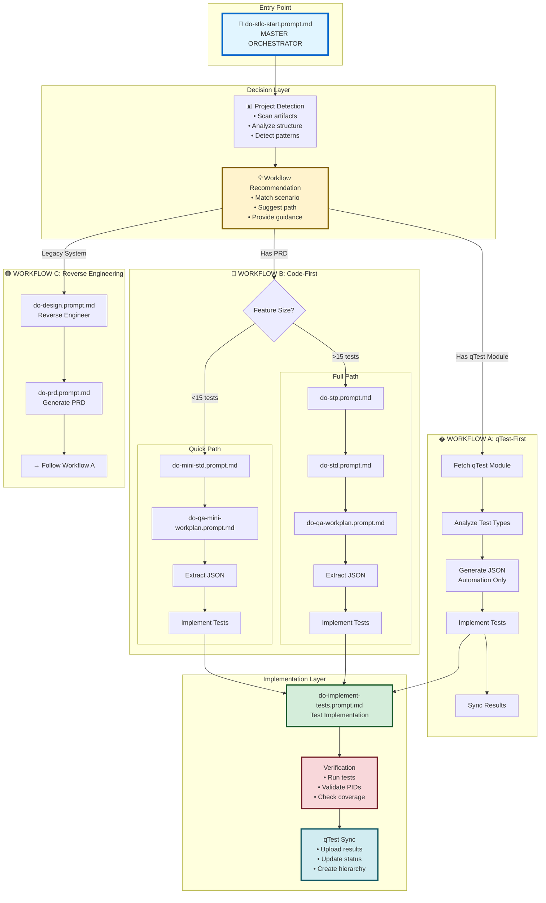
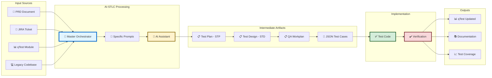

# AI-STLC Organizational Structure
## Visual Guide to Test Automation Workflows

> **Purpose:** Visual organizational map of AI-STLC prompts, workflows, and relationships
> **Last Updated:** February 15, 2026

---

## 📊 High-Level Organization

```
AI-STLC Ecosystem
     ↓
┌────────────────────────────────────────────────────────────┐
│         🎯 MASTER ORCHESTRATOR                             │
│         do-stlc-start.prompt.md                            │
│                                                             │
│  Analyzes → Detects → Recommends → Routes                 │
└────────────────────────────────────────────────────────────┘
                         ↓
        ┌────────────────┼────────────────┐
        ↓                ↓                ↓
   ┌─────────┐     ┌─────────┐     ┌─────────┐
   │WORKFLOW │     │WORKFLOW │     │WORKFLOW │
   │   A     │     │   B     │     │   C     │
   │Code-    │     │qTest-   │     │Reverse  │
   │First    │     │First    │     │Engineer │
   └─────────┘     └─────────┘     └─────────┘
```

---

## 📁 Directory Structure

```
AI-CoPilot/
└── .github/
    └── prompts/
        ├── 📋 AI-STLC-IMPLEMENTATION-GUIDE.md    ← YOU ARE HERE 
        ├── 📋 STLC-INDEX.md                      ← Navigation guide
        ├── 📋 INDEX.md                           ← Master prompt index
        │
        ├── 🎯 do-stlc-start.prompt.md            ← MASTER ORCHESTRATOR
        │
        ├── ai-stlc/                              ← Core STLC workflows
        │   ├── README.md
        │   ├── AI-STLC-Triple-Workflow-Strategy.md (1671 lines)
        │   └── AI-STLC-Brief-Presentation.md
        │
        ├── 🔵 Workflow A & C Prompts (Code-First & Reverse Engineering)
        │   ├── do-stp.prompt.md                  ← Generate Test Plan
        │   ├── do-std.prompt.md                  ← Generate Test Design
        │   ├── do-qa-workplan.prompt.md          ← Generate Implementation Plan
        │   ├── do-mini-std.prompt.md             ← Quick Test Design
        │   ├── do-qa-mini-workplan.prompt.md     ← Quick Implementation Plan
        │   ├── do-design.prompt.md               ← Reverse Engineering
        │   └── do-prd.prompt.md                  ← Generate PRD
        │
        ├── 🛠️ Implementation Support
        │   ├── do-implement-tests.prompt.md      ← Test implementation
        │   └── do-dev-and-test.prompt.md         ← Dev + test workflow
        │
        ├── 📚 Utility Prompts
        │   ├── do-learning.prompt.md             ← Repository learning
        │   ├── do-codereview.prompt.md           ← Code review
        │   ├── do-merge-code.prompt.md           ← Code merge
        │   ├── do-merge-docs.prompt.md           ← Doc merge
        │   ├── do-tests.prompt.md                ← Test generation
        │   ├── do-acceptance.prompt.md           ← Acceptance testing
        │   ├── do-workplan.prompt.md             ← Work planning
        │   ├── do-feature-design.prompt.md       ← Feature design
        │   └── do-project-design.prompt.md       ← Project architecture
        │
        └── 🟢 Workflow B Support (qTest-First)
            └── qtest-mcp-server/                 ← qTest integration tools
```

---

## 🔄 Workflow Relationships



---

## 🎯 Prompt Categories

### 1️⃣ Master Control

| Prompt | Category | Purpose |
|--------|----------|---------|
| **do-stlc-start.prompt.md** | Orchestrator | Routes to correct workflow |

### 2️⃣ Test Planning & Design (Workflow A & C)

| Prompt | Category | Path | Input | Output |
|--------|----------|------|-------|--------|
| **do-stp.prompt.md** | Strategic | Full | PRD | Test Plan |
| **do-std.prompt.md** | Tactical | Full | STP | Test Design |
| **do-mini-std.prompt.md** | Combined | Quick | PRD/JIRA | Mini Test Design |

### 3️⃣ Implementation Planning

| Prompt | Category | Path | Input | Output |
|--------|----------|------|-------|--------|
| **do-qa-workplan.prompt.md** | Implementation | Full | STD | QA Workplan |
| **do-qa-mini-workplan.prompt.md** | Implementation | Quick | Mini-STD | Mini Workplan |

### 4️⃣ Reverse Engineering (Workflow C Only)

| Prompt | Category | Input | Output |
|--------|----------|-------|--------|
| **do-design.prompt.md** | Analysis | Codebase | Design Doc |
| **do-prd.prompt.md** | Documentation | Design | PRD |

### 5️⃣ Test Implementation

| Prompt | Category | Input | Output |
|--------|----------|-------|--------|
| **do-implement-tests.prompt.md** | Development | JSON + Workplan | Test Code |
| **do-dev-and-test.prompt.md** | Development | Requirements | Code + Tests |

### 6️⃣ Utilities

| Prompt | Purpose | When to Use |
|--------|---------|-------------|
| **do-learning.prompt.md** | Repository deep learning | New project onboarding |
| **do-codereview.prompt.md** | AI code review | Before PR submission |
| **do-merge-code.prompt.md** | Merge conflict resolution | During merge conflicts |
| **do-merge-docs.prompt.md** | Documentation merge | Doc conflicts |
| **do-tests.prompt.md** | Test generation | Ad-hoc test creation |
| **do-acceptance.prompt.md** | Acceptance testing | UAT preparation |

---

## 🔀 Workflow Decision Matrix

| Scenario | Artifacts Available | Workflow | First Prompt | Path |
|----------|---------------------|----------|--------------|------|
| **New feature with PRD** | ✅ PRD<br/>❌ qTest<br/>❌ Tests | 🔵 A | `do-stlc-start` | Quick or Full |
| **Existing qTest module** | ✅ qTest (50+ tests)<br/>❌ Code | 🟢 B | `do-stlc-start` or `{moduleId}` | qTest-First |
| **Hotfix/POC** | ✅ JIRA ticket<br/>❌ Full PRD | 🔵 A | `do-stlc-start` | Quick Path |
| **Legacy system** | ✅ Working code<br/>❌ Documentation | 🟠 C | `do-design` | Reverse → A |
| **Enhancement** | ✅ Existing tests<br/>✅ Requirements | 🔵 A | `do-stlc-start` | Quick or Full |
| **Complex feature** | ✅ PRD<br/>✅ >15 test cases | 🔵 A | `do-stlc-start` | Full Path |

---

## 📊 Data Flow Diagram



---

## 🎨 Color Coding System

Throughout AI-STLC documentation:

- 🟢 **Green** = Workflow B (qTest-First)
- 🔵 **Blue** = Workflow A (Code-First)
- 🟠 **Orange** = Workflow C (Reverse Engineering)
- 🎯 **Target** = Master Orchestrator / Entry Point
- 📋 **Document** = Documentation / Artifacts
- 🛠️ **Tools** = Implementation / Utilities
- ⚠️ **Warning** = Important notices / Critical steps

---

## 📈 Complexity Levels

```
┌─────────────────────────────────────────────────────────────┐
│  Complexity Scale                                           │
├─────────────────────────────────────────────────────────────┤
│                                                             │
│  SIMPLE (<15 tests, <1 week)                               │
│  ├── Hotfix                                                │
│  ├── POC/Spike                                             │
│  └── Small enhancement                                     │
│  → Use: Workflow A Quick Path                              │
│                                                             │
│  MODERATE (15-50 tests, 1-2 weeks)                         │
│  ├── Single feature                                        │
│  ├── API endpoint suite                                    │
│  └── Module enhancement                                    │
│  → Use: Workflow A Full Path or Workflow B                 │
│                                                             │
│  COMPLEX (50+ tests, 2+ weeks)                             │
│  ├── Major feature                                         │
│  ├── System integration                                    │
│  └── Multi-module changes                                  │
│  → Use: Workflow A Full Path or Workflow B                 │
│                                                             │
│  LEGACY (Unknown complexity)                                │
│  ├── Undocumented system                                   │
│  ├── No requirements                                       │
│  └── Reverse engineering needed                            │
│  → Use: Workflow C                                         │
│                                                             │
└─────────────────────────────────────────────────────────────┘
```

---

## 🔗 Integration Points

```
┌──────────────────────────────────────────────────────────┐
│  External Systems & Tools                                │
├──────────────────────────────────────────────────────────┤
│                                                          │
│  qTest Manager                                           │
│  ├── Test case management                                │
│  ├── Test execution tracking                             │
│  ├── Module hierarchy                                    │
│  └── PID assignment                                      │
│  → Tools: qtest-mcp-server, simple_sync.py              │
│                                                          │
│  GitHub Copilot                                          │
│  ├── Code generation                                     │
│  ├── Test implementation                                 │
│  ├── Documentation assistance                            │
│  └── Code review                                         │
│  → All prompts optimize for Copilot                      │
│                                                          │
│  Maven / npm                                             │
│  ├── Test execution                                      │
│  ├── Build management                                    │
│  └── Dependency handling                                 │
│  → Integration: PID validation, test runners            │
│                                                          │
│  JIRA                                                    │
│  ├── Requirements source                                 │
│  ├── Acceptance criteria                                 │
│  └── Story tracking                                      │
│  → Input source for Workflow A Quick Path               │
│                                                          │
└──────────────────────────────────────────────────────────┘
```

---

## 📚 Documentation Hierarchy

```
Level 1: Quick Start
  ├── STLC-INDEX.md               ← Navigation guide
  └── README.md                   ← Overview
  
Level 2: Comprehensive Guide
  └── AI-STLC-IMPLEMENTATION-GUIDE.md   ← YOU ARE HERE

Level 3: Strategic Documentation
  ├── AI-STLC-Triple-Workflow-Strategy.md  (1671 lines)
  └── AI-STLC-Brief-Presentation.md        (656 lines)

Level 4: Individual Prompts
  ├── do-stlc-start.prompt.md
  ├── do-stp.prompt.md
  ├── do-std.prompt.md
  └── ... (19 prompts total)
```

---

## 🎯 Usage Patterns

### Pattern 1: First Time User

```
1. Read: STLC-INDEX.md (5 min)
2. Read: AI-STLC-IMPLEMENTATION-GUIDE.md (15 min)
3. Run: "Start AI-STLC workflow"
4. Follow: Master orchestrator guidance
```

### Pattern 2: Experienced User

```
1. Know your scenario
2. Go directly to: do-stlc-start.prompt.md
3. Provide context
4. Follow breadcrumbs
```

### Pattern 3: Specific Task

```
1. Check: STLC-INDEX.md → "Quick Workflow Selection"
2. Run: Specific prompt directly
3. Example: "Generate STP from feature-prd.md using do-stp.prompt.md"
```

---

## 🔄 Maintenance & Updates

**How to update AI-STLC:**

1. **Adding new prompt:**
   - Add to `.github/prompts/`
   - Update INDEX.md
   - Update STLC-INDEX.md
   - Update this file (AI-STLC-ORGANIZATION.md)

2. **Updating workflow:**
   - Edit specific prompt file
   - Update breadcrumbs (NEXT STEP sections)
   - Update workflow diagrams if needed
   - Update AI-STLC-IMPLEMENTATION-GUIDE.md

3. **Documenting new pattern:**
   - Add to AI-STLC-IMPLEMENTATION-GUIDE.md → Common Scenarios
   - Update decision tree in this file
   - Update STLC-INDEX.md → Quick Workflow Selection

---

## 🎓 Learning Path

**For New Team Members:**

```
Week 1: Foundation
├── Day 1: Read STLC-INDEX.md
├── Day 2: Read AI-STLC-IMPLEMENTATION-GUIDE.md
├── Day 3: Review Workflow A Quick Path example
├── Day 4: Attempt simple feature (Workflow A Quick)
└── Day 5: Review and feedback

Week 2: Advanced
├── Day 1: Study Workflow A Full Path
├── Day 2: Learn Workflow B (qTest-First)
├── Day 3: Practice with real feature
├── Day 4: Implement and sync to qTest
└── Day 5: Review and optimization

Week 3: Mastery
├── Day 1: Workflow C (Reverse Engineering)
├── Day 2: Custom scenarios
├── Day 3: Troubleshooting practice
├── Day 4: Tool integration (qTest MCP, etc.)
└── Day 5: Knowledge sharing
```

---

## 📊 Metrics Dashboard

**Track Your AI-STLC Usage:**

| Metric | Target | How to Measure |
|--------|--------|----------------|
| Documentation Time | <2 hours | STP + STD + Workplan (AI-assisted) |
| Implementation Speed | 30% faster | Compare with baseline |
| Test Coverage | >80% | Automated / Total tests |
| Sync Success Rate | 100% | Successful syncs / Total attempts |
| PID Accuracy | 100% | Matching PIDs / Total tests |
| Workflow Selection Accuracy | >95% | Correct workflow / Total uses |

---

## 🚀 Future Enhancements

**Planned Improvements:**

- [ ] Automated workflow detection (AI-powered)
- [ ] Integration with CI/CD pipelines
- [ ] Test case generation from Swagger/OpenAPI
- [ ] Enhanced qTest bidirectional sync
- [ ] Performance test automation workflows
- [ ] Security test automation integration

---

**Version:** 1.0  
**Last Updated:** February 15, 2026  
**Maintained by:** QA Automation Team
