```mermaid
%%{init: {'theme':'base', 'themeVariables': { 'fontSize':'28px', 'fontFamily':'arial'}}}%%
flowchart LR
    START([<span style='font-size:26px'>🎯 Start AI-STLC<br/>Module ID or Analysis</span>]) --> ANALYZE[<span style='font-size:24px'>🔍 Analyze<br/>Project State</span>]
    ANALYZE --> RECOMMEND[<span style='font-size:24px'>🤖 AI Recommends<br/>Workflow</span>]
    RECOMMEND --> JSON[<span style='font-size:24px'>📄 Create JSON<br/>.qtest/test-cases/</span>]
    JSON --> IMPL_CYCLE{{<span style='font-size:24px'>💻 Implementation Cycle</span>}}

    IMPL_CYCLE --> IMPLEMENT[<span style='font-size:24px'>Write Code</span>]
    IMPLEMENT --> RUN[<span style='font-size:24px'>Run Tests</span>]
    RUN --> CHECK{<span style='font-size:24px'>Pass?</span>}
    CHECK -->|No| REGRESSION{<span style='font-size:24px'>Has<br/>Regression?</span>}
    CHECK -->|Yes| UPDATE
    REGRESSION -->|Yes| RUN_REG[<span style='font-size:24px'>Run Regression</span>]
    REGRESSION -->|No| FIX[<span style='font-size:24px'>Fix Issues</span>]
    RUN_REG --> REG_CHECK{<span style='font-size:24px'>Pass?</span>}
    REG_CHECK -->|No| FIX
    REG_CHECK -->|Yes| UPDATE
    FIX --> IMPLEMENT

    UPDATE[<span style='font-size:24px'>📝 Update Docs<br/>& Sync qTest</span>] --> COMPLETE([<span style='font-size:26px'>✅ Test Cycle<br/>Complete</span>])

    style START fill:#e1f5ff,stroke:#0066cc,stroke-width:4px
    style IMPL_CYCLE fill:#fff3cd,stroke:#856404,stroke-width:4px
    style JSON fill:#f8d7da,stroke:#721c24,stroke-width:3px
    style COMPLETE fill:#d4edda,stroke:#28a745,stroke-width:4px
```

```mermaid
%%{init: {'theme':'base', 'themeVariables': { 'fontSize':'20px', 'fontFamily':'arial'}}}%%
flowchart TD
    START([<span style='font-size:18px'>🎯 Start AI-STLC<br/>Provide Module ID or Request Analysis</span>]) --> DETECT{<span style='font-size:18px'>Input Type?</span>}

    DETECT -->|Module ID| DIRECT[<span style='font-size:18px'>⚡ Direct Fetch from qTest</span>]
    DETECT -->|General Request| ANALYZE[<span style='font-size:18px'>🔍 Analyze Project State</span>]

    DIRECT --> JSON_CREATE[<span style='font-size:18px'>📄 Create JSON Files<br/>.qtest/test-cases/</span>]

    ANALYZE --> SELECT{<span style='font-size:18px'>AI Recommends<br/>Workflow</span>}
    SELECT -->|🟢 Workflow A| WF_A[<span style='font-size:18px'>qTest Module Exists<br/>Fetch Test Cases</span>]
    SELECT -->|🔵 Workflow B Quick| WF_BQ[<span style='font-size:18px'>Generate mini-STD<br/>Small Feature</span>]
    SELECT -->|🔵 Workflow B Full| WF_BF[<span style='font-size:18px'>Generate STP → STD<br/>Large Feature</span>]
    SELECT -->|🟠 Workflow C| WF_C[<span style='font-size:18px'>Reverse Engineer<br/>Generate Design → PRD → STP/STD</span>]

    WF_A --> JSON_CREATE
    WF_BQ --> QA_PLAN_Q[<span style='font-size:18px'>📋 QA Work Plan<br/>Mini Approach</span>]
    WF_BF --> QA_PLAN_F[<span style='font-size:18px'>📋 QA Work Plan<br/>Full Approach<br/>do-qa-workplan.prompt.md</span>]
    WF_C --> QA_PLAN_F

    QA_PLAN_Q --> JSON_CREATE
    QA_PLAN_F --> JSON_CREATE

    JSON_CREATE --> REVIEW1{<span style='font-size:18px'>👤 Review & Approve<br/>JSON Files</span>}
    REVIEW1 -->|✅ Approved| IMPLEMENT[<span style='font-size:18px'>💻 Implement Tests in Code</span>]
    REVIEW1 -->|🔄 Revise| JSON_CREATE

    IMPLEMENT --> LOCAL[<span style='font-size:18px'>🧪 Local Testing<br/>npm test / mvn test</span>]
    LOCAL --> LOCAL_PASS{<span style='font-size:18px'>Tests Pass?</span>}
    LOCAL_PASS -->|❌ Failures| DEBUG[<span style='font-size:18px'>🔧 Debug & Fix</span>]
    DEBUG --> LOCAL
    LOCAL_PASS -->|✅ All Pass| COMMIT[<span style='font-size:18px'>📦 Commit to Git</span>]

    COMMIT --> CI[<span style='font-size:18px'>🤖 CI/CD Pipeline<br/>Automated Build & Test</span>]
    CI --> CI_PASS{<span style='font-size:18px'>CI Pass?</span>}
    CI_PASS -->|❌ Failures| FIX_CI[<span style='font-size:18px'>🔧 Fix CI Issues</span>]
    FIX_CI --> COMMIT
    CI_PASS -->|✅ Pass| REGRESSION[<span style='font-size:18px'>🔍 Regression Testing<br/>Full Suite Validation</span>]

    REGRESSION --> REG_PASS{<span style='font-size:18px'>Regression Pass?</span>}
    REG_PASS -->|❌ Failures| FIX_REG[<span style='font-size:18px'>🔧 Fix Regressions</span>]
    FIX_REG --> LOCAL
    REG_PASS -->|✅ All Pass| PRE_SYNC[<span style='font-size:18px'>✅ Pre-Sync Validation<br/>analyze-local-tests.js</span>]

    PRE_SYNC --> REVIEW2{<span style='font-size:18px'>👤 Review Sync Plan</span>}
    REVIEW2 -->|🔄 Adjust| JSON_CREATE
    REVIEW2 -->|✅ Approved| SYNC[<span style='font-size:18px'>🚀 qTest Sync<br/>qtest sync<br/>30 seconds</span>]

    SYNC --> QTEST[<span style='font-size:18px'>📊 qTest Updated<br/>✓ Test Cases<br/>✓ Hierarchy<br/>✓ Traceability</span>]

    QTEST --> CYCLE_CHECK{<span style='font-size:18px'>Continue<br/>Testing?</span>}
    CYCLE_CHECK -->|Yes - New Tests| JSON_CREATE
    CYCLE_CHECK -->|Yes - Updates| IMPLEMENT
    CYCLE_CHECK -->|Complete| END([<span style='font-size:18px'>✅ Test Cycle Complete</span>])

    style START fill:#e1f5ff,stroke:#0066cc,stroke-width:4px
    style REVIEW1 fill:#fff3cd,stroke:#856404,stroke-width:3px
    style REVIEW2 fill:#fff3cd,stroke:#856404,stroke-width:3px
    style JSON_CREATE fill:#f8d7da,stroke:#721c24,stroke-width:4px
    style SYNC fill:#d4edda,stroke:#28a745,stroke-width:3px
    style END fill:#d1ecf1,stroke:#0c5460,stroke-width:4px
```

# <span style="font-size: 2em;">AI-STLC: Triple Workflow Strategy</span>

## <span style="font-size: 1.5em;">Brief Executive Overview</span>

---

## <span style="font-size: 1.8em;">😰 The Challenges We Face</span>

### <span style="font-size: 1.5em;">1. ❌ Different Project States, One Rigid Process</span>

### <span style="font-size: 1.5em;">2. ❌ Lost Control with Full Automation</span>

### <span style="font-size: 1.5em;">3. ❌ Manual qTest Sync Takes Hours</span>

### <span style="font-size: 1.5em;">4. ❌ Framework Lock-In</span>

### <span style="font-size: 1.5em;">5. ❌ No Single Source of Truth</span>

---

## <span style="font-size: 1.8em;">✅ That is How a new Triple Workflow Strategy Solves These Problems</span>

### <span style="font-size: 1.5em;">**1. 🎮 Complete Control Over Each Step**</span>

**<span style="font-size: 1.8em;">You decide when to proceed</span>** <span style="font-size: 1.5em;">- AI guides but doesn't auto-execute</span>

<span style="font-size: 1.4em;">

- ✅ Review AI-generated outputs before proceeding
- ✅ Make adjustments at any stage
- ✅ Pause workflow to gather team input
- ✅ **Clear "NEXT STEP" guidance** at every stage
- ✅ No black-box automation - full transparency

</span>

**Example:** AI generates STD → You review → You decide when to extract JSON → You control implementation pace

---

### <span style="font-size: 1.5em;">**2. 🔀 Flexibility for Any Scenario**</span>

**<span style="font-size: 1.8em;">Three distinct paths</span>** <span style="font-size: 1.5em;">adapt to your actual project state:</span>

<span style="font-size: 1.4em;">

- 🟢 **Workflow A (qTest-First):** qTest module exists → Start from qTest
  - **Use case:** Product team already defined 50 test cases in qTest {moduleId}
  - **Benefit:** Skip docs, jump straight to implementation
- 🔵 **Workflow B (Code-First):** Have requirements → Start from docs
  - **Quick Path:** Small features (5-10 tests) → mini-STD
  - **Full Path:** Large features (30+ tests) → STP → STD
  - **Use case:** New feature with PRD, no qTest module yet
  - **Benefit:** Generate docs first, sync to qTest after implementation
- 🟠 **Workflow C (Reverse Engineering):** Legacy code only → Reverse engineer first
  - **Use case:** Old codebase with no docs or tests
  - **Benefit:** AI generates design docs → PRD → STP/STD from existing code

</span>

**<span style="font-size: 1.5em;">No forcing square pegs into round holes</span>** <span style="font-size: 1.4em;">- AI analyzes your project and selects the right workflow</span>

---

### <span style="font-size: 1.5em;">**3. 🎯 Clear Next Steps at Every Stage**</span>

**<span style="font-size: 1.8em;">AI orchestration provides exact commands:</span>**

```bash
# Example workflow guidance:
✅ Step 1 complete: JSON created
📋 NEXT STEP: Run → qtest validate --tests-dir ./.qtest/test-cases/{package}/
```

**<span style="font-size: 1.5em;">Every stage shows:</span>**

<span style="font-size: 1.4em;">

- ✅ What was just completed
- 📋 Exact command to run next
- 🔍 What to review before proceeding
- ⚠️ Common pitfalls to avoid

</span>

**No guessing, no confusion** - Clear path from start to finish

---

## <span style="font-size: 1.8em;">📊 Simple Workflow Overview</span>



---

## <span style="font-size: 1.8em;">🛠️ Tools That Power This Workflow ( Approved by Globalpay )</span>

<span style="font-size: 1.4em;">

### **1. 🤖 MCP (Model Context Protocol)**

- AI-powered orchestration and workflow routing
- Intelligent code generation and analysis
- Automated test case extraction from documentation

### **2. 📝 Prompt Templates**

- **do-std.prompt.md** - Generate comprehensive Software Test Design
- **do-mini-std.prompt.md** - Quick test design for small features
- **do-stp.prompt.md** - Create Software Test Plan
- **do-qa-workplan.prompt.md** - Generate QA implementation roadmap

### **3. 🔧 Supporting Tools**

- **qTest CLI** - Fast sync, validation, and module management
- **Git** - Version control with auto PID tracking
- **CI/CD Pipeline** - Automated testing and validation
- **npm/Maven** - Build and test execution
- **Validation Scripts** - Duplicate detection and consistency checks

</span>

---

## <span style="font-size: 1.8em;">🎯 Control Points Summary</span>

<span style="font-size: 1.3em;">

| Stage              | Control Point           | Your Decision          |
| ------------------ | ----------------------- | ---------------------- |
| **Start**          | Choose workflow path    | Module ID vs Analysis  |
| **Planning**       | Review QA plan          | Approve or revise      |
| **JSON**           | Review test definitions | Approve before coding  |
| **Implementation** | Code quality            | When ready to commit   |
| **Local Testing**  | Test results            | Fix before CI/CD       |
| **CI/CD**          | Build status            | Fix before regression  |
| **Regression**     | Full suite results      | Fix before sync        |
| **Pre-Sync**       | Sync preview            | Approve sync plan      |
| **Sync**           | qTest update            | Execute when ready     |
| **Cycle**          | Continue or complete    | Next iteration or done |

**You are in control at every step** - AI guides, validates, and automates, but YOU decide when to proceed.

</span>

---

## <span style="font-size: 1.8em;">📊 Quick Comparison: Manual vs AI-STLC</span>

<span style="font-size: 1.3em;">

| Activity                    | Manual Process         | AI-STLC Process    | Time Saved |
| --------------------------- | ---------------------- | ------------------ | ---------- |
| **Generate test plan**      | 4-8 hours writing      | 30 min AI-assisted | 75%        |
| **Create JSON definitions** | 2-4 hours manual       | 15 min extraction  | 90%        |
| **Sync to qTest**           | 30-45 min per feature  | 30 seconds         | 99%        |
| **Validate duplicates**     | 1-2 hours manual check | Automatic          | 100%       |
| **Create hierarchy**        | 15-20 min UI clicks    | Automatic          | 100%       |
| **Update traceability**     | 30 min manual linking  | Automatic          | 100%       |
| **Total per feature**       | 8-15 hours             | 2-4 hours          | **70-80%** |

</span>

---

## <span style="font-size: 2.5em;">🔄 Complete AI-STLC Workflow</span>



---

## <span style="font-size: 2.5em;">📋 Key Commands Reference</span>

### 1️⃣ Start AI-STLC Workflow

```bash
# Option A: Provide qTest Module ID (fastest)
"{moduleId}"

# Option B: Request workflow analysis
"Start AI-STLC workflow for [feature-name]"
```

**AI Response:** Recommends workflow, provides next prompt to run

---

### 2️⃣ Generate QA Work Plan

**For Quick Path (Small Features):**

```bash
# AI uses: do-mini-std.prompt.md
# Input: PRD or JIRA ticket
# Output: docs/{module}/mini-std.md (all test cases)
```

**For Full Path (Large Features):**

```bash
# Step 1: Generate STP
do-stp.prompt.md + docs/prd/{feature}.md
# Output: docs/{module}/{feature}-stp.md

# Step 2: Generate STD
do-std.prompt.md + docs/{module}/{feature}-stp.md
# Output: docs/{module}/{feature}-std.md

# Step 3: Generate QA Work Plan
do-qa-workplan.prompt.md + docs/{module}/{feature}-std.md
# Output: QA implementation plan with epics/stories
```

---

### 3️⃣ Generate JSON Files (Single Source of Truth)

**Option A: Extract from qTest Module (qTest-First Workflow):**

```bash
# Fetch test cases from existing qTest module
qtest fetch --module {moduleId} --output ./.qtest/test-cases/{Module}.json

# This creates JSON with:
# - Test case name, description, steps
# - qTestId and qTestPID for traceability
# - Priority, type, preconditions
```

**Option B: AI Extraction from STD (Code-First Workflow):**

```bash
# AI extracts automation test cases from STD/mini-STD
# Creates: .qtest/test-cases/{package}/{Module}.json

# JSON structure contains:
# - Test case name, description, steps
# - qTestId (for existing) or blank (for new)
# - qTestPID for traceability
# - Priority, type, preconditions
```

**Manual Review Point:**

```bash
# Review JSON files before implementation
ls .qtest/test-cases/{package}/
cat .qtest/test-cases/{package}/{Module}.json

# ✅ YOU CONTROL: Approve or request changes
```

**💡 Clarification: What is QA Work Plan vs JSON Files?**

```mermaid
flowchart LR
    STD[📝 STD/mini-STD<br/>ALL Test Cases<br/>Manual + Automation] --> EXTRACT{Extract}

    EXTRACT -->|Automation Tests| JSON[📄 JSON Files<br/>Test Specifications<br/>WHAT to test]
    EXTRACT -->|For Planning| PLAN[📋 QA Work Plan<br/>Implementation Plan<br/>HOW to organize work]

    JSON --> GENERATE[🤖 Optional: Generate Skeleton<br/>qtest generate-code]
    GENERATE --> CODE[💻 Developer Writes Code<br/>Based on JSON specs]

    PLAN --> ORGANIZE[📊 Organize Sprints/Epics<br/>Track Progress]

    CODE --> TESTS[✅ Actual Test Code<br/>.spec.ts or .java files]

    style JSON fill:#f8d7da,stroke:#721c24,stroke-width:3px
    style CODE fill:#d4edda,stroke:#28a745,stroke-width:2px
    style TESTS fill:#cfe2ff,stroke:#0056b3,stroke-width:2px
    style PLAN fill:#fff3cd,stroke:#856404,stroke-width:2px
```



**Key Understanding:**

1. **STD/mini-STD** → Contains all test cases (manual + automation types)
2. **JSON Files** → Test specifications (WHAT to test) - extracted from STD
3. **Developer Code** → Actual test implementation written by developer
4. **QA Work Plan** → Implementation plan (HOW to organize work) - optional, for planning
   "description": "Validate adding points to all 3 generic wallets",
   "testSteps": [
   "Login to portal",
   "Navigate to wallet section",
   "Add 100 points to wallet 1",
   "Verify balance updated"
   ],
   "qTestPID": "TC-198"
   }
   ]
   }

````

```typescript
// Developer implements based on JSON spec above
// packages/hub/tests/generic-wallet.spec.ts
test("Add points to wallet", async ({ page }) => {
  await loginPage.login(testUser);
  await walletPage.navigate();
  await walletPage.addPoints("wallet1", 100);
  await expect(walletPage.balance("wallet1")).toBe(100);
});
````

**Bottom Line:**

- 📄 **JSON = Test Specification** (what needs to be tested)
- 📋 **QA Work Plan = Optional project plan** (how to organize sprints)
- 💻 **Code = Actual implementation** (auto-generated or manually written)

---

### 4️⃣ Implement Tests in Code

**Developer writes test code based on JSON specifications:**

**automation-web (Playwright/TypeScript):**

```bash
# Create test files based on JSON specs
packages/{package}/tests/{module}.spec.ts

# Local testing
npm run test:{package}:local

# Examples:
npm run test:hub:local
npm run test:cp:local
npm run test:agent:local
```

**automation-comosense (Java/API):**

```bash
# Create test classes based on JSON specs
src/test/java/com/example/{module}/{TestClass}.java

# Local testing
mvn test -Dtest={TestClass}

# Examples:
mvn test -Dtest=GenericWalletTest
mvn test -Dtest=Flow1TransactionProcessingTest
```

**Implementation Example:**

```json
// .qtest/test-cases/{package}/{Module}.json (specification)
{
  "name": "Add points to wallet",
  "description": "Validate adding points to all 3 generic wallets",
  "testSteps": [
    "Login to portal",
    "Navigate to wallet section",
    "Add 100 points to wallet 1",
    "Verify balance updated"
  ],
  "qTestPID": "TC-198"
}
```

```typescript
// packages/hub/tests/generic-wallet.spec.ts (implementation)
import { test, expect } from "@playwright/test";

test("TC-198: Add points to wallet", async ({ page }) => {
  await loginPage.login(testUser);
  await walletPage.navigate();
  await walletPage.addPoints("wallet1", 100);
  await expect(walletPage.balance("wallet1")).toBe(100);
});
```

**Key Control Point:**

```bash
# ✅ YOU CONTROL:
# - When tests are ready
# - When to commit
# - When to trigger CI/CD
```

---

### 5️⃣ CI/CD & Regression Testing

**Continuous Integration:**

```bash
# Git commit triggers CI/CD pipeline
git add .
git commit -m "feat: implement generic wallet tests"
git push origin feature/generic-wallet

# CI pipeline automatically runs:
# 1. Build project
# 2. Run unit tests
# 3. Run integration tests
# 4. Generate test reports
```

**Regression Testing:**

```bash
# automation-web
npm run test:regression

# automation-comosense
mvn test -DsuiteXmlFile=regression-suite.xml

# ✅ YOU CONTROL:
# - When to run full regression
# - When to proceed to sync
```

---

### 6️⃣ qTest Synchronization

**Pre-Sync Validation (Recommended):**

```bash
# Validate JSON files before syncing
qtest validate --tests-dir ./.qtest/test-cases/{package}/ --strict

# Check module status
qtest check --module {moduleId} --verbose

# Output shows:
# - JSON structure validation
# - Test count per module
# - Potential issues

# ✅ YOU CONTROL: Review before actual sync
```

**Execute Sync:**

```bash
# Sync any module with flexible CLI
qtest sync --module {moduleId} --tests-dir ./.qtest/test-cases/{package}/ --create-submodules

# CLI automatically:
# ✅ Creates submodule hierarchy
# ✅ Detects duplicates
# ✅ Updates existing tests
# ✅ Creates new tests
# ✅ Links traceability

# Time: ~30 seconds
```

**Verify in qTest:**

```bash
# Check qTest Manager UI
# ✅ Test cases uploaded
# ✅ Correct hierarchy
# ✅ No duplicates
# ✅ Traceability linked
```

---

### 7️⃣ Test Cycle Continuation

**Iterative Development:**

```bash
# Cycle back based on need:

# Add new tests → Update JSON → Implement → Sync
# Update existing → Modify code → Re-run → Re-sync
# Fix bugs → Update tests → Regression → Sync results

# ✅ YOU CONTROL:
# - When to add tests
# - When cycle is complete
# - When to release
```

---

## 🚀 Getting Started (3 Steps)

### Step 1: Start the Workflow

```bash
# Fastest: Provide qTest module ID
"{moduleId}"

# Or: Request analysis
"Start AI-STLC workflow for payment feature"
```

### Step 2: Follow AI Guidance

- ✅ AI recommends workflow
- ✅ Provides exact next prompt
- ✅ Shows expected outputs
- ✅ You review and approve each stage

### Step 3: Implement & Sync

```bash
# Implement tests locally
npm test  # or mvn test

# Validate before sync
qtest validate --tests-dir ./.qtest/test-cases/{package}/

# Check module status
qtest check --module {moduleId}

# Sync to qTest
qtest sync --module {moduleId} --tests-dir ./.qtest/test-cases/{package}/ --create-submodules
```

---

## 🛠️ CLI Commands Quick Reference

### Creating JSON from qTest

```bash
# Fetch test cases from existing qTest module
qtest fetch --module {moduleId} --output ./.qtest/test-cases/{Module}.json
```

### Generating Code from JSON

```bash
# Generate test skeleton (optional - saves boilerplate)
qtest generate-code --module {moduleId} --framework playwright --output ./tests/

# Frameworks supported: playwright, testng, pytest
```

### Syncing to qTest

```bash
# Validate before sync
qtest validate --tests-dir ./.qtest/test-cases/{package}/ --strict

# Sync with submodule creation
qtest sync --module {moduleId} --tests-dir ./.qtest/test-cases/{package}/ --create-submodules
```

### Checking Module Status

```bash
# Quick status check
qtest check --module {moduleId} --verbose
```

---

## 💡 Key Takeaways

1. **🎮 You Control Every Step** - AI guides but doesn't auto-execute
2. **🔀 Flexible for Any Scenario** - 3 workflows adapt to your project
3. **📄 JSON is Single Source** - Version-controlled, framework-agnostic
4. **🚀 90% Faster with Validation** - Speed without sacrificing quality
5. **✅ Clear Next Steps** - No guessing what to do next

---

**Start with:** `"Start AI-STLC workflow"` or provide qTest module ID  
**AI handles the guidance, you maintain control** 🎯

---

**Version:** 1.0  
**Last Updated:** February 9, 2026  
**Purpose:** Brief executive presentation, quick team overview  
**Based on:** AI-STLC-Presentation.md (Full version)
