# AI-STLC Implementation Guide
## Complete Reference for Test Automation Workflows

> **Purpose:** Practical step-by-step guide for implementing test automation using AI-STLC process
> **Last Updated:** February 15, 2026 | **Version:** 1.0

---

## 📋 Table of Contents

1. [Quick Decision Tree](#-quick-decision-tree)
2. [Workflow Implementations](#-workflow-implementations)
3. [Common Scenarios](#-common-scenarios)
4. [Best Practices](#-best-practices)
5. [Troubleshooting](#-troubleshooting)
6. [Prompt Reference](#-prompt-reference)

---

## 📚 Related Documentation

| Document | Purpose | Read Time |
|----------|---------|-----------|
| **[AI-STLC-QUICK-START.md](AI-STLC-QUICK-START.md)** | 5-minute router & decision tree | 5 min |
| **[AI-STLC-ORGANIZATION.md](AI-STLC-ORGANIZATION.md)** | Visual structure & navigation | 10 min |
| **[AI-STLC-Triple-Workflow-Strategy.md](AI-STLC-Triple-Workflow-Strategy.md)** | Strategic overview & ROI | 60 min |
| **[STLC-INDEX.md](STLC-INDEX.md)** | Master index of all prompts | Quick ref |

**💡 Tip:** New to AI-STLC? Start with [AI-STLC-QUICK-START.md](AI-STLC-QUICK-START.md) first!

---

## 🌳 Quick Decision Tree

```mermaid
graph TB
    START([🎯 New Test Automation Task]) --> Q1{Do you have qTest module with test cases?}
    
    Q1 -->|Yes - 50+ tests| WF_A[🟢 WORKFLOW A: qTest-First]
    Q1 -->|No| Q2{Do you have PRD or requirements?}
    
    Q2 -->|Yes| Q3{Feature complexity?}
    Q2 -->|No - Legacy system| WF_C[🟠 WORKFLOW C: Reverse Engineering]
    
    Q3 -->|Simple - <15 tests| WF_B_QUICK[🔵 WORKFLOW B: Code-First QUICK PATH]
    Q3 -->|Complex - >15 tests| WF_B_FULL[🔵 WORKFLOW B: Code-First FULL PATH]
    
    WF_A --> A1[1️⃣ Fetch from qTest<br/>2️⃣ Generate JSON<br/>3️⃣ Implement tests<br/>4️⃣ Sync results]
    
    WF_B_QUICK --> B1[1️⃣ do-mini-std<br/>2️⃣ Extract JSON<br/>3️⃣ Implement tests<br/>4️⃣ Verify & sync]
    
    WF_B_FULL --> B2[1️⃣ do-stp<br/>2️⃣ do-std<br/>3️⃣ do-qa-workplan<br/>4️⃣ Extract JSON<br/>5️⃣ Implement<br/>6️⃣ Verify & sync]
    
    WF_C --> C1[1️⃣ do-design<br/>2️⃣ do-prd<br/>3️⃣ Follow Workflow A]
    
    style START fill:#e1f5ff,stroke:#0066cc,stroke-width:4px
    style WF_A fill:#d4edda,stroke:#155724,stroke-width:3px
    style WF_B_QUICK fill:#cce5ff,stroke:#004085,stroke-width:3px
    style WF_B_FULL fill:#cce5ff,stroke:#004085,stroke-width:3px
    style WF_C fill:#fff3cd,stroke:#856404,stroke-width:3px
```



---

## 🔄 Workflow Implementations

### 🟢 WORKFLOW A: qTest-First (Existing Test Cases)

**When to use:**
- ✅ qTest module exists with 10+ test cases
- ✅ Manual test cases already documented in qTest
- ✅ Need to automate existing test suite
- ✅ Test cases are stable and approved

**@QTestCase Pattern:**
```java
// JSON already has qTestPID: "TC-2415" (from qTest)
@QTestCase("TC-2415")  // ✅ Use TC from JSON during implementation
@Test
void testCashbackCalculation() { }
```

**Step-by-Step:**

```bash
# Step 1: Start the workflow
"Start AI-STLC workflow"
# Or provide qTest module ID directly:
"{moduleId}"

# Step 2: AI fetches qTest module
# Output: Analysis of module, test types (manual vs automation)

# Step 3: AI creates JSON test definitions
# Location: .qtest/test-cases/{package}/{Module}.json
# Contains: Only automation tests (Type=702)
# ✅ JSON includes qTestPID: "TC-2415" (from qTest)

# Step 4: Implement tests (using GitHub Copilot)
# Input: JSON file with test cases (qTestPID already populated)
# Output: Test code (e.g., Flow4CashbackProcessingTest.java)
# ✅ Use @QTestCase("TC-2415") from JSON qTestPID during implementation

# Step 5: Run and verify tests
mvn test                                    # Java/API
npm test                                    # TypeScript/Playwright

# Step 6: Validate synchronization
npm run validate:pids                       # Check PID mapping

# Step 7: Sync to qTest (if test details updated)
qtest sync --module {moduleId} \
  --tests-dir ./.qtest/test-cases/{package}/ \
  --create-submodules
```

**Key Points:**
- 🔹 Only automation tests go into JSON files
- 🔹 Manual tests stay in qTest and STD documentation
- 🔹 Verify all tests pass before syncing to qTest
- 🔹 JSON already has qTestPID from qTest - use in @QTestCase immediately
- 🔹 No reverse-sync needed (TC numbers already exist)

**Expected Timeline:**
- Fetch & JSON creation: 30-45 min (AI-assisted)
- Test implementation: 3-6 days (depending on test count)
- Sync & validation: 30 min

---

### 🔵 WORKFLOW B: Code-First (New Features)

**@QTestCase Pattern:**
```java
// STEP 1: During implementation (no qTest tests yet)
@QTestCase("")  // ✅ Empty - test doesn't exist in qTest yet
@Test
void testCashbackCalculation() { }

// STEP 2-3: After sync to qTest + reverse-sync
@QTestCase("TC-2415")  // ✅ Updated with TC from JSON after sync
@Test
void testCashbackCalculation() { }
```

#### 🚀 Quick Path (Simple Features)

**When to use:**
- ✅ Single sprint feature (<15 test cases)
- ✅ Hotfix or POC
- ✅ Small enhancement
- ✅ Fast validation needed

**Step-by-Step:**

```bash
# Step 1: Generate mini-STD (combines STP+STD)
"Generate mini-STD from docs/prd/payment-feature.md using do-mini-std.prompt.md"

# Output: docs/doc_{package}/payment-feature-mini-std.md
# Contains: All test cases (manual + automation)
# Timeline: 30-45 min (AI-assisted)

# Step 2: Extract automation tests to JSON
"Extract automation tests from payment-feature-mini-std.md to JSON"

# Output: .qtest/test-cases/{package}/PaymentFeature.json
# Contains: Only automation tests
# ✅ JSON has qTestPID: null (not synced to qTest yet)
# Timeline: 15 min

# Step 3: Implement tests
# Using: GitHub Copilot + JSON test cases
# Output: Test code files
# ✅ Use @QTestCase("") - empty, no TC numbers yet
# Timeline: 1-2 days

# Step 4: Verify implementation
mvn test                                    # Run all tests
# Expected: 100% pass rate

# Step 5: Sync to qTest (creates TC numbers in qTest)
cd /path/to/qtest-mcp-server
node sync-p2c.js
# Output: TC-2415, TC-2416, etc. created in qTest
# Timeline: 5-10 min

# Step 6: Reverse sync to fetch TC numbers into JSON
node reverse-sync-qtest-to-json.js
# Updates JSON: "qTestPID": "TC-2415"
# Timeline: 2-5 min

# Step 7: Update @QTestCase annotations
# Update all @QTestCase("") → @QTestCase("TC-2415") using TC from JSON
# ✅ Match JSON qTestPID values exactly
# Timeline: 10-15 min
```

**Expected Timeline:** 2-4 days total

---

#### 📋 Full Path (Complex Features)

**When to use:**
- ✅ Multi-sprint feature (>15 test cases)
- ✅ Complex feature or major enhancement
- ✅ Requires comprehensive planning
- ✅ Full traceability needed

**Step-by-Step:**

```bash
# Step 1: Generate Software Test Plan
"Generate STP from docs/prd/payment-feature.md using do-stp.prompt.md"

# Output: docs/doc_{package}/payment-feature-stp.md
# Timeline: 30-45 min (AI-assisted)

# Step 2: Generate Software Test Design
"Generate STD from payment-feature-stp.md using do-std.prompt.md"

# Output: docs/doc_{package}/payment-feature-std.md
# Contains: All test cases (manual + automation)
# Timeline: 45-60 min (AI-assisted)

# Step 3: Generate QA Implementation Plan
"Generate QA workplan from payment-feature-std.md using do-qa-workplan.prompt.md"

# Output: docs/doc_{package}/payment-feature-workplan.md
# Contains: Epics, stories, implementation plan
# Timeline: 30-45 min (AI-assisted)

# Step 4: Extract automation tests to JSON
"Extract automation tests from payment-feature-std.md to JSON"

# Output: .qtest/test-cases/{package}/PaymentFeature.json
# ✅ JSON has qTestPID: null (not synced to qTest yet)
# Timeline: 15 min

# Step 5: Implement tests
# Using: GitHub Copilot + JSON + Workplan
# ✅ Use @QTestCase("") - empty, no TC numbers yet
# Timeline: 3-5 days

# Step 6: Verify implementation
mvn test                                    # Full regression
npm run validate:pids                       # Validate PID sync

# Step 7: Sync to qTest (creates TC numbers in qTest)
cd /path/to/qtest-mcp-server
node sync-p2c.js
# Output: TC-2415, TC-2416, etc. created in qTest
# Timeline: 5-10 min

# Step 8: Reverse sync to fetch TC numbers into JSON
node reverse-sync-qtest-to-json.js
# Updates JSON: "qTestPID": "TC-2415"
# Timeline: 2-5 min

# Step 9: Update @QTestCase annotations
# Update all @QTestCase("") → @QTestCase("TC-2415") using TC from JSON
# ✅ Match JSON qTestPID values exactly
# Timeline: 10-20 min
```

**Expected Timeline:** 5-8 days total

---

### 🟠 WORKFLOW C: Reverse Engineering (Legacy Systems)

**When to use:**
- ✅ Legacy/undocumented system
- ✅ No PRD exists
- ✅ No STP/STD documentation
- ✅ No qTest module
- ✅ Need to document existing behavior first

**@QTestCase Pattern (Same as Workflow B):**
```java
// Tests already exist in code, but not in qTest
@QTestCase("")  // ✅ Empty - test not synced to qTest yet
@Test
void existingTestCase() { }

// After sync to qTest + reverse-sync
@QTestCase("TC-2415")  // ✅ Updated with TC from JSON after sync
@Test
void existingTestCase() { }
```

**Step-by-Step:**

```bash
# Step 1: Reverse Engineer System Design
"Reverse engineer the payment system using do-design.prompt.md"

# Input: Existing codebase, system behavior, observations
# Output: docs/design/payment-system-design.md
# Timeline: 4-6 hours (AI-assisted)

# Step 2: Generate PRD from Design
"Generate PRD from payment-system-design.md using do-prd.prompt.md"

# Output: docs/prd/payment-system-prd.md
# Timeline: 3-4 hours (AI-assisted)

# Step 3-8: Follow Workflow B (Full Path)
# Use the generated PRD and continue with STP → STD → Workplan
# Tests already exist, so add @QTestCase("") → Implement missing → Sync to qTest
# → Reverse sync → Update @QTestCase with TC numbers from JSON
```

**Expected Timeline:** 7-10 days total

---

## 🎯 Common Scenarios

### Scenario 1: New Feature with PRD

```
You have: PRD document (docs/prd/feature.md)
You need: Automated tests

Decision: 🔵 WORKFLOW A
Path: Quick (if <15 tests) or Full (if >15 tests)
Start: do-stlc-start.prompt.md
```

---

### Scenario 2: Existing qTest Module (100 test cases)

```
You have: qTest module ID (e.g., TR-456)
You need: Automate the manual tests

Decision: 🟢 WORKFLOW B
Path: qTest-First
Start: do-stlc-start.prompt.md or provide "{moduleId}"
```

---

### Scenario 3: Hotfix with JIRA ticket

```
You have: JIRA ticket with acceptance criteria
You need: Quick test automation

Decision: 🔵 WORKFLOW A (Quick Path)
Path: do-mini-std → implement → sync
Start: do-stlc-start.prompt.md
```

---

### Scenario 4: Legacy System Documentation

```
You have: Working codebase, no documentation
You need: Everything from scratch

Decision: 🟠 WORKFLOW C
Path: Reverse Engineering → PRD → Workflow A
Start: do-design.prompt.md
```

---

## 💡 Best Practices

### 1. Always Start with do-stlc-start.prompt.md

**Why:**
- ✅ Automatic project detection
- ✅ Workflow recommendation based on artifacts
- ✅ Clear next steps provided
- ✅ Prevents wrong workflow selection

```
"Start AI-STLC workflow for [feature-name]"
```

---

### 2. Automation Tests Only in JSON

**Critical Rule:**
- ✅ JSON files contain ONLY automation tests (Type=702)
- ✅ Manual tests stay in STD documentation
- ✅ Manual tests managed in qTest Manager UI only

```json
{
  "testCases": [
    {
      "name": "Automated Test Case",
      "testType": "Automation",
      "qTestId": "123",
      "qTestPID": "TC-XXX"
    }
  ]
}
```

---

### 3. Verify Before Syncing

**Pre-Sync Checklist:**
```bash
# 1. Run all tests locally
mvn test                    # Java
npm test                    # TypeScript

# 2. Ensure 100% pass rate
# Expected: All tests green

# 3. Validate PID synchronization
npm run validate:pids

# 4. Check qTest module status
qtest check --module {moduleId} --verbose

# 5. Only then sync
qtest sync --module {moduleId} --tests-dir ./.qtest/test-cases/{package}/
```

---

### 4. Use Quick Path for Simple Features

**When feature has < 15 test cases:**
```
do-mini-std.prompt.md           ← Instead of STP → STD
do-qa-mini-workplan.prompt.md   ← Instead of full workplan
```

**Saves:** 1-2 hours of documentation time

---

### 5. Follow the Breadcrumbs

**Every prompt output includes:**
```markdown
## ✅ NEXT STEP

→ **Run Prompt:** do-std.prompt.md
→ **Input Document:** payment-feature-stp.md
→ **Expected Output:** payment-feature-std.md
→ **Command:** "Generate STD from payment-feature-stp.md using do-std.prompt.md"
```

**Always read and follow the NEXT STEP section.**

---

### 6. Maintain Test Documentation

**File structure:**
```
docs/
  ├── prd/
  │   └── feature-prd.md           ← Requirements
  ├── doc_{package}/
  │   ├── feature-stp.md           ← Test Plan
  │   ├── feature-std.md           ← Test Design
  │   └── feature-workplan.md      ← Implementation Plan
  └── design/
      └── feature-design.md        ← System Design (if reverse engineered)

.qtest/
  └── test-cases/
      └── {package}/
          └── Feature.json         ← Automation tests only
```

---

## 🛠️ Troubleshooting

### Issue: "I don't know which workflow to use"

**Solution:**
```
"Start AI-STLC workflow"
```
The master orchestrator will analyze your project and recommend.

---

### Issue: "Tests fail during sync validation"

**Solution:**
```bash
# 1. Check test execution
mvn test -Dtest=SpecificTest

# 2. Review logs
tail -50 target/surefire-reports/TestClass.txt

# 3. Fix failures
# Update test code

# 4. Re-verify
mvn clean test

# 5. Only sync when all pass
qtest sync --module {moduleId} --tests-dir ./.qtest/test-cases/{package}/
```

---

### Issue: "PID validation fails"

**Solution:**
```bash
# 1. Run validation
npm run validate:pids

# 2. Check for mismatches
# Output shows: JSON PIDs vs Java annotation PIDs

# 3. Fix mismatches
# Either update JSON or update Java annotations

# 4. Re-validate
npm run validate:pids
```

---

### Issue: "Duplicate tests in qTest"

**Solution:**
```bash
# Before sync, check for duplicates
qtest check --module {moduleId} --verbose

# Output shows existing test cases
# Match by name or PID to avoid duplicates

# Sync with --update flag
qtest sync --module {moduleId} --update --tests-dir ./.qtest/test-cases/{package}/
```

---

### Issue: "I'm in the middle of a workflow and forgot next step"

**Solution:**
1. Check the "NEXT STEP" section at end of last AI output
2. Check STLC-INDEX.md workflow maps
3. Re-run do-stlc-start.prompt.md (safe to re-run anytime)

---

## 📚 Prompt Reference

### Master Orchestrator

| Prompt | Purpose | Input | Output |
|--------|---------|-------|--------|
| **do-stlc-start.prompt.md** | Route to correct workflow | Project workspace or qTest ID | Workflow selection + next steps |

---

### Workflow A & C Prompts (Full Path)

| Prompt | Purpose | Input | Output | Time |
|--------|---------|-------|--------|------|
| **do-stp.prompt.md** | Generate Software Test Plan | PRD | STP document | 30-45 min |
| **do-std.prompt.md** | Generate Software Test Design | STP | STD document (all tests) | 45-60 min |
| **do-qa-workplan.prompt.md** | Generate QA Implementation Plan | STD | QA Workplan | 30-45 min |

---

### Workflow A & C Prompts (Quick Path)

| Prompt | Purpose | Input | Output | Time |
|--------|---------|-------|--------|------|
| **do-mini-std.prompt.md** | Quick Test Design (STP+STD) | PRD or JIRA | Mini-STD (all tests) | 30-45 min |
| **do-qa-mini-workplan.prompt.md** | Quick Implementation Plan | Mini-STD | Mini Workplan | 15-30 min |

---

### Workflow C Specific Prompts

| Prompt | Purpose | Input | Output | Time |
|--------|---------|-------|--------|------|
| **do-design.prompt.md** | Reverse engineer system | Codebase/system | Design document | 4-6 hours |
| **do-prd.prompt.md** | Generate PRD | Design doc | PRD document | 3-4 hours |

---

### Utility Prompts

| Prompt | Purpose | Input | Output |
|--------|---------|-------|--------|
| **do-learning.prompt.md** | Deep repository learning | Repository | Knowledge base |
| **do-implement-tests.prompt.md** | Implement automation tests | JSON + Workplan | Test code |
| **do-codereview.prompt.md** | Code review | Code files | Review feedback |

---

## 🎯 Success Criteria

### For Each Workflow Completion:

- ✅ All test cases documented (in STD or qTest)
- ✅ Automation tests extracted to JSON
- ✅ Test code implemented and passing (100% pass rate)
- ✅ PID validation successful
- ✅ qTest synchronized (if applicable)
- ✅ Documentation complete and in correct locations

---

## 📊 Metrics & KPIs

Track these metrics for each workflow:

| Metric | Target | Measurement |
|--------|--------|-------------|
| Test Coverage | >80% | Automated tests / Total test cases |
| Pass Rate | 100% | Passing tests / Total tests |
| Documentation Time | <2 hours | STP + STD + Workplan (AI-assisted) |
| Implementation Time | 3-5 days | Depends on test count |
| Sync Success Rate | 100% | Successful syncs / Total attempts |
| PID Validation | 100% | Matching PIDs / Total tests |

---

## 🔗 Related Resources

- **Strategy Guide:** `ai-stlc/AI-STLC-Triple-Workflow-Strategy.md`
- **Navigation Guide:** `STLC-INDEX.md`
- **Prompt Index:** `INDEX.md`
- **qTest MCP Server:** `qtest-mcp-server/`

---

## 📝 Quick Reference Cards

### Card 1: Starting a New Feature

```
1. "Start AI-STLC workflow for [feature-name]"
2. AI recommends workflow (A, B, or C)
3. Follow the breadcrumbs (NEXT STEP sections)
4. Verify tests pass before syncing
5. Sync to qTest when ready
```

---

### Card 2: Automating Existing qTest Module

```
1. Provide qTest module ID: "{moduleId}"
2. AI fetches and analyzes test cases
3. AI creates JSON (automation tests only)
4. Implement test code
5. Verify: mvn test (100% pass)
6. Validate: npm run validate:pids
7. Sync: qtest sync --module {moduleId}
```

---

### Card 3: Quick Hotfix

```
1. "Start AI-STLC workflow for [hotfix]"
2. Run: do-mini-std.prompt.md
3. Extract automation tests to JSON
4. Implement tests
5. Verify & sync
```

---

## 🎓 Training Checklist

Before using AI-STLC, ensure you understand:

- [ ] Three workflow types (A, B, C) and when to use each
- [ ] Automation vs Manual test separation
- [ ] JSON structure for test cases
- [ ] qTest synchronization process
- [ ] PID validation importance
- [ ] File structure and naming conventions
- [ ] Pre-sync verification steps

---

**Version:** 1.0  
**Last Updated:** February 15, 2026  
**Maintained by:** QA Automation Team  
**For Questions:** See STLC-INDEX.md or ask the AI-STLC Master Orchestrator
