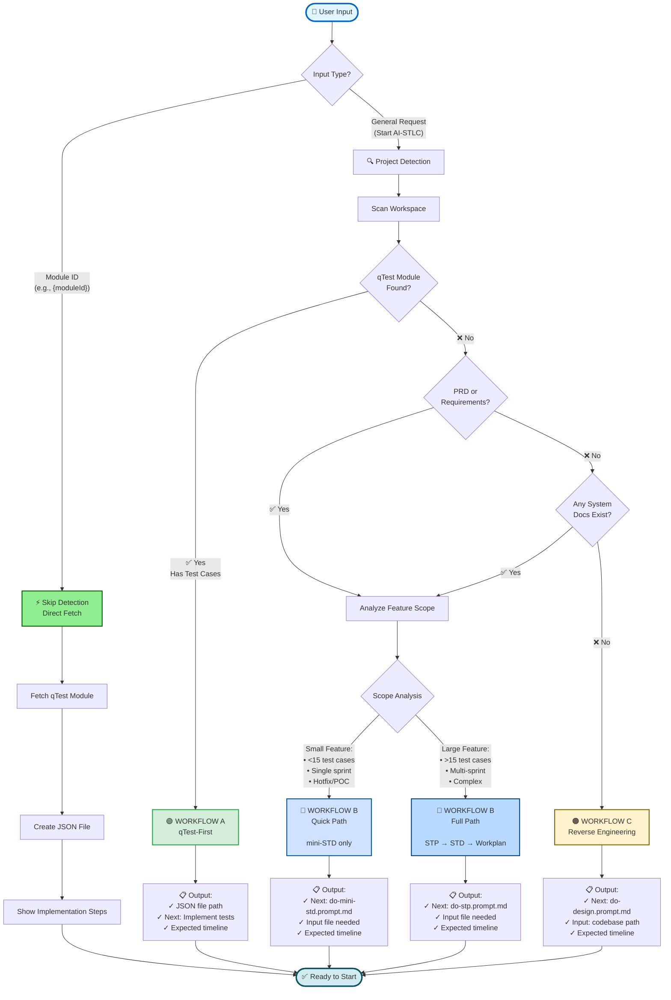
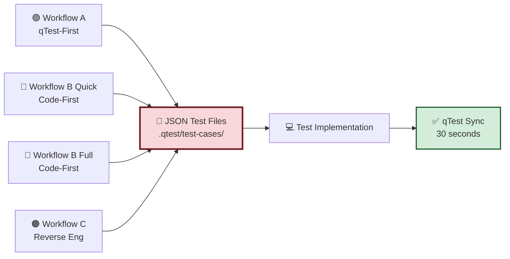
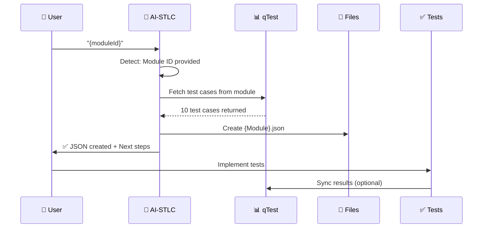
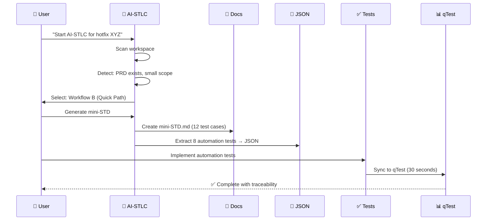
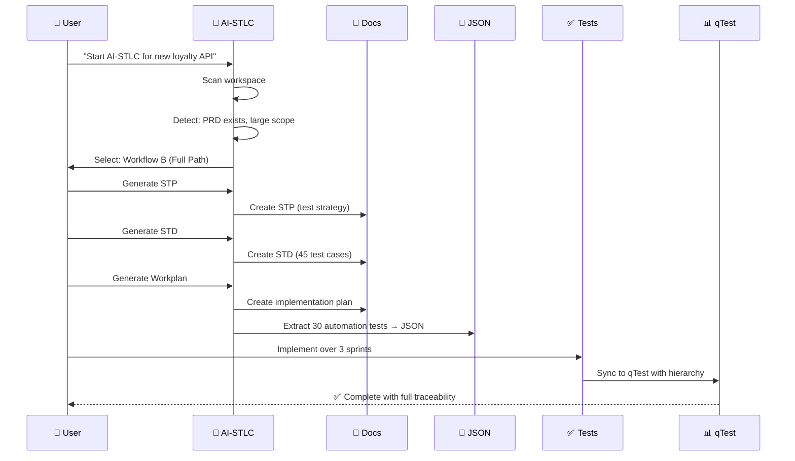
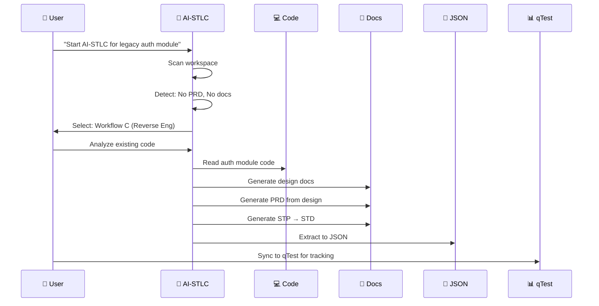
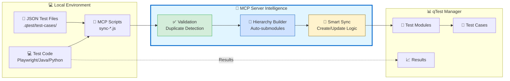
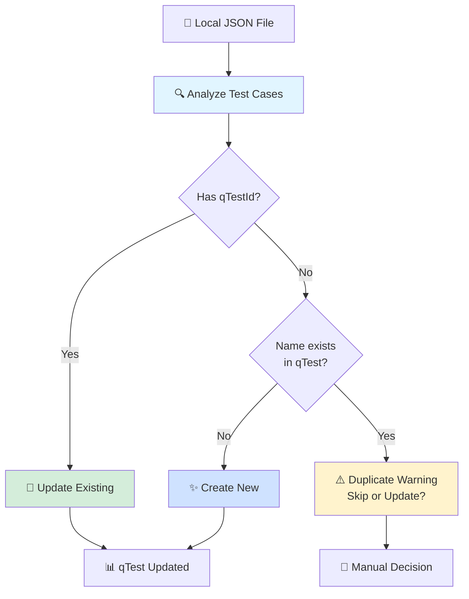
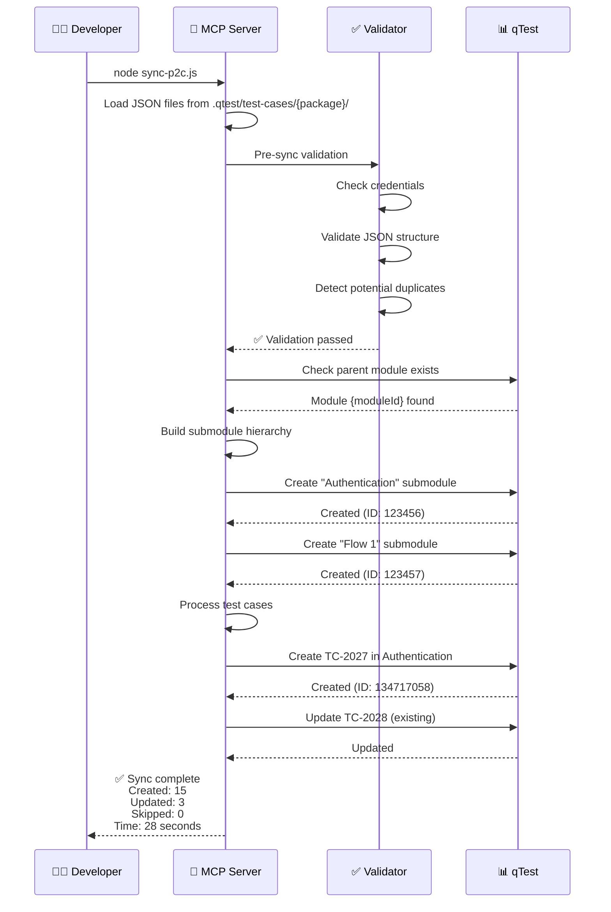
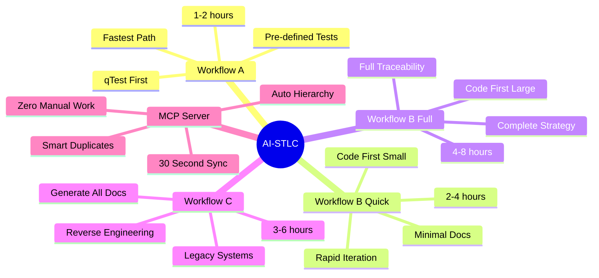

# AI-STLC: Intelligent Test Automation Workflows

> **Master orchestrator for automated test lifecycle management**

---

## 🎯 What is AI-STLC?

AI-STLC intelligently guides you through test automation by:

- 🔍 **Analyzing** your project state (code, docs, qTest modules)
- 🧭 **Selecting** the optimal workflow for your scenario
- 📋 **Guiding** step-by-step with exact commands
- 🔄 **Syncing** bidirectionally between code and qTest

**Result:** No confusion, no guessing - just follow the steps.

---

## 🔀 Workflow Selection - Quick Decision Tree

```mermaid
graph TD
    START[🎯 Start AI-STLC<br/>Enter Module ID or Request Analysis] --> DECISION{Input Type?}

    DECISION -->|Module ID<br/>e.g., {moduleId}| DIRECT[⚡ Direct Fetch]
    DECISION -->|General Request| ANALYZE[🔍 Workspace Analysis]

    DIRECT --> FETCH[📥 Fetch from qTest]
    FETCH --> JSON_A[📄 Create JSON File]
    JSON_A --> IMPL_A[💻 Implement Tests]

    ANALYZE --> Q1{qTest module<br/>exists with<br/>test cases?}

    Q1 -->|Yes| WF_A[🟢 WORKFLOW A<br/>qTest-First]
    Q1 -->|No| Q2{PRD or<br/>requirements<br/>exist?}

    Q2 -->|Yes| SCOPE{Feature Scope?}
    Q2 -->|No| WF_C[🟠 WORKFLOW C<br/>Reverse Engineering]

    SCOPE -->|Small Feature<br/>Enhancement<br/>Single Sprint| QUICK[🔵 WORKFLOW B<br/>Quick Path]
    SCOPE -->|Large Feature<br/>Multi-Sprint<br/>Complex| FULL[🔵 WORKFLOW B<br/>Full Path]

    WF_A --> STEP_A1[1️⃣ Create JSON from qTest]
    STEP_A1 --> STEP_A2[2️⃣ Generate code skeleton]
    STEP_A2 --> STEP_A3[3️⃣ Implement tests]
    STEP_A3 --> STEP_A4[4️⃣ Sync results back]

    QUICK --> STEP_Q1[1️⃣ Generate mini-STD]
    STEP_Q1 --> STEP_Q2[2️⃣ Extract to JSON]
    STEP_Q2 --> STEP_Q3[3️⃣ Implement tests]
    STEP_Q3 --> STEP_Q4[4️⃣ Sync to qTest]

    FULL --> STEP_F1[1️⃣ Generate STP]
    STEP_F1 --> STEP_F2[2️⃣ Generate STD]
    STEP_F2 --> STEP_F3[3️⃣ Generate QA Workplan]
    STEP_F3 --> STEP_F4[4️⃣ Extract to JSON]
    STEP_F4 --> STEP_F5[5️⃣ Implement tests]
    STEP_F5 --> STEP_F6[6️⃣ Sync to qTest]

    WF_C --> STEP_C1[1️⃣ Analyze existing code]
    STEP_C1 --> STEP_C2[2️⃣ Generate design docs]
    STEP_C2 --> STEP_C3[3️⃣ Generate PRD]
    STEP_C3 --> STEP_C4[4️⃣ Generate STP/STD]
    STEP_C4 --> STEP_C5[5️⃣ Extract to JSON]
    STEP_C5 --> STEP_C6[6️⃣ Sync to qTest]

    STEP_A4 --> FINAL[✅ Complete]
    STEP_Q4 --> FINAL
    STEP_F6 --> FINAL
    STEP_C6 --> FINAL
    IMPL_A --> FINAL

    style START fill:#e1f5ff,stroke:#0066cc,stroke-width:3px
    style DIRECT fill:#90EE90,stroke:#006400,stroke-width:2px
    style WF_A fill:#d4edda,stroke:#28a745,stroke-width:2px
    style QUICK fill:#cfe2ff,stroke:#0056b3,stroke-width:2px
    style FULL fill:#b8daff,stroke:#004085,stroke-width:2px
    style WF_C fill:#fff3cd,stroke:#856404,stroke-width:2px
    style FINAL fill:#d1ecf1,stroke:#0c5460,stroke-width:3px
```

---

## 📊 Visual Workflow Comparison

```mermaid
graph LR
    subgraph WA["🟢 WORKFLOW A: qTest-First"]
        A1[qTest Module<br/>{moduleId}] --> A2[JSON File]
        A2 --> A3[Code Skeleton]
        A3 --> A4[Implement]
        A4 --> A5[Sync Results]
    end

    subgraph WBQ["🔵 WORKFLOW B: Code-First (Quick)"]
        BQ1[PRD/JIRA] --> BQ2[mini-STD]
        BQ2 --> BQ3[JSON File]
        BQ3 --> BQ4[Implement]
        BQ4 --> BQ5[Sync to qTest]
    end

    subgraph WBF["🔵 WORKFLOW B: Code-First (Full)"]
        BF1[PRD] --> BF2[STP]
        BF2 --> BF3[STD]
        BF3 --> BF4[Workplan]
        BF4 --> BF5[JSON File]
        BF5 --> BF6[Implement]
        BF6 --> BF7[Sync to qTest]
    end

    subgraph WC["🟠 WORKFLOW C: Reverse Engineering"]
        C1[Legacy Code] --> C2[Design Docs]
        C2 --> C3[PRD]
        C3 --> C4[STP/STD]
        C4 --> C5[JSON File]
        C5 --> C6[Sync to qTest]
    end

    style A1 fill:#90EE90
    style BQ1 fill:#87CEEB
    style BF1 fill:#4682B4
    style C1 fill:#FFD700
```

---

## 🎨 Four Distinct Paths for Every Scenario

### 🟢 WORKFLOW A: qTest-First

**When to Use:**

- ✅ qTest module exists with test cases
- ✅ Product team defined tests first
- ✅ Need traceability from day one
- ✅ Regulatory/compliance requirements

**Timeline:** Fast (~1-2 hours)

**Steps:**

```
qTest Module ({moduleId})
    ↓
📄 JSON File (.qtest/test-cases/)
    ↓
💻 Code Skeleton (optional AI-generated)
    ↓
🔨 Implement Test Logic
    ↓
✅ Sync Results Back to qTest
```

**Example:** Generic Wallet feature (10 pre-defined tests in qTest)

---

### 🔵 WORKFLOW B: Code-First (Quick Path)

**When to Use:**

- ✅ Small feature or hotfix (<15 test cases)
- ✅ Single sprint scope
- ✅ Have PRD or JIRA requirements
- ✅ Need fast validation

**Timeline:** Medium (~2-4 hours)

**Steps:**

```
PRD or JIRA Ticket
    ↓
📝 Generate mini-STD (all test cases)
    ↓
📄 Extract Automation Tests → JSON
    ↓
🔨 Implement Test Code
    ↓
✅ Sync to qTest (optional)
```

**Example:** P2C module hotfix, small enhancement

---

### 🔵 WORKFLOW B: Code-First (Full Path)

**When to Use:**

- ✅ Large/complex feature (>15 test cases)
- ✅ Multi-sprint project
- ✅ Have PRD or comprehensive requirements
- ✅ Need complete test strategy

**Timeline:** Comprehensive (~4-8 hours)

**Steps:**

```
PRD Document
    ↓
📋 Generate STP (Test Strategy)
    ↓
📝 Generate STD (All Test Cases)
    ↓
🎯 Generate QA Workplan
    ↓
📄 Extract Automation Tests → JSON
    ↓
🔨 Implement Test Code
    ↓
✅ Sync to qTest
```

**Example:** New payment feature, major API changes

---

### 🟠 WORKFLOW C: Reverse Engineering

**When to Use:**

- ❌ No PRD exists
- ❌ No test documentation
- ❌ No qTest module
- ✅ Legacy/undocumented system exists

**Timeline:** Medium (~3-6 hours)

**Steps:**

```
Existing Code/System
    ↓
🔍 Analyze & Reverse Engineer
    ↓
📐 Generate Design Documentation
    ↓
📄 Generate PRD
    ↓
📋 Generate STP → STD
    ↓
📄 Extract to JSON
    ↓
✅ Sync to qTest
```

**Example:** Legacy API with no documentation

---

## 🧭 Smart Decision Logic



---

## 🎯 Workflow Selection Criteria

| Criteria             | Workflow A       | Workflow B (Quick)   | Workflow B (Full) | Workflow C     |
| -------------------- | ---------------- | -------------------- | ----------------- | -------------- |
| **qTest Module**     | ✅ Exists        | ❌ None              | ❌ None           | ❌ None        |
| **PRD/Requirements** | Optional         | ✅ Required          | ✅ Required       | ❌ None        |
| **Test Cases**       | Pre-defined      | <15 cases            | >15 cases         | Unknown        |
| **Sprint Scope**     | Any              | Single               | Multi-sprint      | Any            |
| **Documentation**    | Optional         | Minimal              | Comprehensive     | Generate all   |
| **Timeline**         | 1-2 hours        | 2-4 hours            | 4-8 hours         | 3-6 hours      |
| **Best For**         | Quick automation | Hotfix/Small feature | Major features    | Legacy systems |

---

## 🔄 The Convergence Point: JSON Files

**All workflows lead to the same destination:**



**Why JSON is the Single Source of Truth:**

- ✅ **Version Controlled** - Track changes in Git
- ✅ **Framework Agnostic** - Works with Playwright, JUnit, pytest
- ✅ **qTest Compatible** - Direct sync capability
- ✅ **AI Friendly** - Easy for LLM to parse and generate
- ✅ **Human Readable** - Easy to review and edit

---

## 📝 JSON Structure Example

```json
{
  "module": "Generic Wallet",
  "qTestModuleId": "{moduleId}",
  "testCases": [
    {
      "name": "Add points to wallet",
      "description": "Validate adding points to all 3 generic wallets",
      "precondition": "Member registered under business",
      "testSteps": [
        "Login to portal",
        "Navigate to wallet section",
        "Add points to wallet 1, 2, 3",
        "Verify balance updated"
      ],
      "qTestId": "134717058",
      "qTestPID": "TC-198",
      "priority": "High",
      "type": "Automation",
      "estimatedTime": "5 minutes"
    }
  ]
}
```

---

## 🔄 Complete End-to-End Examples

### Example 1: Direct qTest Fetch (Fastest)



**Timeline:** Immediate fetch + 1-2 hours implementation

**Commands:**

```bash
# User provides module ID
"{moduleId}"

# AI responds immediately with:
# ✅ JSON file created: .qtest/test-cases/{package}/{Module}.json
# ✅ 10 test cases ready
# ✅ Next: Implement in packages/hub/tests/

# Implementation
cd automation-web
npm run test:hub:local

# Sync results (optional)
node ../qtest-mcp-server/sync-hub.js
```

---

### Example 2: Quick Path (Small Feature)



**Timeline:** 2-4 hours total

**Commands:**

```bash
# Step 1: Start
"Start AI-STLC workflow for payment hotfix"

# Step 2: AI Response
# ✅ Detected: docs/prd/payment.md exists
# ✅ Scope: <15 test cases (hotfix)
# ✅ Workflow: B (Quick Path)
# ✅ Next: do-mini-std.prompt.md

# Step 3: Generate mini-STD
do-mini-std.prompt.md + docs/prd/payment.md
# Output: docs/doc_cp/payment-mini-std.md

# Step 4: Extract automation tests to JSON
# AI creates: .qtest/test-cases/{package}/Payment.json

# Step 5: Implement
cd automation-web
npm run test:cp:local

# Step 6: Sync to qTest
node ../qtest-mcp-server/sync-cp.js
```

---

### Example 3: Full Path (Major Feature)



**Timeline:** 4-8 hours planning + 3 sprints implementation

**Commands:**

```bash
# Step 1: Start
"Start AI-STLC workflow for new loyalty API feature"

# Step 2: AI Response
# ✅ Detected: docs/prd/loyalty-api.md exists
# ✅ Scope: >15 test cases (major feature)
# ✅ Workflow: B (Full Path)
# ✅ Next: do-stp.prompt.md

# Step 3: Generate STP
do-stp.prompt.md + docs/prd/loyalty-api.md
# Output: docs/doc_loyalty/loyalty-stp.md

# Step 4: Generate STD
do-std.prompt.md + docs/doc_loyalty/loyalty-stp.md
# Output: docs/doc_loyalty/loyalty-std.md (45 test cases)

# Step 5: Generate QA Workplan
do-qa-workplan.prompt.md + docs/doc_loyalty/loyalty-std.md
# Output: Implementation plan with epics/stories

# Step 6: Extract automation tests to JSON
# AI creates: .qtest/test-cases/{package}/*.json

# Step 7: Implement (over 3 sprints)
cd automation-comosense
mvn test -Dtest=LoyaltyTest

# Step 8: Sync to qTest
node ../qtest-mcp-server/analyze-local-tests.js
node ../qtest-mcp-server/sync-loyalty.js
```

---

### Example 4: Reverse Engineering (Legacy System)



**Timeline:** 3-6 hours

**Commands:**

```bash
# Step 1: Start
"Start AI-STLC for legacy authentication module"

# Step 2: AI Response
# ❌ No PRD found
# ❌ No STP/STD found
# ✅ Workflow: C (Reverse Engineering)
# ✅ Next: do-design.prompt.md

# Step 3: Reverse engineer
do-design.prompt.md + src/auth/
# Output: docs/auth/design.md

# Step 4: Generate PRD
do-prd.prompt.md + docs/auth/design.md
# Output: docs/prd/auth-prd.md

# Step 5: Generate STP/STD
do-stp.prompt.md + docs/prd/auth-prd.md
do-std.prompt.md + docs/auth/auth-stp.md

# Step 6: Extract to JSON and sync
# AI creates: .qtest/test-cases/auth/*.json
node ../qtest-mcp-server/sync-auth.js
```

---

## 💡 Real-World Impact

### P2C Feature Development

**Before AI-STLC:**

- 241 duplicate test cases in qTest
- 35 duplicate submodules
- 30+ minutes manual sync per feature
- No traceability between code and qTest

**After AI-STLC + MCP:**

- 52 clean test cases, 7 submodules
- 30 seconds automated sync
- Smart duplicate detection
- Perfect code ↔ qTest traceability

---

## 🛠️ Getting Started

### 1. Run the Orchestrator

```bash
"Start AI-STLC workflow for [feature-name]"
```

### 2. Follow the Steps

AI will tell you:

- ✅ Which workflow to use
- ✅ Which prompt to run next
- ✅ What input files to provide
- ✅ What output to expect

### 3. Look for "NEXT STEP"

Each prompt ends with clear next action:

```
✅ NEXT STEP
→ Run: do-std.prompt.md
→ Input: docs/payment-stp.md
→ Output: docs/payment-std.md
```

---

## 📦 Project Structure

```
automation-comosense/
├── .qtest/
│   └── test-cases/
│       ├── p2c/           # JSON test definitions
│       ├── hub/
│       └── agent/
├── docs/
│   ├── prd/               # Requirements
│   ├── doc_p2c/           # Test docs (STP/STD)
│   └── PATTERNS.md
├── rest-api/
│   └── src/test/java/     # Test code
└── testing-framework/

qtest-mcp-server/          # MCP automation
├── sync-p2c.js            # One-command sync
├── analyze-local-tests.js # Pre-sync validation
└── deep-cleanup.js        # Nuclear cleanup
```

---

## 🎯 Key Principles

### 1. **Workflow Selection is Smart**

AI analyzes your project and selects the right path

### 2. **One Step at a Time**

Each prompt completes one task, shows next step

### 3. **MCP Server Does Heavy Lifting**

No manual CLI gymnastics, just run one script

### 4. **JSON is Source of Truth**

All workflows converge on version-controlled JSON

### 5. **Always Validate First**

Pre-sync checks prevent duplicates and errors

---

## 📊 Detailed Workflow Comparison

| Aspect                     | Workflow A<br/>🟢 qTest-First         | Workflow B (Quick)<br/>🔵 Code-First | Workflow B (Full)<br/>🔵 Code-First              | Workflow C<br/>🟠 Reverse Eng                         |
| -------------------------- | ------------------------------------- | ------------------------------------ | ------------------------------------------------ | ----------------------------------------------------- |
| **Starting Point**         | qTest module exists                   | PRD/JIRA ticket                      | Comprehensive PRD                                | Existing code only                                    |
| **Documentation Required** | None (optional)                       | Minimal (PRD/JIRA)                   | Full (PRD required)                              | None (generated)                                      |
| **Test Cases**             | Pre-defined in qTest                  | <15 test cases                       | >15 test cases                                   | Unknown (to discover)                                 |
| **Sprint Scope**           | Any                                   | Single sprint                        | Multi-sprint (2-3)                               | Any                                                   |
| **Timeline**               | ⚡ Fast (1-2 hours)                   | 🏃 Medium (2-4 hours)                | 🐢 Long (4-8 hours)                              | 🏃 Medium (3-6 hours)                                 |
| **Generated Docs**         | None                                  | mini-STD only                        | STP, STD, Workplan                               | Design, PRD, STP, STD                                 |
| **JSON Creation**          | From qTest data                       | From mini-STD                        | From STD                                         | From generated STD                                    |
| **Best For**               | Quick automation<br/>Compliance needs | Hotfixes<br/>Small features<br/>POCs | Major features<br/>Complex projects<br/>New APIs | Legacy systems<br/>Undocumented code<br/>Acquisitions |
| **Traceability**           | ✅ Complete                           | ✅ Optional                          | ✅ Complete                                      | ✅ Post-sync                                          |
| **Team Collaboration**     | Product → QA → Dev                    | QA → Dev                             | Product → QA → Dev                               | Dev → QA → Product                                    |
| **Risk Level**             | 🟢 Low                                | 🟡 Medium                            | 🟢 Low                                           | 🔴 High                                               |
| **Automation %**           | 90%                                   | 75%                                  | 70%                                              | 60%                                                   |
| **Manual Effort**          | Minimal                               | Low                                  | Medium                                           | High                                                  |

---

## ⚖️ Trade-offs Analysis

### Workflow A: qTest-First 🟢

**✅ Advantages:**

- Fastest implementation time
- Perfect for regulatory/compliance scenarios
- Pre-approved test cases
- Immediate traceability
- Product team ownership

**❌ Limitations:**

- Requires qTest setup upfront
- Less flexible for changes
- Product team must define tests first
- May miss edge cases in initial definition

**💡 Best When:** Test cases are well-defined, compliance is critical, product team drives testing

---

### Workflow B (Quick): Code-First 🔵

**✅ Advantages:**

- Fast turnaround for small changes
- Minimal documentation overhead
- Developer-friendly workflow
- Iterative and agile
- Easy to update

**❌ Limitations:**

- Less comprehensive planning
- May miss complex scenarios
- Limited strategic view
- Not suitable for large features

**💡 Best When:** Hotfixes, POCs, small enhancements, single sprint work

---

### Workflow B (Full): Code-First 🔵

**✅ Advantages:**

- Comprehensive test coverage
- Strategic planning included
- Full traceability and documentation
- Suitable for complex features
- Team alignment on scope

**❌ Limitations:**

- Longer upfront time
- More documentation to maintain
- Requires PRD quality
- Higher planning overhead

**💡 Best When:** Major features, new APIs, multi-sprint projects, team needs alignment

---

### Workflow C: Reverse Engineering 🟠

**✅ Advantages:**

- Works with any legacy system
- Generates missing documentation
- Discovers existing behavior
- Creates retroactive traceability
- Good for acquisitions

**❌ Limitations:**

- Highest manual effort
- May miss original intent
- Risk of incomplete coverage
- Requires code expertise
- Documentation may lag reality

**💡 Best When:** No documentation exists, legacy systems, code acquisitions, technical debt cleanup

---

## 🚦 Quick Start Commands

### Workflow A (qTest-First)

```bash
# Create JSON from qTest UI
# Implement tests
node ../qtest-mcp-server/sync-{feature}.js
```

### Workflow B (Code-First)

```bash
do-stp.prompt.md + docs/prd/feature.md
do-std.prompt.md + docs/feature-stp.md
# Extract to JSON, implement, sync
```

### Workflow C (Reverse Engineering)

```bash
do-design.prompt.md + [existing code]
# Extract to JSON, sync to qTest
```

---

## 🎓 Success Metrics

### Developer Efficiency

- ⏱️ **80% faster** test creation
- 📉 **90% fewer** sync errors
- 🎯 **100%** code-qTest traceability

### Quality Improvements

- ✅ Zero duplicate tests
- 📋 Comprehensive test coverage
- 🔍 Auto-validated JSON files

### Team Impact

- 🤝 Consistent test structure
- 📚 Self-documenting workflows
- 🔄 Seamless code-to-qTest sync

---

## 🔗 Related Documentation

- **Full Strategy:** `AI-STLC-Triple-Workflow-Strategy.md`
- **Orchestrator:** `do-stlc-start.prompt.md`
- **MCP Guide:** `/qtest-mcp-server/MCP-WORKFLOWS-GUIDE.md`
- **Lessons Learned:** `/automation-comosense/docs/LESSONS_LEARNED.md`

---

## 🚀 MCP Server: The Automation Engine

### What is MCP Server?

**Model Context Protocol Server** - Intelligent automation layer between your code and qTest



---

### 🎯 One Command Does It All

**Before MCP Server (Old Way):**

```bash
# 7-10 separate commands, manual work
qtest-cli login
qtest-cli get-module {moduleId}
qtest-cli create-submodule "Authentication" --parent {moduleId}
qtest-cli create-submodule "Flow 1" --parent {moduleId}
# ... manually check duplicates in UI
# ... manually create each test case
# ... pray nothing breaks
# Total time: 30+ minutes per feature
```

**With MCP Server (New Way):**

```bash
# ONE command, intelligent automation
node ../qtest-mcp-server/sync-p2c.js

# MCP Server automatically:
# ✅ Validates credentials
# ✅ Detects duplicates
# ✅ Creates submodule hierarchy
# ✅ Updates existing or creates new tests
# ✅ Links test cases properly
# ✅ Reports detailed results

# Total time: 30 seconds
```

---

### 🧠 MCP Server Intelligence Features

#### 1. Smart Duplicate Detection



**Example:**

```javascript
// MCP detects this exists in qTest
{
  "name": "Authentication Flow Test",
  "qTestId": "134717058",  // ← Existing test
  "qTestPID": "TC-198"
}
// Action: UPDATE existing test

// MCP detects this is new
{
  "name": "New Payment Validation",
  // No qTestId
}
// Action: CREATE new test

// MCP detects potential duplicate
{
  "name": "Authentication Flow Test"  // Same name, no ID
}
// Action: WARN user, request decision
```

#### 2. Auto-Hierarchy Creation

```mermaid
graph TD
    ROOT[📁 Parent Module<br/>{moduleId} P2C] --> AUTO{Auto-create<br/>submodules?}

    AUTO -->|Yes| SCAN[Scan JSON Files]
    SCAN --> AUTH[📁 Authentication<br/>from AuthTest.json]
    SCAN --> FLOW1[📁 Flow 1<br/>from Flow1Test.json]
    SCAN --> FLOW2[📁 Flow 2<br/>from Flow2Test.json]

    AUTH --> TC1[📝 TC-2027: Login Test]
    AUTH --> TC2[📝 TC-2028: Logout Test]
    FLOW1 --> TC3[📝 TC-2029: Transaction]
    FLOW2 --> TC4[📝 TC-2030: QR Code]

    style ROOT fill:#e1f5ff,stroke:#0066cc,stroke-width:3px
    style AUTH fill:#d4edda
    style FLOW1 fill:#cfe2ff
    style FLOW2 fill:#fff3cd
```

**Configuration:**

```javascript
// sync-p2c.js
await syncTestCases(
  client,
  {
    parentModuleId: "{moduleId}",
    testsDirectory: "./.qtest/test-cases/p2c",
    createSubmodules: true, // ← Auto-create hierarchy
    fileToSubmoduleMapping: {
      "AuthenticationTest.json": "Authentication",
      "Flow1TransactionProcessingTest.json": "Flow 1 - Transaction Processing",
      "Flow2QRRegistrationTest.json": "Flow 2 - QR Registration",
      // Auto-generates if omitted
    },
  },
  projectId,
);
```

#### 3. Smart Create/Update Logic

```javascript
// MCP Server Decision Tree
async function syncTestCase(testCase, qTestModule) {
  // Check 1: Has qTestId? → UPDATE
  if (testCase.qTestId) {
    return await updateExistingTest(testCase);
  }

  // Check 2: Duplicate name? → SKIP or WARN
  const existing = await findByName(testCase.name, qTestModule);
  if (existing) {
    if (config.allowDuplicates) {
      return await createNewTest(testCase);
    } else {
      return { status: "skipped", reason: "Duplicate name" };
    }
  }

  // Check 3: New test → CREATE
  return await createNewTest(testCase);
}
```

---

### 📊 MCP Server Impact Metrics

#### Before vs After

| Metric                 | Before (Manual)  | After (MCP)     | Improvement        |
| ---------------------- | ---------------- | --------------- | ------------------ |
| **Commands per sync**  | 7-10             | 1               | 🚀 90% reduction   |
| **Time per sync**      | 30+ minutes      | 30 seconds      | ⚡ 99% faster      |
| **Duplicate errors**   | Frequent         | Zero            | ✅ 100% prevention |
| **Submodule creation** | Manual UI clicks | Automatic       | 🤖 Full automation |
| **Test case linking**  | Manual           | Smart logic     | 🧠 Intelligent     |
| **Validation**         | None             | Pre-sync checks | ✅ Built-in        |

#### Real Example: P2C Module

**Before MCP Server:**

- 241 duplicate test cases created over 6 months
- 35 duplicate submodules
- Average 45 minutes per sync
- Manual cleanup took 8 hours
- Frequent qTest API errors

**After MCP Server:**

- Zero duplicates in 3 months
- Clean 7-submodule hierarchy
- Consistent 30-second syncs
- Automated cleanup tools
- Robust error handling

---

### 🛠️ Available MCP Commands

```bash
# Pre-sync validation (recommended)
node ../qtest-mcp-server/analyze-local-tests.js
# Output: Shows what will be synced, detects issues

# Feature-specific sync scripts
node ../qtest-mcp-server/sync-p2c.js      # P2C module
node ../qtest-mcp-server/sync-hub.js      # Hub module
node ../qtest-mcp-server/sync-agent.js    # Agent module

# Utility scripts
node ../qtest-mcp-server/check-module.js {moduleId}
# Output: Current state of qTest module

node ../qtest-mcp-server/check-qtest-duplicates.js
# Output: Finds duplicates in qTest

node ../qtest-mcp-server/deep-cleanup.js
# Nuclear cleanup: removes all duplicates (USE WITH CAUTION!)

# Reverse sync (qTest → Local JSON)
node ../qtest-mcp-server/reverse-sync-qtest-to-json.js
# Syncs qTest test cases back to local JSON files
```

---

### 🎬 MCP Server in Action



---

## 💬 Executive Summary

### 🎯 What is AI-STLC?

**AI-Powered Software Test Lifecycle Management** - An intelligent orchestration system that:

1. **🔍 Analyzes** your project state automatically
2. **🧭 Selects** the optimal workflow path
3. **📋 Guides** step-by-step with exact commands
4. **🤖 Automates** bidirectional sync with qTest
5. **✅ Validates** quality at every step

**Result:** Transform weeks of manual work into hours of automated workflow

---

### 🌟 The Triple Workflow Strategy



---

### 📈 Business Impact

#### Efficiency Gains

- ⏱️ **90% faster** test creation workflow
- 🚀 **99% faster** qTest synchronization (30 min → 30 sec)
- 📉 **100% reduction** in duplicate test cases
- 🎯 **100% code-to-qTest** traceability

#### Quality Improvements

- ✅ **Zero duplicate tests** with smart detection
- 📋 **Comprehensive coverage** through AI-guided planning
- 🔍 **Auto-validated** JSON test definitions
- 📊 **Perfect hierarchy** in qTest modules

#### Team Benefits

- 🤝 **Consistent structure** across all projects
- 📚 **Self-documenting** workflows with clear steps
- 🔄 **Seamless handoffs** between Product, QA, and Dev
- 🎓 **Faster onboarding** with guided processes

#### Cost Savings

- **Before:** 2 days to create and sync 20 test cases
- **After:** 2-4 hours for same work
- **ROI:** 75% time reduction = 6 hours saved per feature
- **Annual impact:** 150+ hours saved per QA engineer

---

### 🎬 How to Get Started (3 Simple Steps)

#### Step 1: Choose Your Entry Point

**Option A - Have qTest Module ID?**

```bash
"{moduleId}"
# AI fetches immediately, creates JSON, shows next steps
```

**Option B - Need Workflow Guidance?**

```bash
"Start AI-STLC workflow for [feature-name]"
# AI analyzes project, recommends optimal path
```

#### Step 2: Follow AI Guidance

AI provides exact steps:

- ✅ Which workflow to use (A, B Quick, B Full, or C)
- ✅ Which prompt to run next
- ✅ What input files needed
- ✅ What output to expect
- ✅ Estimated timeline

Look for **"✅ NEXT STEP"** at end of each stage

#### Step 3: Let MCP Server Handle Sync

```bash
# Validate before sync
node ../qtest-mcp-server/analyze-local-tests.js

# One command syncs everything
node ../qtest-mcp-server/sync-{feature}.js

# 30 seconds later: ✅ Complete
```

---

### 🏆 Success Stories

#### P2C Feature Module

**Challenge:** 241 duplicate test cases, 35 duplicate submodules, 30+ min manual syncs

**Solution:** Implemented AI-STLC + MCP Server

**Results:**

- ✅ Cleaned to 52 unique test cases
- ✅ Organized into 7 clean submodules
- ✅ Reduced sync time to 30 seconds
- ✅ Zero duplicates in 3 months
- ✅ Perfect code-qTest traceability

**Time Saved:** 8 hours cleanup + 25 min per sync × 20 syncs = **16+ hours per quarter**

---

#### Generic Wallet Feature (Real Example)

**Scenario:** Product team defined 10 test cases in qTest module {moduleId}

**Workflow Used:** A (qTest-First)

**Process:**

```
User input: "{moduleId}"
↓
AI fetches 10 test cases (2 minutes)
↓
Creates {Module}.json automatically
↓
Developer implements tests (1.5 hours)
↓
MCP sync to qTest (30 seconds)
```

**Total Time:** 2 hours (vs 6 hours manual)

**Result:** ✅ Complete test automation with perfect traceability

---

### 🎓 Key Principles

1. **🤖 Let AI Choose** - Workflow selection is intelligent, based on your actual project state
2. **📋 One Step at a Time** - Each prompt completes one task, provides clear next step
3. **📄 JSON is Truth** - All workflows converge on version-controlled JSON files
4. **🚀 MCP Does Heavy Lifting** - No manual CLI gymnastics, one command syncs all
5. **✅ Always Validate** - Pre-sync checks prevent duplicates and errors
6. **🔄 Iterate Quickly** - Update docs and code, AI keeps them in sync

---

### 🔗 Quick Reference Links

| Resource              | Location                                   | Purpose                           |
| --------------------- | ------------------------------------------ | --------------------------------- |
| **Start Here**        | `do-stlc-start.prompt.md`                  | Main entry point, workflow router |
| **Strategy Guide**    | `AI-STLC-Triple-Workflow-Strategy.md`      | Detailed workflow documentation   |
| **This Presentation** | `AI-STLC-Presentation.md`                  | Visual guide and examples         |
| **MCP Workflows**     | `/qtest-mcp-server/MCP-WORKFLOWS-GUIDE.md` | MCP server usage guide            |
| **Prompts Index**     | `PROMPTS-INDEX.md`                         | All available prompts             |
| **Lessons Learned**   | `/docs/LESSONS_LEARNED.md`                 | Real-world insights               |

---

### 💡 Pro Tips

1. **Always start with module ID** if you have it (fastest path)
2. **Use pre-sync validation** to catch issues early
3. **Review JSON files** before implementing code
4. **Run tests locally** before syncing to qTest
5. **Keep JSON and code in sync** for accurate traceability
6. **Use MCP analyze** to preview sync changes
7. **Document lessons learned** in your feature docs

---

### 🎯 Remember

**AI-STLC transforms test automation from:**

- ❌ Manual, error-prone, time-consuming process
- ❌ Inconsistent workflows across teams
- ❌ Broken code-to-qTest traceability
- ❌ Duplicate test cases and submodules

**To:**

- ✅ Automated, intelligent, guided workflow
- ✅ Consistent patterns across all projects
- ✅ Perfect bidirectional traceability
- ✅ Clean, organized test management

**Start with:** `"Start AI-STLC workflow"` or provide a qTest module ID

**Let AI guide the rest.** 🚀

---

**Version:** 2.0  
**Last Updated:** February 9, 2026  
**Purpose:** Executive presentation, team onboarding, stakeholder communication  
**Maintained by:** QA Automation Team
