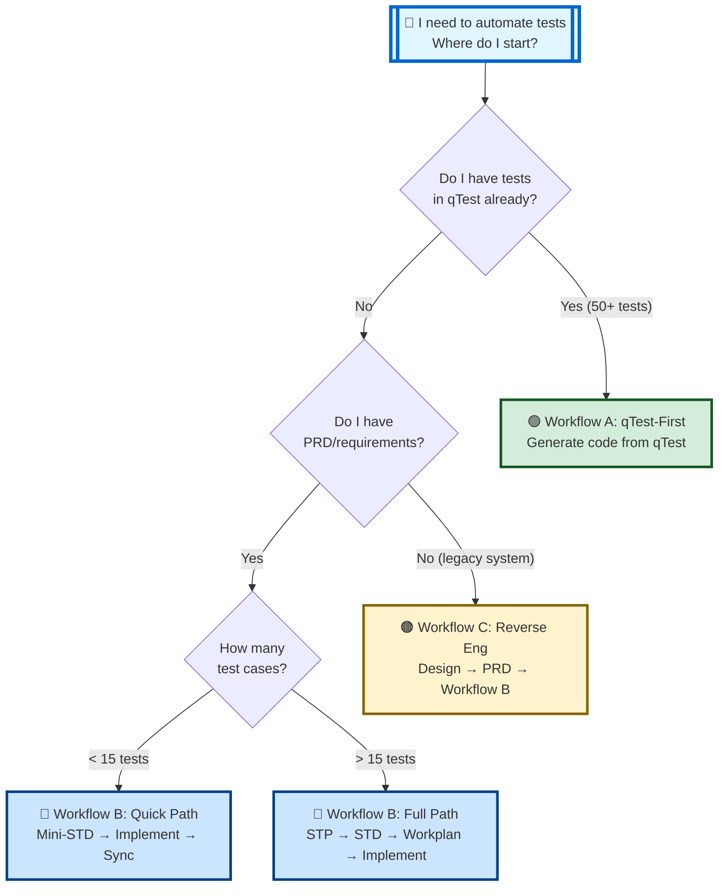

# AI-STLC Quick Start Guide
## 5-Minute Decision Tree & Command Reference

> **Purpose:** Ultra-fast entry point to AI-STLC workflows  
> **Read Time:** 5 minutes  
> **Last Updated:** February 15, 2026

---

## 🎯 Start Here: Which File Do I Need?

| Your Situation | Read This | Time |
|----------------|-----------|------|
| 📖 **"I'm brand new to AI-STLC"** | This file (you're here!) | 5 min |
| 🛠️ **"I need step-by-step commands"** | [AI-STLC-IMPLEMENTATION-GUIDE.md](AI-STLC-IMPLEMENTATION-GUIDE.md) | 15 min |
| 🗺️ **"Show me the visual structure"** | [AI-STLC-ORGANIZATION.md](AI-STLC-ORGANIZATION.md) | 10 min |
| 📘 **"I need strategic overview / ROI"** | [AI-STLC-Triple-Workflow-Strategy.md](AI-STLC-Triple-Workflow-Strategy.md) | 60 min |
| 📝 **"What changed in the refactor?"** | [AI-STLC-REFACTORING-SUMMARY.md](AI-STLC-REFACTORING-SUMMARY.md) | 5 min |

---

## 🌳 Quick Decision Tree



---

## ⚡ Workflow Commands At-a-Glance

### 🟢 Workflow A: qTest-First (Tests Already in qTest)

```bash
# ✅ JSON already has qTestPID: "TC-2415" from qTest
# ✅ Use @QTestCase("TC-2415") during implementation

# 1. Generate code from qTest
"Start AI-STLC workflow with module ID: {moduleId}"

# 2. Implement tests (JSON has qTestPID)
# Use @QTestCase("TC-2415") from JSON

# 3. Run tests
mvn test  # or npm test

# 4. Sync results back to qTest (optional)
qtest sync --module {moduleId}
```

**@QTestCase Pattern:** `@QTestCase("TC-2415")` ← Use TC from JSON immediately

---

### 🔵 Workflow B: Code-First (New Feature with PRD)

#### Quick Path (< 15 tests)

```bash
# ✅ Use @QTestCase("") empty - no TC numbers yet

# 1. Generate mini-STD
"Generate mini-STD from docs/prd/feature.md using do-mini-std.prompt.md"

# 2. Extract JSON
# Creates .qtest/test-cases/{package}/Feature.json

# 3. Implement tests with @QTestCase("")
mvn test  # Verify all pass

# 4. Sync to qTest (creates TC-XXXX)
cd /path/to/qtest-mcp-server
node sync-p2c.js

# 5. Reverse sync (fetch TC numbers into JSON)
node reverse-sync-qtest-to-json.js

# 6. Update @QTestCase("") → @QTestCase("TC-2415")
# Use TC from JSON qTestPID
```

#### Full Path (> 15 tests)

```bash
# 1. Generate STP
"Generate STP from docs/prd/feature.md using do-stp.prompt.md"

# 2. Generate STD
"Generate STD from stp.md using do-std.prompt.md"

# 3. Generate Workplan
"Generate workplan from std.md using do-qa-workplan.prompt.md"

# 4. Implement with @QTestCase("")
mvn test  # Verify all pass

# 5. Sync → Reverse-sync → Update annotations
# Same as Quick Path steps 4-6
```

**@QTestCase Pattern:** 

1. Start: `@QTestCase("")` ← Empty
2. After sync: `@QTestCase("TC-2415")` ← Updated from JSON

---

### 🟠 Workflow C: Reverse Engineering (Legacy System)

```bash
# Same as Workflow B pattern: @QTestCase("") → sync → update

# 1. Reverse engineer design
"Reverse engineer system using do-design.prompt.md"

# 2. Generate PRD
"Generate PRD from design.md using do-prd.prompt.md"

# 3. Follow Workflow B Full Path
# (Steps same as above)
```

---

## 🏷️ Critical: @QTestCase Annotation Rules

| Workflow | Initial Annotation | After qTest Sync | Why? |
|----------|-------------------|------------------|------|
| **A (qTest-First)** | `@QTestCase("TC-2415")` | Same | JSON already has qTestPID from qTest |
| **B (Code-First)** | `@QTestCase("")` | `@QTestCase("TC-2415")` | Tests created first, synced later |
| **C (Reverse Eng)** | `@QTestCase("")` | `@QTestCase("TC-2415")` | Same as Code-First |

**❌ Common Mistake:** Using `testCaseId` instead of `qTestPID` from JSON

**✅ Correct:**
```java
// JSON: "qTestPID": "TC-2415"
@QTestCase("TC-2415")  // ← Use qTestPID from JSON
```

**❌ Wrong:**
```java
// JSON: "testCaseId": "TC_LOC_Agent_001"  ← Internal identifier
@QTestCase("TC_LOC_Agent_001")  // ❌ Wrong field!
```

---

## 📋 Common Scenarios

| Scenario | First Action | Workflow |
|----------|-------------|----------|
| New feature with PRD | `"Generate STP from PRD using do-stp.prompt.md"` | 🔵 B Full |
| Small hotfix | `"Generate mini-STD from JIRA using do-mini-std.prompt.md"` | 🔵 B Quick |
| qTest has 100+ tests | `"Start AI-STLC with module {moduleId}"` | 🟢 A |
| Legacy system, no docs | `"Reverse engineer using do-design.prompt.md"` | 🟠 C |
| Add to existing module | `"Generate mini-STD and use existing module ID"` | 🔵 B Quick |

---

## 🔗 What to Read Next

### For Developers/QA (Implementation)
👉 **[AI-STLC-IMPLEMENTATION-GUIDE.md](AI-STLC-IMPLEMENTATION-GUIDE.md)**
- Complete step-by-step commands
- Troubleshooting guide
- Best practices
- Framework-specific patterns

### For Visual Learners (Navigation)
👉 **[AI-STLC-ORGANIZATION.md](AI-STLC-ORGANIZATION.md)**
- Mermaid diagrams
- Directory structure
- Workflow relationships
- Data flow visualization

### For Leadership/Strategy (ROI & Benefits)
👉 **[AI-STLC-Triple-Workflow-Strategy.md](AI-STLC-Triple-Workflow-Strategy.md)**
- MCP Server benefits
- Real-world examples
- ROI metrics
- SDLC integration

### For History/Context
👉 **[AI-STLC-REFACTORING-SUMMARY.md](AI-STLC-REFACTORING-SUMMARY.md)**
- What changed on Feb 15, 2026
- Before/after comparison
- Organizational improvements

---

## 💡 Pro Tips

1. **Always start with:** `do-stlc-start.prompt.md` (master orchestrator)
2. **@QTestCase rules:** Empty for B/C, populated for A
3. **Sync order (B/C):** Implement → Sync → Reverse-sync → Update annotations
4. **Never skip:** Reverse-sync in Workflows B/C (JSON needs qTestPID first)
5. **100% pass before sync:** Always verify tests locally first

---

## 🆘 Quick Help

| Problem | Solution |
|---------|----------|
| "Which workflow?" | Use decision tree above |
| "Wrong @QTestCase?" | Check JSON `qTestPID` field (not `testCaseId`) |
| "Sync failed?" | Verify tests pass 100% locally first |
| "Missing TC numbers?" | Run `node reverse-sync-qtest-to-json.js` |
| "Forgot next step?" | Check workflow commands above |

---

## 📚 Full Documentation Index

Comprehensive navigation: **[STLC-INDEX.md](STLC-INDEX.md)**

---

**🎯 Ready to start?** Pick your workflow from the decision tree above and dive into the [Implementation Guide](AI-STLC-IMPLEMENTATION-GUIDE.md)!
