# AI-Driven STLC: Triple Workflow Strategy

> **Integrating qTest-First, Code-First, and Reverse Engineering Approaches in Software Testing Life Cycle**

---

## 📋 Table of Contents

1. [Executive Summary](#executive-summary)
2. [MCP Server: The Game Changer](#mcp-server-the-game-changer)
3. [STLC in SDLC Context](#stlc-in-sdlc-context)
4. [Triple Workflow Strategy Overview](#triple-workflow-strategy-overview)
5. [WORKFLOW A: qTest-First Approach](#workflow-a-qtest-first-approach)
6. [WORKFLOW B: Code-First Approach](#workflow-b-code-first-approach)
7. [WORKFLOW C: Reverse Engineering Approach](#workflow-c-reverse-engineering-approach)
8. [Workflow Decision Tree](#workflow-decision-tree)
9. [Integration with SDLC Phases](#integration-with-sdlc-phases)
10. [Real-World Examples](#real-world-examples)
11. [Benefits & ROI](#benefits--roi)
12. [Implementation Roadmap](#implementation-roadmap)

---

## 📚 Quick Navigation

**Looking for something specific?** Choose your guide:

| Document | Purpose | Audience | Read Time |
|----------|---------|----------|-----------|
| **[AI-STLC-QUICK-START.md](AI-STLC-QUICK-START.md)** | 5-minute router & decision tree | Everyone (start here!) | 5 min |
| **[AI-STLC-IMPLEMENTATION-GUIDE.md](AI-STLC-IMPLEMENTATION-GUIDE.md)** | Step-by-step commands | Developers/QA | 15 min |
| **[AI-STLC-ORGANIZATION.md](AI-STLC-ORGANIZATION.md)** | Visual structure & navigation | Visual learners | 10 min |
| **AI-STLC-Triple-Workflow-Strategy.md** (this file) | Strategic overview & ROI | Leadership/Stakeholders | 60 min |
| **[AI-STLC-REFACTORING-SUMMARY.md](AI-STLC-REFACTORING-SUMMARY.md)** | What changed (Feb 2026) | Historical context | 5 min |
| **[STLC-INDEX.md](STLC-INDEX.md)** | Master navigation index | Quick reference | As needed |

**💡 First time here?** Go to [AI-STLC-QUICK-START.md](AI-STLC-QUICK-START.md) for a 5-minute overview!

---

## MCP Server: The Game Changer

### Revolutionary qTest Integration

The **MCP (Model Context Protocol) Server** transforms how we interact with qTest:

#### MCP Server Sync:

```javascript
// 30 seconds - ONE command
await syncTestCases(
  client,
  {
    parentModuleId: "{moduleId}",
    testsDirectory: "./.qtest/test-cases/{package}",
    createSubmodules: true,
  },
  "{projectId}",
);

// Result: N tests, X submodules, 0 duplicates ✅
```

### qTest CLI Powers All 3 Workflows

| Workflow                   | CLI Command                             | What It Does                                                |
| -------------------------- | --------------------------------------- | ----------------------------------------------------------- |
| **A: qTest-First**         | `qtest fetch`<br/>`qtest generate-code` | Fetches qTest tests → Generates Java/Python/TypeScript code |
| **B: Code-First**          | `qtest sync`                            | Syncs JSON → qTest with auto-submodule creation             |
| **C: Reverse Engineering** | `qtest sync`                            | Smart UPDATE existing or CREATE new tests                   |

### Real Example: P2C Feature

**Before MCP:** 30+ minutes manual work

- 7 separate CLI sync commands
- Manual submodule creation in qTest UI
- Broken duplicate detection
- Flat structure (no hierarchy)

**After MCP:** 30 seconds automated

- 1 command syncs all files
- Auto-creates 7 submodules
- Smart duplicate detection per submodule
- Proper hierarchical structure

**ROI:** 60x faster sync process

---

## Executive Summary

### The Challenge

Traditional testing approaches often face:

- ❌ Disconnect between test design (qTest) and test implementation (Code)
- ❌ Manual synchronization overhead
- ❌ Inflexible workflows that don't adapt to project maturity
- ❌ Delayed feedback loops between QA and Development

### The Solution: Triple Workflow Strategy

We've developed **three complementary workflows** that integrate seamlessly into STLC:

| Workflow                            | When to Use                                      | Primary Flow                                       | Key Benefit                       |
| ----------------------------------- | ------------------------------------------------ | -------------------------------------------------- | --------------------------------- |
| **WORKFLOW A: qTest-First**         | Mature projects with established test repository | qTest → Generate → Code → Sync Results             | Test traceability from day one    |
| **WORKFLOW B: Code-First**          | New features with PRD/requirements available     | PRD → STP → STD → Code → Sync to qTest             | Development velocity, flexibility |
| **WORKFLOW C: Reverse Engineering** | Legacy/undocumented systems                      | Reverse Engineer → Design → PRD → STP → STD → Code | Document existing behavior first  |

**Result**:

- ✅ 100% bi-directional synchronization (Code ↔ qTest)
- ✅ Automated test case generation and sync
- ✅ Flexible adaptation to project needs
- ✅ Integrated into CI/CD pipeline
- ✅ AI-accelerated test development (2-5x faster)

---

## STLC in SDLC Context

### Software Development Life Cycle (SDLC)


### Software Testing Life Cycle (STLC) - Embedded in SDLC

```mermaid
graph TB
    subgraph "SDLC: Requirements Phase"
        R[Requirements Analysis]
    end

    subgraph "STLC Phase 1: Test Planning"
        TP1[Review Requirements]
        TP2[Identify Test Scope]
        TP3[Create Test Strategy]
    end

    subgraph "STLC Phase 2: Test Design"
        TD1[Software Test Plan - STP]
        TD2[Software Test Design - STD]
        TD3[Test Case Documentation]
    end

    subgraph "STLC Phase 3: Test Implementation"
        TI1[🔄 WORKFLOW DECISION]
        TI2A[WORKFLOW A: qTest-First]
        TI2B[WORKFLOW B: Code-First]
    end

    subgraph "STLC Phase 4: Test Execution"
        TE1[Run Automated Tests]
        TE2[Sync Results to qTest]
        TE3[Create Test Cycles]
    end

    subgraph "STLC Phase 5: Test Reporting"
        TR1[Test Metrics Dashboard]
        TR2[Defect Analysis]
        TR3[Sign-off & Closure]
    end

    R --> TP1
    TP1 --> TP2 --> TP3
    TP3 --> TD1 --> TD2 --> TD3
    TD3 --> TI1
    TI1 -->|Existing qTest Module| TI2A
    TI1 -->|STP/STD Docs Only| TI2B
    TI2A --> TE1
    TI2B --> TE1
    TE1 --> TE2 --> TE3
    TE3 --> TR1 --> TR2 --> TR3
```



**Key Integration Points:**

- **Requirements → Test Planning**: Define test scope and strategy
- **Design → Test Design**: Create STP/STD documents
- **Development → Test Implementation**: **DUAL WORKFLOW DECISION POINT** ⭐
- **Testing → Test Execution**: Automated execution with qTest reporting
- **Deployment → Test Reporting**: Metrics, dashboards, sign-off

---

## Triple Workflow Strategy Overview

### The Core Concept

Instead of a **single rigid workflow**, we support **three complementary approaches**:

````mermaid
graph TD
    START[Test Implementation Phase]
    DECISION{Test Source Available?}

    START --> DECISION

    DECISION -->|qTest Module Exists| WFA[WORKFLOW A: qTest-First]
    DECISION -->|PRD/Requirements Exist| WFB[WORKFLOW B: Code-First]
    DECISION -->|No Docs/Legacy System| WFC[WORKFLOW C: Reverse Engineering]

    WFA --> GEN[Generate Plans from qTest]
    GEN --> CODE_A[Generate Code Skeletons]
    CODE_A --> IMPL_A_2[Implement Tests]
    IMPL_A_2 --> SYNC_A_2[Sync Results Back to qTest]

    WFB --> READ[Read PRD/Requirements]
    READ --> GEN_STP[Generate STP - do-stp]
    GEN_STP --> GEN_STD[Generate STD - do-std]
    GEN_STD --> GEN_WP[Generate QA Workplan - do-qa-workplan]
    GEN_WP --> IMPL_B[Implement Tests from Specs]
    IMPL_B --> SYNC_B[Forward Sync to qTest]
    SYNC_B --> CAPTURE[Capture New Module ID]

    WFC --> REVERSE[Reverse Engineer System]
    REVERSE --> DESIGN_DOC[Create Design Document]
    DESIGN_DOC --> PRD_DOC[Create PRD]
    PRD_DOC --> STP_DOC[Create STP]
    STP_DOC --> STD_DOC[Create STD]
    STD_DOC --> IMPL_C[Implement Tests]
    IMPL_C --> SYNC_C[Forward Sync to qTest]
    SYNC_C --> CAPTURE_C[Capture Module ID]

    SYNC_A_2 --> COMPLETE[Test Cycle Creation]
    CAPTURE --> COMPLETE
    CAPTURE_C --> COMPLETE
    COMPLETE --> REPORT[Automated Reporting]
```

### Why Three Workflows?

| Scenario | Challenge | Solution |
|----------|-----------|----------|
| **Legacy System Migration** | 500+ test cases already in qTest | **WORKFLOW A**: Generate code from qTest, maintain traceability |
| **New Feature Development** | PRD available, no qTest module yet | **WORKFLOW B**: Create STP/STD from PRD, implement, sync |
| **Undocumented Legacy System** | No docs, no qTest, no PRD - only working system | **WORKFLOW C**: Reverse engineer, create design/PRD, then test |
| **Rapid Prototyping** | Need to start testing immediately | **WORKFLOW B**: Code-first, sync documentation later |
| **Regulatory Compliance** | Must link tests to requirements in qTest | **WORKFLOW A**: Traceability from day one |
| **Greenfield Project** | Building test repository from scratch | **WORKFLOW B**: Build tests, populate qTest automatically |

---

## 🏷️ @QTestCase Annotation Patterns by Workflow

### Critical Difference: When TC Numbers Exist

Each workflow has a **different @QTestCase annotation pattern** based on whether TC numbers already exist in qTest:

| Workflow | TC Numbers Exist? | Initial @QTestCase | After Sync | Sync Flow |
|----------|------------------|-------------------|------------|-----------|
| **A: qTest-First** | ✅ YES | `@QTestCase("TC-2415")` | Same (no change) | qTest → JSON (has qTestPID) → Implement |
| **B: Code-First** | ❌ NO | `@QTestCase("")` | `@QTestCase("TC-2415")` | Implement → Sync → Reverse-Sync → Update |
| **C: Reverse Eng** | ❌ NO | `@QTestCase("")` | `@QTestCase("TC-2415")` | Same as Workflow B |

### Workflow A: qTest-First Pattern

```java
// JSON already has qTestPID: "TC-2415" (from qTest)
@QTestCase("TC-2415")  // ✅ Use TC from JSON during implementation
@Test
@DisplayName("TC-2415: Agent Greeting in Slovak")
void testAgentGreeting_Slovak() {
    // Implement test logic
}
```

**Key Point:** TC numbers already exist in qTest, so JSON files have `qTestPID` populated from the start.

### Workflow B & C: Code-First Pattern

```java
// STEP 1: During implementation (no qTest tests yet)
@QTestCase("")  // ✅ Empty - test doesn't exist in qTest yet
@Test
@DisplayName("Agent Greeting in Slovak")
void testAgentGreeting_Slovak() {
    // Implement test logic
}

// STEP 2: Sync to qTest (creates TC-2415 in qTest)
// cd /path/to/qtest-mcp-server && node sync-p2c.js

// STEP 3: Reverse sync (fetches TC numbers into JSON)
// node reverse-sync-qtest-to-json.js
// Updates JSON: "qTestPID": "TC-2415"

// STEP 4: Update @QTestCase annotation
@QTestCase("TC-2415")  // ✅ Updated with TC from JSON
@Test
@DisplayName("TC-2415: Agent Greeting in Slovak")
void testAgentGreeting_Slovak() {
    // Test already implemented
}
```

**Key Point:** Start with empty annotation, update after qTest sync populates JSON qTestPID field.

### Sync Commands by Workflow

**Workflow A (qTest-First):**
```bash
# 1. Tests already exist in qTest with TC-XXXX
# 2. JSON generated with qTestPID already populated
# 3. Implement using @QTestCase("TC-2415") from JSON
# 4. Only sync if updating test details (optional)
```

**Workflow B/C (Code-First/Reverse Eng):**
```bash
# 1. Implement with @QTestCase("") - empty
# 2. Verify all tests pass locally
# 3. Sync to qTest (creates TC-XXXX in qTest)
cd /path/to/qtest-mcp-server
node sync-p2c.js

# 4. Reverse sync to fetch TC numbers into JSON
node reverse-sync-qtest-to-json.js  # Updates JSON: "qTestPID": "TC-2415"

# 5. Update @QTestCase annotations to match JSON qTestPID
# Change all @QTestCase("") → @QTestCase("TC-2415")
```

**Critical Rule:** Never update @QTestCase before running reverse-sync in Workflows B/C! JSON must have qTestPID from qTest first.

---

## WORKFLOW B: Code-First Approach

### Overview

**Philosophy**: "Requirements first, AI-accelerated documentation, then automation"

**When to Use**:

- ✅ New features with PRD/SRS/Jira tickets
- ✅ Agile sprint development
- ✅ No qTest module yet
- ✅ Need to auto-create test repository

### Process Flow

```mermaid
sequenceDiagram
    participant QA as QA Engineer
    participant PRD as Requirements (PRD/SRS/Jira)
    participant AI as AI Copilot
    participant Code as Test Automation
    participant qTest as qTest Manager
    participant CI as CI/CD Pipeline

    QA->>PRD: 1. Read Requirements
    Note over PRD: User story<br/>Acceptance criteria<br/>Business rules

    QA->>AI: 2. Generate STP (do-stp prompt)
    AI-->>QA: Software Test Plan

    QA->>AI: 3. Generate STD (do-std prompt)
    AI-->>QA: Software Test Design

    QA->>AI: 4. Generate QA Workplan (do-qa-workplan prompt)
    AI-->>QA: QA Implementation Plan

    QA->>Code: 5. Implement Tests
    Note over Code: Follow STD specs<br/>Add page objects<br/>Add assertions

    Code->>Code: 6. Run Tests Locally
    Note over Code: Verify all pass<br/>100% pass rate<br/>Backend deployed & working

    QA->>qTest: 7. Pre-Sync Checks
    Note over qTest: Verify credentials<br/>Fetch existing tests<br/>Review structure

    Code->>qTest: 8. Forward Sync to qTest
    Note over qTest: Auto-create module<br/>Link tests to requirements<br/>ONLY AFTER verification

    qTest-->>Code: Confirm sync + Module ID
    Note over qTest: New Module: 12345678<br/>30 tests registered

    Code->>CI: 8. CI/CD Execution
    CI->>qTest: Auto-sync results
    qTest-->>QA: Dashboard updates
````

### STLC Phase Mapping

| STLC Phase              | Activity                      | Artifacts                                         | Tools                                                 |
| ----------------------- | ----------------------------- | ------------------------------------------------- | ----------------------------------------------------- |
| **Test Planning**       | AI Generate STP from PRD      | Software Test Plan (STP)                          | AI Copilot (do-stp prompt)                            |
| **Test Design**         | AI Generate STD from STP      | Software Test Design (STD)                        | AI Copilot (do-std prompt)                            |
| **Test Implementation** | Generate QA Workplan → Code   | - QA Workplan<br/>- Test files<br/>- Page objects | - AI Copilot (do-qa-workplan)<br/>- Playwright/TestNG |
| **Test Execution**      | Automated runs + forward sync | - Test results<br/>- qTest module                 | - CI/CD<br/>- Allure<br/>- qTest sync                 |
| **Test Reporting**      | Dashboards, metrics           | - Test cycles<br/>- Execution trends              | qTest Manager                                         |

### Commands (Example: Point Shop Feature)

```bash
# Phase 1: AI Generate STP from PRD
# Use AI Copilot with do-stp.prompt.md + PRD document
# Output: docs/doc_{package}/point-shop-stp.md

# Phase 2: AI Generate STD from STP
# Use AI Copilot with do-std.prompt.md + STP document
# Output: docs/doc_{package}/point-shop-std.md

# Phase 3: AI Generate QA Work Plan
# Use AI Copilot with do-qa-workplan.prompt.md + STD document
# Output: docs/doc_{package}/point-shop-qa-workplan.md
#   - Implementation epics and stories
#   - All test cases organized by priority
#   - Timeline and dependencies

# Phase 4: Implement tests following the work plan
# - Create test files
# - Add page objects
# - Add assertions
# ✅ Use @QTestCase("") - empty annotation (no TC numbers yet)
# Example: packages/agent/tests/point-shop.spec.ts

# Phase 5: Run tests locally and verify
npm run test:agent:qa -- point-shop.spec.ts
# ⚠️ CRITICAL: Ensure all tests pass AND backend is deployed before syncing

# Phase 6: Pre-Sync Checks (BEFORE creating qTest module)
# Verify qTest credentials and check existing module
qtest check --module {moduleId} --verbose

# Validate JSON ↔ Java synchronization
cd ../qtest-mcp-server
npm run validate:pids

# Phase 7: Forward sync to qTest (creates TC-XXXX in qTest)
qtest sync --module {moduleId} \
  --tests-dir ./.qtest/test-cases/{package}/ \
  --create-submodules

# Output:
# ✅ Created new qTest module: "{Module Name}"
# ✅ Module ID: {moduleId}
# ✅ Synced N test results
# ✅ Pass: N, Fail: 0
# ✅ JSON files auto-updated with PIDs: TC-XXX through TC-YYY

# Phase 8: Reverse sync to fetch TC numbers into JSON
node reverse-sync-qtest-to-json.js
# Updates JSON: "qTestPID": "TC-2415", "qTestPID": "TC-2416", etc.

# Phase 9: Update @QTestCase annotations with TC from JSON
# Update all @QTestCase("") → @QTestCase("TC-2415")
# ✅ Match JSON qTestPID values exactly

# Phase 10: Verify PID sync and commit
npm run validate:pids  # Check JSON ↔ Java synchronization
git add .qtest/test-cases/
git commit -m "feat: Add Point Shop tests - TC-XXX through TC-YYY"

# Output:
# ✅ Test cycle created: TC-56789
# ✅ 30 tests linked to cycle
```

### Key Benefits

| Benefit             | Impact                             | Metrics                                |
| ------------------- | ---------------------------------- | -------------------------------------- |
| **Speed**           | AI generates documentation fast    | STP: 30 min, STD: 45 min, Plan: 30 min |
| **Auto-Creation**   | qTest module created on first sync | No manual qTest setup required         |
| **Flexibility**     | Start coding before qTest ready    | Code first, sync later                 |
| **AI Acceleration** | Faster implementation              | 3-5x faster with code generation       |
| **Quality Gates**   | Cannot skip test design            | Forces upfront planning                |
| **MCP Integration** | ONE command syncs all files        | 7+ CLI commands → 1 MCP call           |
| **Smart Sync**      | Auto-creates qTest submodules      | No manual folder creation in qTest     |
| **Bidirectional**   | Code ↔ qTest sync                  | Generate code OR sync tests            |

### Real-World Example: Point Shop Feature

**Scenario**: New Point Shop feature with PRD document

**Inputs**:

- Product Requirements Document (PRD): Point Shop feature
- User stories with acceptance criteria
- Business rules for point redemption

**Process**:

1. ✅ Read PRD (30 minutes)
2. ✅ AI Generated STP using do-stp prompt (30 minutes)
3. ✅ AI Generated STD using do-std prompt (45 minutes)
4. ✅ AI Generated QA Workplan using do-qa-workplan prompt (30 minutes)
5. ✅ Implemented 30 automated tests (2 days)
6. ✅ Forward synced to qTest - auto-created new module (30 minutes)
7. ✅ Captured Module ID: 87654321

**Results**:

- **Time Saved**: 57% faster (3 days vs 7 days manual)
- **Quality**: 100% test coverage based on acceptance criteria
- **Auto-Creation**: qTest module created automatically on first sync
- **Traceability**: All tests linked to PRD requirements

---

## WORKFLOW A: qTest-First Approach

### Overview

**Philosophy**: "Test design leads, automation follows"

**When to Use**:

- ✅ Existing qTest test repository
- ✅ Regulatory/compliance requirements
- ✅ Established manual testing process
- ✅ Need for upfront traceability
- ✅ 100% requirement linkage required

### Process Flow


### STLC Phase Mapping

| STLC Phase              | Activity                    | Artifacts                                                 | Tools                                                         |
| ----------------------- | --------------------------- | --------------------------------------------------------- | ------------------------------------------------------------- |
| **Test Planning**       | Define test scope in qTest  | Test modules, folders                                     | qTest Manager                                                 |
| **Test Design**         | Create detailed test cases  | Test cases with steps, data                               | qTest Manager                                                 |
| **Test Implementation** | Generate → Implement → Sync | - QA Work Plan<br/>- 1 test file<br/>- Page objects       | - qTest CLI<br/>- Playwright/TestNG<br/>- AI (GitHub Copilot) |
| **Test Execution**      | Automated runs + reporting  | - Test results<br/>- Screenshots<br/>- Logs               | - CI/CD<br/>- Allure<br/>- qTest sync                         |
| **Test Reporting**      | Dashboards, metrics         | - Test cycles<br/>- Execution trends<br/>- Defect linkage | qTest Manager                                                 |

### Commands (Example: Web/Playwright)

```bash
# Phase 1: Generate JSON Files from qTest
# ⚠️ KEY STEP: Create local JSON files with qTestPID from existing qTest tests
cd /path/to/qtest-mcp-server

QTEST_PROJECT_ID=124660 \
QTEST_MODULE_ID=67588436 \
QTEST_TESTS_DIR=/path/to/automation-web/.qtest/test-cases \
node create-json-from-qtest.js

# Output:
# ✅ Found 20 test cases in qTest
# ✅ Created: 20 JSON files
#    - advanced-purchase-with-points.json (PID: TC-10)
#    - points-payment-flow.json (PID: TC-13)
#    - ... (18 more files)
# ✅ JSON files already have qTestPID assigned from qTest!

# Phase 2: Review Generated JSON Files
ls -la /path/to/automation-web/.qtest/test-cases/
cat /path/to/automation-web/.qtest/test-cases/points-payment-flow.json

# Output shows:
# {
#   "name": "Points Payment flow",
#   "qTestPID": "TC-13",  ← Already assigned from qTest!
#   "status": "not-implemented",
#   "type": "manual",
#   "priority": "Medium",
#   "steps": [],  ← To be filled during implementation
#   "expectedResults": []
# }

# Phase 3: Generate QA Work Plan (1 consolidated plan)
# Use: do-qa-workplan.prompt.md with JSON files as input
# Output: docs/doc_agent/agent-tests-qa-workplan.md
#   - Implementation epics and stories
#   - All test cases organized by priority (TC-10, TC-13, etc.)
#   - Timeline and dependencies

# Phase 4: Implement Playwright Tests
# Using JSON specs as source of truth
# Create: packages/agent/tests/agent-test-cases.spec.ts

# Example implementation:
# @QTestCase("TC-13")  ← Use TC from JSON qTestPID
# test('TC-13: Points Payment flow', async ({ page }) => {
#   // Implement test logic following JSON spec
# });

# Phase 5: Run tests locally and verify
npm run test:agent:qa -- agent-test-cases.spec.ts
# ⚠️ CRITICAL: Ensure all tests pass AND backend is ready before syncing

# Phase 6: Sync Results Back to qTest
cd ../qtest-mcp-server

qtest sync --module 67588436 \
  --tests-dir /path/to/automation-web/.qtest/test-cases/ \
  --create-submodules

# Output:
# ✅ Synced 20 test results to qTest
# ✅ Module ID: 67588436
# ✅ Pass: 18, Fail: 2
# ✅ JSON files already have PIDs (no reverse-sync needed!)

# Phase 7: Create Test Cycle in qTest
# Output:
# ✅ Test cycle created: TC-12345
# ✅ 20 tests linked to cycle
```

# Phase 2: Generate STP using AI

# Use do-stp.prompt.md (AI CoPilot prompt)

# Output: docs/doc_cp/payment-wallet-stp.md

# Phase 3: Generate STD using AI

# Use do-std.prompt.md (AI CoPilot prompt)

# Input: payment-wallet-stp.md

# Output: docs/doc_cp/payment-wallet-std.md

# Phase 4: Review generated test design

cat docs/doc_cp/payment-wallet-stp.md
cat docs/doc_cp/payment-wallet-std.md

# Phase 5: Implement tests (manual with AI assistance)

# Create: packages/cp/tests/payment-wallet-test-cases.spec.ts

# - Implement all test scenarios from STP/STD

# - Add page objects

# - Add test data

# Phase 6: Run tests locally

npm run test:cp:qa -- payment-wallet-test-cases.spec.ts

# Output:

# ✅ 25/25 tests passing

# ⏱️ Duration: 2m 30s

# Phase 7: Validate and sync to qTest (creates module)

cd ../qtest-mcp-server
npm run validate:pids # Validate JSON ↔ Java sync

qtest sync --module {moduleId} \
 --tests-dir ./.qtest/test-cases/{package}/ \
 --create-submodules

# Output:

# ✅ Created new qTest module

# ✅ Module ID: {moduleId}

# ✅ Synced N test cases

# ✅ All tests marked as "Passed"

# ✅ JSON files auto-updated with PIDs: TC-XXX through TC-YYY

# Phase 8: Verify sync and capture module ID

npm run validate:pids # Verify JSON ↔ Java synchronization

# Output:

# ✅ Module ID: {moduleId}

# ✅ Test cases in qTest: N

# ✅ Test cases in code: N

# ✅ Coverage: 100%

# ✅ All PIDs synced correctly

# Phase 9: Document module ID and commit changes

echo "## qTest Module

- **Module ID:** {moduleId}
- **Created:** $(date +%Y-%m-%d)
- **Test Count:** N
- **PIDs:** TC-XXX through TC-YYY" >> docs/doc\_{package}/plans/{feature}/README.md

git add .qtest/test-cases/{package}/
git add rest-api/src/test/java/
git commit -m "feat: Add payment wallet tests - TC-XXX through TC-YYY"

````

### Key Benefits

| Benefit             | Impact                        | Metrics                           |
| ------------------- | ----------------------------- | --------------------------------- |
| **Traceability**    | 100% requirement linkage      | Every test linked to test case ID |
| **Consistency**     | Standardized test structure   | All tests follow qTest template   |
| **Documentation**   | Auto-generated reference docs | N markdown files (permanent)      |
| **Compliance**      | Meet regulatory requirements  | Full audit trail                  |
| **Team Alignment**  | Single source of truth        | qTest as master repository        |

### Real-World Example: Mail Service API

**Scenario**: Automate 340 existing manual test cases for Mail Service API

**Inputs**:

- qTest Module ID: `{moduleId}`
- Test cases: N (created by QA team over X months)

**Process**:

1. ✅ Generated 340 markdown implementation plans (1 hour)
2. ✅ Generated 15 consolidated test files (2 hours)
3. ✅ Implemented tests with AI assistance (4 days)
4. ✅ Synced results to qTest (100% pass rate)
5. ✅ Created test cycle for Sprint 5

**Results**:

- **Time Saved**: 58% faster (5 days vs 12 days manual)
- **Quality**: 0 missing test cases (100% coverage of qTest cases)
- **Maintenance**: Single source of truth in qTest Manager
- **Traceability**: Every test linked to qTest test case ID

---

## WORKFLOW C: Reverse Engineering Approach

### Overview

**Philosophy**: "Understand first, document second, test third"

**When to Use**:

- ✅ Legacy systems with no documentation
- ✅ No PRD or requirements documents available
- ✅ No qTest test cases exist
- ✅ Need to understand existing system behavior
- ✅ Inherited codebase without specs

### Process Flow

```mermaid
sequenceDiagram
    participant QA as QA Engineer
    participant System as Existing System
    participant AI as AI Tools (do-design/do-prd)
    participant Design as Design Document
    participant PRD as PRD Document
    participant Docs as STP/STD Docs
    participant Code as Test Automation
    participant CLI as qTest CLI
    participant qTest as qTest Manager

    QA->>System: 1. Analyze Existing System
    Note over System: Review code<br/>Observe behavior<br/>Interview stakeholders

    QA->>AI: 2. Reverse Engineer Design
    Note over AI: Use do-design.prompt.md
    AI->>Design: Create Design Document
    Note over Design: Architecture<br/>Data flows<br/>Business logic

    QA->>AI: 3. Generate PRD from Design
    Note over AI: Use do-prd.prompt.md
    AI->>PRD: Create PRD
    Note over PRD: Features<br/>Requirements<br/>Acceptance criteria

    QA->>AI: 4. Generate STP from PRD
    AI->>Docs: Create Software Test Plan
    Note over Docs: Test scope<br/>Test strategy<br/>Test scenarios

    QA->>AI: 5. Generate STD from STP
    AI->>Docs: Create Software Test Design
    Note over Docs: Test cases<br/>Test steps<br/>Expected results

    QA->>Code: 6. Implement Tests
    Note over Code: Create test file<br/>Add infrastructure<br/>Follow STD specs<br/>Use @QTestCase("") - empty

    Code->>Code: 7. Run Tests Locally
    Note over Code: Verify all pass<br/>100% pass rate

    QA->>CLI: 8. Forward Sync to qTest
    CLI->>qTest: Create new module
    qTest-->>CLI: Return new Module ID
    CLI-->>QA: Module ID: {moduleId}

    QA->>CLI: 9. Reverse Sync to Fetch TC Numbers
    Note over CLI: node reverse-sync-qtest-to-json.js<br/>Updates JSON qTestPID

    QA->>Code: 10. Update @QTestCase Annotations
    Note over Code: Change @QTestCase("")<br/>to @QTestCase("TC-2415")

    QA->>Docs: 11. Document Module ID
    Note over Docs: Update README.md<br/>Reference for future
````

### STLC Phase Mapping

| STLC Phase                | Activity                   | Artifacts                                                                  | Tools                                                               |
| ------------------------- | -------------------------- | -------------------------------------------------------------------------- | ------------------------------------------------------------------- |
| **Requirements Analysis** | Reverse engineer system    | - Code analysis<br/>- Behavioral observations<br/>- Stakeholder interviews | - IDE<br/>- Browser DevTools<br/>- Meetings                         |
| **Test Planning**         | Design → PRD → STP         | - Design Document<br/>- PRD<br/>- Software Test Plan (STP)                 | - do-design.prompt.md<br/>- do-prd.prompt.md<br/>- do-stp.prompt.md |
| **Test Design**           | Generate STD from STP      | Software Test Design (STD)                                                 | - do-std.prompt.md<br/>- Markdown                                   |
| **Test Implementation**   | Code → Sync → Document     | - 1 test file<br/>- Page objects<br/>- New qTest module                    | - Playwright/TestNG<br/>- AI (GitHub Copilot)<br/>- qTest CLI       |
| **Test Execution**        | Automated runs + reporting | - Test results<br/>- Screenshots<br/>- Logs                                | - CI/CD<br/>- Allure<br/>- qTest sync                               |
| **Test Reporting**        | Dashboards, metrics        | - Test cycles<br/>- Module ID reference<br/>- Execution trends             | qTest Manager                                                       |

### Commands (Example: Playwright/npm)

```bash
# Phase 1: Analyze existing system
# - Review codebase
# - Test system manually
# - Document current behavior
# - Interview team members

# Phase 2: Reverse engineer design using AI
# Use do-design.prompt.md (AI CoPilot prompt)
# Input: Code observations, system behavior, screenshots
# Output: docs/design/loyalty-rewards-design.md

# Phase 3: Generate PRD from design using AI
# Use do-prd.prompt.md (AI CoPilot prompt)
# Input: loyalty-rewards-design.md
# Output: docs/prd/loyalty-rewards-prd.md

# Phase 4: Generate STP using AI
# Use do-stp.prompt.md (AI CoPilot prompt)
# Input: loyalty-rewards-prd.md
# Output: docs/doc_loyalty/loyalty-rewards-stp.md

# Phase 5: Generate STD using AI
# Use do-std.prompt.md (AI CoPilot prompt)
# Input: loyalty-rewards-stp.md
# Output: docs/doc_loyalty/loyalty-rewards-std.md

# Phase 6: Review generated documentation
cat docs/design/loyalty-rewards-design.md
cat docs/prd/loyalty-rewards-prd.md
cat docs/doc_loyalty/loyalty-rewards-stp.md
cat docs/doc_loyalty/loyalty-rewards-std.md

# Phase 7: Implement tests (manual with AI assistance)
# Create: packages/{package}/tests/{feature}-test-cases.spec.ts
# - Implement all test scenarios from STP/STD
# - Add page objects
# - Add test data

# Phase 8: Run tests locally and verify
npm run test:loyalty:qa -- loyalty-rewards-test-cases.spec.ts

# Output:
# ✅ 30/30 tests passing
# ⏱️  Duration: 3m 15s
# ⚠️ Verified: Backend deployed and all tests passing

# Phase 9: Pre-Sync Checks (BEFORE creating qTest module)
cd /Users/aliktitelman/myworkspace/qtest-mcp-server
npm run validate:pids  # Check JSON ↔ Java synchronization
npm run check:duplicates  # Check for duplicate PIDs

# Phase 10: Forward sync to qTest (ONLY AFTER verification)
qtest sync --module {moduleId} \
  --tests-dir ./.qtest/test-cases/{package}/ \
  --create-submodules

# Output:
# ✅ Created new qTest module
# ✅ Module ID: {moduleId}
# ✅ Synced N test cases in X submodules
# ✅ 0 duplicates
# ✅ JSON files auto-updated with PIDs: TC-XXX through TC-YYY

# Phase 11: Verify sync and commit
npm run validate:pids  # Verify JSON ↔ Java synchronization

# Output:
# ✅ Found 3 submodules
# ✅ Total: 30 test cases
# ✅ No duplicates found
# ✅ All PIDs synced correctly

git add .qtest/test-cases/loyalty/
git add rest-api/src/test/java/
git commit -m "feat: Add loyalty rewards tests - TC-XXX through TC-YYY"

# Phase 12: Document module ID for future reference
echo "## qTest Module
- **Module ID:** {moduleId}
- **Created:** $(date +%Y-%m-%d)
- **Test Count:** N
- **Source:** Reverse engineered from existing system
- **PIDs:** TC-XXX through TC-YYY" >> docs/doc_{package}/plans/{feature}/README.md
```

### Key Benefits

| Benefit                    | Impact                              | Metrics                       |
| -------------------------- | ----------------------------------- | ----------------------------- |
| **Documentation Creation** | Create docs for undocumented system | Complete doc set from nothing |
| **Knowledge Capture**      | Preserve tribal knowledge           | Design, PRD, STP, STD created |
| **Structured Approach**    | Systematic documentation            | Clear path from code to tests |
| **AI Acceleration**        | Faster doc generation               | 3-4x faster with AI prompts   |
| **Test Foundation**        | Build test suite from scratch       | Complete test coverage        |

### Real-World Example: Legacy Loyalty Rewards System

**Scenario**: Legacy loyalty rewards feature with no documentation

**Inputs**:

- Existing system code (no comments)
- Working application (can observe behavior)
- No PRD, no design docs, no test docs
- No qTest module

**Process**:

1. ✅ Analyzed existing system (2 days)
   - Reviewed source code
   - Tested manually in browser
   - Documented observed behaviors
   - Interviewed 2 team members
2. ✅ Generated Design Document using do-design prompt (4 hours with AI)
3. ✅ Generated PRD using do-prd prompt (3 hours with AI)
4. ✅ Generated STP using do-stp prompt (2 hours with AI)
5. ✅ Generated STD using do-std prompt (2 hours with AI)
6. ✅ Reviewed all documentation (1 hour)
7. ✅ Implemented 30 test cases in 1 file (4 days with AI)
8. ✅ Ran tests locally (100% pass rate)
9. ✅ Forward synced to qTest (created new module)
10. ✅ Captured Module ID: `{moduleId}`
11. ✅ Documented module ID in README
12. ✅ Created test cycle for Sprint 6

**Results**:

- **Time**: 8 days total (vs. 12+ days without AI)
- **Documentation Created**: 4 comprehensive documents (Design, PRD, STP, STD)
- **Tests**: 30/30 tests automated
- **Quality**: 100% pass rate
- **Knowledge**: System behavior fully documented
- **Maintenance**: Future team members have complete documentation

**Lessons Learned**:

- 📝 Reverse engineering requires system access and observation time
- 📝 AI prompts (do-design, do-prd, do-stp, do-std) saved significant time
- 📝 Design document quality is critical for subsequent docs
- 📝 Stakeholder interviews filled knowledge gaps
- 📝 Documentation now serves as system reference for entire team

---

## Workflow Decision Tree

### Interactive Decision Guide

```mermaid
graph TD
    START([Start Test Implementation])

    Q1{Does qTest<br/>module exist?}
    Q2{Are test cases<br/>defined in qTest?}
    Q3{Is PRD or<br/>STP/STD available?}
    Q4{Is system<br/>documented?}

    WFA[🟢 WORKFLOW A:<br/>qTest-First]
    WFB[🔵 WORKFLOW B:<br/>Code-First]
    WFC[🟠 WORKFLOW C:<br/>Reverse Engineering]
    ASK[❓ Ask Team:<br/>Which approach?]

    START --> Q1

    Q1 -->|Yes| Q2
    Q1 -->|No| Q3

    Q2 -->|Yes, 10+ cases| WFA
    Q2 -->|No/Few cases| Q3

    Q3 -->|Yes, PRD exists| WFB
    Q3 -->|Yes, STP/STD exists| WFB
    Q3 -->|No| Q4

    Q4 -->|No docs,<br/>legacy system| WFC
    Q4 -->|Some info| ASK

    style WFA fill:#90EE90
    style WFB fill:#87CEEB
    style WFC fill:#FFB366
    style ASK fill:#FFD700
```



### Decision Matrix

| Situation                   | qTest Module? | Test Cases in qTest? | PRD/STP/STD?            | Documentation? | **Recommended Workflow**          |
| --------------------------- | ------------- | -------------------- | ----------------------- | -------------- | --------------------------------- |
| Legacy system automation    | ✅ Yes        | ✅ Yes (50+)         | ❌ No                   | ⚠️ Partial     | **WORKFLOW A**                    |
| New feature development     | ❌ No         | ❌ No                | ✅ PRD (create STP/STD) | ✅ Yes         | **WORKFLOW B**                    |
| Undocumented legacy system  | ❌ No         | ❌ No                | ❌ No                   | ❌ None        | **WORKFLOW C** (reverse engineer) |
| Regulatory compliance       | ✅ Yes        | ✅ Yes               | ✅ Yes                  | ✅ Yes         | **WORKFLOW A**                    |
| Rapid prototyping           | ❌ No         | ❌ No                | ⚠️ PRD only             | ⚠️ Minimal     | **WORKFLOW B** (create STP/STD)   |
| Migration project           | ✅ Yes        | ✅ Yes (100+)        | ❌ No                   | ⚠️ Partial     | **WORKFLOW A**                    |
| Greenfield project          | ❌ No         | ❌ No                | ✅ PRD                  | ✅ Yes         | **WORKFLOW B** (create STP/STD)   |
| Inherited undocumented code | ❌ No         | ❌ No                | ❌ No                   | ❌ None        | **WORKFLOW C** (reverse engineer) |
| Acquired/3rd party system   | ❌ No         | ❌ No                | ❌ No                   | ❌ None        | **WORKFLOW C** (reverse engineer) |

### Quick Start Guide

**Step 1: Assess Current State**

```bash
# Check for qTest module
# MCP Server uses GCP Secret Manager for auth
node ../qtest-mcp-server/analyze-local-tests.js  # Verify JSON files

# Check for PRD/STP/STD docs
find docs -name "*prd*.md" -o -name "*PRD*.md"
find docs -name "*STP*.md" -o -name "*STD*.md"
find docs -name "*design*.md" -o -name "*DESIGN*.md"

# Check for any system documentation
find docs -type f -name "*.md" | wc -l
```

**Step 2: Choose Workflow**

- **WORKFLOW A** if: qTest module exists + test cases defined
- **WORKFLOW B** if: PRD/Requirements available OR need to create test docs + no qTest module yet
- **WORKFLOW C** if: No docs, no qTest, undocumented legacy/inherited system

**Step 3: Follow Process**

- See [WORKFLOW A Process](#workflow-a-qtest-first-approach) OR
- See [WORKFLOW B Process](#workflow-b-code-first-approach) OR
- See [WORKFLOW C Process](#workflow-c-reverse-engineering-approach)

---

## Integration with SDLC Phases

### Phase-by-Phase Breakdown

#### 1️⃣ Requirements Phase (SDLC)

**STLC Activities**:

- Review functional requirements (PRD)
- Identify testable requirements
- Define test scope
- OR: Reverse engineer system if no requirements exist

**Workflow Impact**:

- 🟢 **WORKFLOW A**: QA creates test cases in qTest from requirements
- 🔵 **WORKFLOW B**: Create STP document from PRD
- 🟠 **WORKFLOW C**: Reverse engineer system → Create Design → Create PRD

**Tools**: Jira, Confluence, qTest Manager, do-design.prompt.md, do-prd.prompt.md

---

#### 2️⃣ Design Phase (SDLC)

**STLC Activities**:

- Create Software Test Plan (STP)
- Create Software Test Design (STD)
- Design test scenarios and test data

**Workflow Impact**:

- 🟢 **WORKFLOW A**: STP/STD reference qTest test case IDs
- 🔵 **WORKFLOW B**: Generate STP/STD from PRD using AI prompts (qTest created later)
- 🟠 **WORKFLOW C**: Generate STP/STD from newly created PRD

**Tools**:

- AI Prompts: do-stp.prompt.md, do-std.prompt.md
- Documentation: Markdown
- Collaboration: Miro, Figma

**Example STP/STD Structure**:

```markdown
# Software Test Plan: Payment Wallet

## Test Scenarios (25 total)

### 1. Wallet Creation

- TC_WALLET_001: Create new wallet successfully
- TC_WALLET_002: Create wallet with invalid data
- TC_WALLET_003: Create duplicate wallet (error)

### 2. Wallet Transactions

- TC_WALLET_004: Add funds to wallet
- TC_WALLET_005: Withdraw funds from wallet
  ...
```

---

#### 3️⃣ Development Phase (SDLC)

**STLC Activities**:

- **THIS IS WHERE TRIPLE WORKFLOW APPLIES** ⭐
- Test implementation
- Test infrastructure setup
- CI/CD integration

**Workflow Impact**:

| Activity           | WORKFLOW A                     | WORKFLOW B             | WORKFLOW C                       |
| ------------------ | ------------------------------ | ---------------------- | -------------------------------- |
| **Test Creation**  | Generate from qTest            | Implement from STP/STD | Implement from newly created STD |
| **Test Structure** | Follows qTest template         | Flexible, code-driven  | Flexible, code-driven            |
| **Documentation**  | N markdown files + 1 test file | 1 test file + README   | Design+PRD+STP+STD + 1 test file |
| **qTest Module**   | Already exists                 | Created via sync       | Created via sync                 |

**Tools**:

- Playwright/TestNG/JUnit
- GitHub Copilot (AI)
- qTest CLI
- VS Code
- AI Prompts (do-design, do-prd, do-stp, do-std)

**Timeline**:

- 🟢 **WORKFLOW A**: 2-3 weeks for 50 tests
- 🔵 **WORKFLOW B**: 1-2 weeks for 25 tests
- 🟠 **WORKFLOW C**: 1-2 weeks for 30 tests (includes doc creation)

---

#### 4️⃣ Testing Phase (SDLC)

**STLC Activities**:

- Execute automated tests
- Sync results to qTest
- Create test cycles
- Report bugs

**Workflow Impact**:

- Both workflows converge here
- Same execution process
- Same reporting mechanism

**Commands (Both Workflows)**:

```bash
# Run tests
npm run test:[module]:[env]

# Validate synchronization
cd ../qtest-mcp-server
npm run validate:pids

# Sync results
qtest sync --module {moduleId} \
  --tests-dir ./.qtest/test-cases/{package}/ \
  --create-submodules

# Commit changes with PIDs
git add .qtest/test-cases/
git commit -m "feat: Add {feature} tests - TC-XXX through TC-YYY"
```

**Tools**:

- CI/CD (GitHub Actions)
- Allure Reports
- qTest Manager

---

#### 5️⃣ Deployment Phase (SDLC)

**STLC Activities**:

- Smoke test execution
- Production validation
- Test metrics review

**Workflow Impact**:

- Both workflows use same smoke tests
- Results synced to qTest production cycle

**Example**:

```bash
# Production smoke tests
npm run test:smoke:prod

# Validate and sync to production cycle
cd ../qtest-mcp-server
npm run validate:pids

qtest sync --module {moduleId} \
  --tests-dir ./.qtest/test-cases/smoke/ \
  --create-submodules
```

---

#### 6️⃣ Maintenance Phase (SDLC)

**STLC Activities**:

- Regression testing
- Test suite maintenance
- qTest module updates

**Workflow Impact**:

| Maintenance Task | WORKFLOW A                                   | WORKFLOW B                       |
| ---------------- | -------------------------------------------- | -------------------------------- |
| **Add new test** | Add in qTest → Generate → Implement → Sync   | Implement → Sync to qTest        |
| **Update test**  | Update qTest → Regenerate → Implement → Sync | Implement → Sync to qTest        |
| **Remove test**  | Remove from qTest → Update code → Sync       | Remove from code → Sync to qTest |
| **Refactor**     | Preserve qTest linkage                       | Preserve module ID               |

---

## Real-World Examples

### Example 1: Agent POS Module (WORKFLOW A)

**Context**:

- Project: Agent Point of Sale
- Test cases: 104 manual tests in qTest
- Timeline: 6 months of manual test creation
- Goal: Automate all 104 tests

**Workflow Decision**: ✅ **WORKFLOW A** (qTest-First)

**Reasoning**:

- ✅ qTest module exists (ID: `{moduleId}`)
- ✅ N test cases already defined
- ✅ Test cases reviewed and approved
- ✅ Need traceability to requirements

**Implementation**:

```bash
# Week 1: Generate plans and skeletons
qtest fetch --module {moduleId} \
  --output ./.qtest/test-cases/{package}/{Module}.json

qtest generate-code --spec ./.qtest/test-cases/{package}/{Module}.json \
  --framework playwright \
  --output packages/{package}/tests/

# Output:
# ✅ 104 test cases fetched from qTest
# ✅ 1 test file skeleton: agent-pos-test-cases.spec.ts

# Week 2-3: Implement tests (with AI)
# - Created page objects (AgentPOSPage, ProductCatalogPage, etc.)
# - Implemented test logic
# - Added test data
# - Local testing: 104/104 passing

# Week 4: Validate and sync results
cd ../qtest-mcp-server
npm run validate:pids

qtest sync --module {moduleId} \
  --tests-dir ./.qtest/test-cases/{package}/ \
  --create-submodules

git add .qtest/test-cases/{package}/
git commit -m "feat: Add Agent POS tests - TC-XXX through TC-YYY"
```

**Results**:

- ✅ **Time**: 4 weeks (vs. 8 weeks manual estimate)
- ✅ **Coverage**: 104/104 tests automated
- ✅ **Quality**: 100% pass rate
- ✅ **Traceability**: Every test linked to qTest ID
- ✅ **Documentation**: 104 permanent reference plans

**Lessons Learned**:

- 📝 Generated plans were excellent implementation guides
- 📝 Code skeletons saved significant time
- 📝 Test data was biggest challenge (not in qTest)
- 📝 AI (Copilot) accelerated by 60%

---

### Example 2: Payment Wallet Feature (WORKFLOW B)

**Context**:

- Project: Customer Portal
- Feature: New payment wallet functionality
- Starting Point: PRD from product team
- Timeline: Sprint 5 (2 weeks)
- Goal: Document → Implement → Automate 25 test scenarios

**Workflow Decision**: ✅ **WORKFLOW B** (Code-First)

**Reasoning**:

- ✅ New feature (no qTest module yet)
- ✅ PRD available, need to create test docs
- ✅ Need to move fast
- ✅ Agile development (requirements may change)

**Implementation**:

```bash
# Day 1: Review PRD and generate test documentation
cat docs/prd/payment-wallet-prd.md

# Use AI prompts to generate STP and STD
# - do-stp.prompt.md → payment-wallet-stp.md
# - do-std.prompt.md → payment-wallet-std.md

# Day 2: Review generated test design
cat docs/doc_cp/payment-wallet-stp.md
cat docs/doc_cp/payment-wallet-std.md

# Day 3-10: Implement tests (with AI)
# Created: packages/{package}/tests/{feature}-test-cases.spec.ts
# - N test scenarios from STP/STD
# - Page object: {Feature}Page
# - Test data: {feature}-test-data.ts
# - Local testing: N/N passing
# ⚠️ Verified: Backend deployed and all tests passing

# Day 11: Pre-Sync Checks and validation
cd ../qtest-mcp-server
npm run validate:pids  # Check JSON ↔ Java synchronization

# Day 11: Forward sync to qTest (ONLY AFTER verification)
qtest sync --module {moduleId} \
  --tests-dir ./.qtest/test-cases/{package}/ \
  --create-submodules

# Output:
# ✅ Created new qTest module
# ✅ Module ID: {moduleId}
# ✅ Synced N test cases
# ✅ JSON files auto-updated with PIDs: TC-XXX through TC-YYY

# Day 11: Capture module ID and commit changes
npm run validate:pids  # Verify all PIDs synced
echo "qTest Module: {moduleId}" >> docs/doc_{package}/plans/{feature}/README.md

git add .qtest/test-cases/{package}/
git add rest-api/src/test/java/
git commit -m "feat: Add {feature} tests - TC-XXX through TC-YYY"
```

**Results**:

- ✅ **Time**: 12 days (vs. 15 days with qTest-First)
- ✅ **Coverage**: 25/25 tests automated
- ✅ **Quality**: 100% pass rate
- ✅ **Flexibility**: Changed test structure once mid-sprint
- ✅ **Documentation**: qTest module created automatically

**Lessons Learned**:

- 📝 Code-first was faster for new features
- 📝 STP/STD quality was critical
- 📝 Forward sync worked flawlessly
- 📝 Module ID documentation is important
- 📝 AI (Copilot) accelerated by 50%
- 📝 ⚠️ **CRITICAL**: Never sync until tests verified and backend deployed
- 📝 Pre-sync checks prevent duplicates and errors

---

### Example 3: Data Validation Service (Hybrid Approach)

**Context**:

- Project: REST API
- Component: Data validation endpoints
- Situation: Some tests in qTest, some new scenarios
- Goal: Complete test coverage

**Workflow Decision**: ✅ **HYBRID** (Both workflows)

**Reasoning**:

- 📊 30 existing test cases in qTest → **WORKFLOW A**
- 📊 38 new test scenarios from STD → **WORKFLOW B**

**Implementation**:

```bash
# Phase 1: Existing tests (WORKFLOW A)
qtest fetch --module {moduleId} \
  --output ./.qtest/test-cases/{package}/{Module}.json

qtest generate-code --spec ./.qtest/test-cases/{package}/{Module}.json \
  --framework testng \
  --output rest-api/src/test/java/

# Implement 30 tests
# ...

cd ../qtest-mcp-server
npm run validate:pids

qtest sync --module {moduleId} \
  --tests-dir ./.qtest/test-cases/{package}/ \
  --create-submodules

# Phase 2: New tests (WORKFLOW B)
# Read STD: docs/doc_api/data-validation-std.md
# Implement 38 new tests in same file

# Validate and forward sync new tests
npm run validate:pids

qtest sync --module {moduleId} \
  --tests-dir ./.qtest/test-cases/{package}/ \
  --create-submodules

# Output:
# ✅ Updated qTest module: {moduleId}
# ✅ Added N new test cases
# ✅ Total: 68 tests in qTest
# ✅ JSON files auto-updated with PIDs: TC-XXX through TC-YYY

git add .qtest/test-cases/{package}/
git commit -m "feat: Add {feature} tests - TC-XXX through TC-YYY"
```

**Results**:

- ✅ **Time**: 3 weeks
- ✅ **Coverage**: 68/68 tests automated
- ✅ **Quality**: 100% pass rate
- ✅ **Flexibility**: Best of both workflows
- ✅ **Documentation**: Consistent qTest module

---

## Benefits & ROI

### Quantitative Benefits

| Metric                        | Before Dual Workflow | After Dual Workflow      | Improvement             |
| ----------------------------- | -------------------- | ------------------------ | ----------------------- |
| **Time to Automate 50 Tests** | 8 weeks              | 3-4 weeks                | **50-60% faster**       |
| **Test Development Speed**    | Manual               | AI-assisted              | **2-5x faster**         |
| **qTest Sync Accuracy**       | 85% (manual)         | 100% (automated)         | **+15% accuracy**       |
| **Documentation Effort**      | 8 hours/module       | 0 hours (auto-generated) | **100% saved**          |
| **Test Coverage**             | 65%                  | 95%                      | **+30% coverage**       |
| **CI/CD Integration**         | Partial              | 100%                     | **Complete automation** |

### Qualitative Benefits

#### For QA Engineers

- ✅ **Flexibility**: Choose workflow based on project needs
- ✅ **Speed**: Code-first for new features
- ✅ **Quality**: qTest-first for compliance
- ✅ **Learning Curve**: Gradual adoption

#### For Developers

- ✅ **Familiar Workflow**: Code-first approach
- ✅ **Less Context Switching**: Work in IDE
- ✅ **Faster Feedback**: Local testing first

#### For Test Leads

- ✅ **Adaptability**: Right workflow for each project
- ✅ **Metrics**: Unified qTest reporting
- ✅ **Resource Optimization**: Team works faster
- ✅ **Risk Management**: Traceability when needed

#### For Stakeholders

- ✅ **Visibility**: All tests in qTest (single source of truth)
- ✅ **Compliance**: Audit trail available
- ✅ **ROI**: Faster delivery, lower cost
- ✅ **Quality**: Higher test coverage

### ROI Calculation Example

**Project**: Agent POS Automation (104 tests)

**Traditional Approach** (Manual + qTest-First only):

- Test design: 6 weeks (already done)
- Test automation: 8 weeks (manual implementation)
- Documentation: 2 weeks (manual)
- **Total**: 16 weeks
- **Cost**: $32,000 (@ $2,000/week)

**Dual Workflow Approach** (qTest-First with AI):

- Test design: 6 weeks (already done)
- Test automation: 4 weeks (AI-assisted)
- Documentation: 0 weeks (auto-generated)
- **Total**: 10 weeks
- **Cost**: $20,000 (@ $2,000/week)

**Savings**:

- ⏱️ **Time**: 6 weeks saved (37.5% faster)
- 💰 **Cost**: $12,000 saved (37.5% cost reduction)
- 📈 **Quality**: Same or better (100% coverage)

---

## Implementation Roadmap

### Phase 1: Foundation (Week 1-2)

**Goal**: Set up infrastructure for both workflows

**Tasks**:

- [ ] Install qTest CLI tools
- [ ] Configure qTest API credentials (GCP Secret Manager)
- [ ] Set up project structure
- [ ] Create documentation templates
- [ ] Train team on dual workflow concept

**Deliverables**:

- ✅ Working qTest integration
- ✅ Documentation: STLC Dual Workflow Guide
- ✅ Training slides

---

### Phase 2: Pilot Projects (Week 3-6)

**Goal**: Validate both workflows with real projects

**WORKFLOW A Pilot**: Agent POS Module

- Existing qTest module (104 tests)
- Generate plans and code
- Implement and sync
- Measure metrics

**WORKFLOW B Pilot**: Payment Wallet Feature

- STP/STD documents (25 tests)
- Implement code-first
- Forward sync to qTest
- Measure metrics

**Deliverables**:

- ✅ 2 completed pilot projects
- ✅ Metrics report
- ✅ Lessons learned document

---

### Phase 3: Team Rollout (Week 7-10)

**Goal**: Enable entire team to use both workflows

**Tasks**:

- [ ] Team training sessions (2 hours)
- [ ] Create workflow decision guide
- [ ] Set up CI/CD integration
- [ ] Create qTest dashboards
- [ ] Establish best practices

**Deliverables**:

- ✅ Trained team (8 QA engineers)
- ✅ CI/CD pipelines (3 projects)
- ✅ qTest dashboards (5 modules)
- ✅ Best practices document

---

### Phase 4: Scale & Optimize (Week 11-16)

**Goal**: Apply dual workflow across all projects

**Targets**:

- 10 projects using WORKFLOW A
- 5 projects using WORKFLOW B
- 3 projects using HYBRID

**Metrics to Track**:

- Time to automate (per test)
- Test coverage (%)
- qTest sync accuracy (%)
- Team satisfaction (survey)

**Deliverables**:

- ✅ 18 projects automated
- ✅ Quarterly metrics report
- ✅ ROI analysis
- ✅ Process refinement

---

### Phase 5: Continuous Improvement (Ongoing)

**Goal**: Optimize workflows based on feedback

**Activities**:

- Monthly metrics review
- Quarterly workflow retrospectives
- Tool upgrades (qTest CLI, AI tools)
- Team feedback sessions
- Documentation updates

**KPIs**:

- Test automation velocity (tests/week)
- qTest coverage (% of tests in qTest)
- CI/CD pass rate (%)
- Team productivity (tests/engineer/week)

---

## Appendix

### A. Tool Stack

| Category              | Tool               | Purpose                    | Workflow |
| --------------------- | ------------------ | -------------------------- | -------- |
| **Test Management**   | qTest Manager      | Test repository, reporting | Both     |
| **Test Automation**   | Playwright         | UI automation              | Both     |
| **Test Automation**   | TestNG/JUnit       | API automation             | Both     |
| **CI/CD**             | GitHub Actions     | Automated execution        | Both     |
| **CLI**               | qTest CLI          | Sync, generate, verify     | Both     |
| **AI**                | GitHub Copilot     | Code generation            | Both     |
| **Reporting**         | Allure             | Test reports               | Both     |
| **Documentation**     | Markdown           | STP/STD, plans             | Both     |
| **Secret Management** | GCP Secret Manager | API credentials            | Both     |

### B. Command Reference

**WORKFLOW A Commands**:

```bash
# Fetch test specs from qTest
qtest fetch --module {moduleId} \
  --output ./.qtest/test-cases/{package}/{Module}.json

# Generate code skeleton
qtest generate-code --spec ./.qtest/test-cases/{package}/{Module}.json \
  --framework {playwright|testng|pytest} \
  --output {output-dir}/

# Validate synchronization
cd ../qtest-mcp-server
npm run validate:pids

# Sync results to qTest
qtest sync --module {moduleId} \
  --tests-dir ./.qtest/test-cases/{package}/ \
  --create-submodules

# Commit changes
git add .qtest/test-cases/
git commit -m "feat: Add {feature} tests - TC-XXX through TC-YYY"
```

**WORKFLOW B Commands**:

```bash
# 1. Review PRD
cat docs/prd/[feature]-prd.md

# 2. Generate STP (use do-stp.prompt.md with AI)
# Output: docs/doc_[module]/[feature]-stp.md

# 3. Generate STD (use do-std.prompt.md with AI)
# Output: docs/doc_[module]/[feature]-std.md

# 4. Review docs
cat docs/doc_[module]/[feature]-stp.md
cat docs/doc_[module]/[feature]-std.md

# 5. Implement tests (with AI assistance)

# 6. Validate and sync to create module
cd ../qtest-mcp-server
npm run validate:pids

qtest sync --module {moduleId} \
  --tests-dir ./.qtest/test-cases/{package}/ \
  --create-submodules

# Verify and capture ID
npm run validate:pids

# Document module ID and commit
echo "Module ID: {moduleId}" >> docs/doc_[module]/plans/[feature]/README.md

git add .qtest/test-cases/
git add rest-api/src/test/java/
git commit -m "feat: Add {feature} tests - TC-XXX through TC-YYY"
```

**WORKFLOW C Commands**:

```bash
# 1. Analyze existing system
# - Review codebase, test manually
# - Document observations
# - Interview team members

# 2. Reverse engineer design (use do-design.prompt.md with AI)
# Output: docs/design/[feature]-design.md

# 3. Generate PRD from design (use do-prd.prompt.md with AI)
# Input: [feature]-design.md
# Output: docs/prd/[feature]-prd.md

# 4. Generate STP (use do-stp.prompt.md with AI)
# Input: [feature]-prd.md
# Output: docs/doc_[module]/[feature]-stp.md

# 5. Generate STD (use do-std.prompt.md with AI)
# Input: [feature]-stp.md
# Output: docs/doc_[module]/[feature]-std.md

# 6. Review all documentation
cat docs/design/[feature]-design.md
cat docs/prd/[feature]-prd.md
cat docs/doc_[module]/[feature]-stp.md
cat docs/doc_[module]/[feature]-std.md

# 7. Implement tests (with AI assistance)

# 8. Validate and sync to create module
cd ../qtest-mcp-server
npm run validate:pids

qtest sync --module {moduleId} \
  --tests-dir ./.qtest/test-cases/{package}/ \
  --create-submodules

# 9. Verify and capture ID
npm run validate:pids

# 10. Document module ID and commit
echo "Module ID: {moduleId}
Source: Reverse engineered
PIDs: TC-XXX through TC-YYY" >> docs/doc_{package}/plans/{feature}/README.md

git add .qtest/test-cases/
git add rest-api/src/test/java/
git commit -m "feat: Add {feature} tests - TC-XXX through TC-YYY"
```

### C. Decision Checklist

Use this checklist to decide which workflow to use:

**WORKFLOW A (qTest-First)** if:

- ☑️ qTest module exists with test cases
- ☑️ Need traceability from day one
- ☑️ Regulatory/compliance requirements
- ☑️ Manual test cases already reviewed
- ☑️ Large test repository (50+ tests)

**WORKFLOW B (Code-First)** if:

- ☑️ PRD or requirements documents available
- ☑️ New feature development
- ☑️ Need development speed
- ☑️ No qTest module yet
- ☑️ Agile/iterative approach

**WORKFLOW C (Reverse Engineering)** if:

- ☑️ No documentation exists
- ☑️ No PRD, STP, or STD available
- ☑️ No qTest module
- ☑️ Legacy/inherited/undocumented system
- ☑️ Need to create documentation from existing code

**HYBRID** if:

- ☑️ Some tests in qTest, some new
- ☑️ Need both traceability and speed
- ☑️ Large project with multiple phases

**⚠️ CRITICAL RULES (ALL WORKFLOWS)**:

- ☑️ **Pre-Sync Checks REQUIRED**: Verify credentials, fetch existing tests, review structure
- ☑️ **Sync ONLY AFTER Verification**: Tests implemented, passing locally, backend deployed
- ☑️ **Never Sync Failing Tests**: 100% pass rate required before sync
- ☑️ **Backend Must Be Ready**: Email services, APIs, databases must be deployed

---

## Summary

The **AI-Driven STLC Triple Workflow Strategy** provides:

✅ **Flexibility**: Choose the right workflow for each project  
✅ **Speed**: 2-5x faster with AI assistance  
✅ **Quality**: 100% qTest synchronization  
✅ **Traceability**: Complete audit trail when needed  
✅ **Developer-Friendly**: Code-first option available  
✅ **Scalable**: Works for 10 tests or 1000 tests  
✅ **ROI**: 37-60% time savings, 37-60% cost savings

**Next Steps**:

1. Review this strategy with team
2. Start pilot projects (WORKFLOW A + WORKFLOW B)
3. Measure results and adjust
4. Scale across all projects

---

## MCP Server Integration Guide

### Essential Commands for All Workflows

**MCP Server Location:** `/Users/aliktitelman/myworkspace/qtest-mcp-server`

#### Workflow A: qTest → Code

```bash
cd /Users/aliktitelman/myworkspace/qtest-mcp-server

# Generate test code from qTest module
# Uses generateTestCode() MCP tool
# Creates Java/Python/TypeScript code from qTest test cases
```

Programmatic usage:

```javascript
await generateTestCode(
  client,
  {
    moduleId: "{moduleId}",
    outputDirectory: "./generated-tests",
    language: "java",
    framework: "junit",
  },
  projectId,
);
```

#### Workflow B & C: Code → qTest

```bash
cd /Users/aliktitelman/myworkspace/qtest-mcp-server

# 1. Pre-Sync: Validate JSON files
node analyze-local-tests.js

# 2. Sync to qTest (creates tests and submodules)
node sync-{feature}.js  # Use template from sync-p2c.js

# 3. Post-Sync: Verify no duplicates
node cleanup-duplicates.js

# If re-syncing (updating existing tests):
node deep-cleanup.js  # Delete all first
node sync-{feature}.js  # Fresh sync
```

### Key MCP Tools

| Tool                     | Workflow | Purpose                                      |
| ------------------------ | -------- | -------------------------------------------- |
| `generateTestCode()`     | A        | qTest → Generate Java/Python/TypeScript code |
| `syncTestCases()`        | B, C     | JSON files → qTest (creates/updates)         |
| `analyze-local-tests.js` | B, C     | Validate JSON before sync                    |
| `deep-cleanup.js`        | B, C     | Delete all tests (before re-sync)            |
| `cleanup-duplicates.js`  | B, C     | Find and remove duplicates                   |

### MCP vs Old CLI

| Feature                 | Old CLI        | MCP Server                 |
| ----------------------- | -------------- | -------------------------- |
| **Sync command count**  | 7+ per feature | **1 command**              |
| **Submodule creation**  | Manual in UI   | **Automatic**              |
| **Duplicate detection** | Broken         | **Smart per-submodule**    |
| **Code generation**     | Not supported  | **Java/Python/TypeScript** |
| **Batch processing**    | File-by-file   | **Directory-based**        |
| **Time per sync**       | 30+ minutes    | **30 seconds**             |

### MCP Sync Script Template

```javascript
#!/usr/bin/env node
import { QTestClient } from "./dist/qtest-client.js";
import { syncTestCases } from "./dist/tools/sync-test-cases.js";
import { execSync } from "child_process";

const PROJECT_ID = "124660";
const MODULE_ID = "YOUR_MODULE_ID";

async function main() {
  const secret = JSON.parse(
    execSync(
      "gcloud secrets versions access latest --secret=qa-id-300-app-automation-main-secret --project=qa-us-automation",
      { encoding: "utf8" },
    ),
  );

  const client = new QTestClient(
    "https://heartland.qtestnet.com",
    secret.qtest.qa.apiToken,
    PROJECT_ID,
  );

  const result = await syncTestCases(
    client,
    {
      parentModuleId: MODULE_ID,
      testsDirectory: "/path/to/.qtest/test-cases/feature",
      createSubmodules: true,
      fileToSubmoduleMapping: {
        "AuthTest.json": "Authentication",
        "Flow1Test.json": "Flow 1 Tests",
      },
    },
    PROJECT_ID,
  );

  console.log(`✅ Created: ${result.created} tests`);
  console.log(`✅ Submodules: ${result.submodulesCreated.length}`);
}

main().catch(console.error);
```

### Critical MCP Best Practices

1. **ALWAYS validate before sync:**

   ```bash
   node analyze-local-tests.js  # Check for issues
   ```

2. **NEVER sync multiple times without cleanup:**
   - Result: 241 duplicates instead of 52 tests
   - Solution: Run `deep-cleanup.js` before re-sync

3. **ALWAYS verify after sync:**

   ```bash
   node cleanup-duplicates.js  # Should show 0 duplicates
   ```

4. **Document module IDs:**
   - Update feature README.md
   - Maintain `.qtest/MODULES.md` registry

For detailed MCP lessons learned, see: `/automation-comosense/docs/LESSONS_LEARNED.md § qTest MCP Server Integration`

---

**Document Version**: 3.0  
**Last Updated**: February 8, 2026  
**Author**: QA Automation Team  
**Related Documents**:

- `.github/prompts/do-qa-workplan-v2.prompt.md` - QA Workplan Generation Prompt (WORKFLOW A & B)
- `.github/prompts/do-design.prompt.md` - System Design Reverse Engineering (WORKFLOW C)
- `.github/prompts/do-prd.prompt.md` - PRD Generation (WORKFLOW C)
- `.github/prompts/do-stp.prompt.md` - Software Test Plan Generation (WORKFLOW B & C)
- `.github/prompts/do-std.prompt.md` - Software Test Design Generation (WORKFLOW B & C)
- `/qtest-mcp-server/MCP-WORKFLOWS-GUIDE.md` - Detailed MCP usage examples
- `/automation-comosense/docs/LESSONS_LEARNED.md` - qTest MCP integration lessons
- `docs/AI STLC.pptx` - PowerPoint Presentation
