# AI-Driven STLC: Triple Workflow Strategy

> **Integrating qTest-First, Code-First, and Reverse Engineering Approaches in Software Testing Life Cycle**

---

## 📋 Table of Contents

1. [Executive Summary](#executive-summary)
2. [STLC in SDLC Context](#stlc-in-sdlc-context)
3. [Triple Workflow Strategy Overview](#triple-workflow-strategy-overview)
4. [WORKFLOW A: qTest-First Approach](#workflow-a-qtest-first-approach)
5. [WORKFLOW B: Code-First Approach](#workflow-b-code-first-approach)
6. [WORKFLOW C: Reverse Engineering Approach](#workflow-c-reverse-engineering-approach)
7. [Workflow Decision Tree](#workflow-decision-tree)
8. [Integration with SDLC Phases](#integration-with-sdlc-phases)
9. [Real-World Examples](#real-world-examples)
10. [Benefits & ROI](#benefits--roi)
11. [Implementation Roadmap](#implementation-roadmap)

---

## Executive Summary

### The Challenge

Traditional testing approaches often face:

- ❌ Disconnect between test design (qTest) and test implementation (Code)
- ❌ Manual synchronization overhead
- ❌ Inflexible workflows that don't adapt to project maturity
- ❌ Delayed feedback loops between QA and Development

### The Solution: Triple Workflow Strategy

We've developed **three complementary workflows** that integrate seamlessly into STLC:

| Workflow                            | When to Use                                      | Primary Flow                                       | Key Benefit                       |
| ----------------------------------- | ------------------------------------------------ | -------------------------------------------------- | --------------------------------- |
| **WORKFLOW A: qTest-First**         | Mature projects with established test repository | qTest → Generate → Code → Sync Results             | Test traceability from day one    |
| **WORKFLOW B: Code-First**          | New features with PRD/requirements available     | PRD → STP → STD → Code → Sync to qTest             | Development velocity, flexibility |
| **WORKFLOW C: Reverse Engineering** | Legacy/undocumented systems                      | Reverse Engineer → Design → PRD → STP → STD → Code | Document existing behavior first  |

**Result**:

- ✅ 100% bi-directional synchronization (Code ↔ qTest)
- ✅ Automated test case generation and sync
- ✅ Flexible adaptation to project needs
- ✅ Integrated into CI/CD pipeline
- ✅ AI-accelerated test development (2-5x faster)

---

## STLC in SDLC Context

### Software Development Life Cycle (SDLC)


### Software Testing Life Cycle (STLC) - Embedded in SDLC

```mermaid
graph TB
    subgraph "SDLC: Requirements Phase"
        R[Requirements Analysis]
    end

    subgraph "STLC Phase 1: Test Planning"
        TP1[Review Requirements]
        TP2[Identify Test Scope]
        TP3[Create Test Strategy]
    end

    subgraph "STLC Phase 2: Test Design"
        TD1[Software Test Plan - STP]
        TD2[Software Test Design - STD]
        TD3[Test Case Documentation]
    end

    subgraph "STLC Phase 3: Test Implementation"
        TI1[🔄 WORKFLOW DECISION]
        TI2A[WORKFLOW A: Code-First]
        TI2B[WORKFLOW B: qTest-First]
    end

    subgraph "STLC Phase 4: Test Execution"
        TE1[Run Automated Tests]
        TE2[Sync Results to qTest]
        TE3[Create Test Cycles]
    end

    subgraph "STLC Phase 5: Test Reporting"
        TR1[Test Metrics Dashboard]
        TR2[Defect Analysis]
        TR3[Sign-off & Closure]
    end

    R --> TP1
    TP1 --> TP2 --> TP3
    TP3 --> TD1 --> TD2 --> TD3
    TD3 --> TI1
    TI1 -->|Existing qTest Module| TI2A
    TI1 -->|STP/STD Docs Only| TI2B
    TI2A --> TE1
    TI2B --> TE1
    TE1 --> TE2 --> TE3
    TE3 --> TR1 --> TR2 --> TR3
```



**Key Integration Points:**

- **Requirements → Test Planning**: Define test scope and strategy
- **Design → Test Design**: Create STP/STD documents
- **Development → Test Implementation**: **DUAL WORKFLOW DECISION POINT** ⭐
- **Testing → Test Execution**: Automated execution with qTest reporting
- **Deployment → Test Reporting**: Metrics, dashboards, sign-off

---

## Triple Workflow Strategy Overview

### The Core Concept

Instead of a **single rigid workflow**, we support **three complementary approaches**:

````mermaid
graph TD
    START[Test Implementation Phase]
    DECISION{Test Source Available?}

    START --> DECISION

    DECISION -->|qTest Module Exists| WFB[WORKFLOW B: qTest-First]
    DECISION -->|PRD/Requirements Exist| WFA[WORKFLOW A: Code-First]
    DECISION -->|No Docs/Legacy System| WFC[WORKFLOW C: Reverse Engineering]

    WFB --> GEN[Generate Plans from qTest]
    GEN --> CODE_B[Generate Code Skeletons]
    CODE_B --> IMPL_B_2[Implement Tests]
    IMPL_B_2 --> SYNC_B_2[Sync Results Back to qTest]

    WFA --> READ[Read PRD/Requirements]
    READ --> GEN_STP[Generate STP - do-stp]
    GEN_STP --> GEN_STD[Generate STD - do-std]
    GEN_STD --> GEN_WP[Generate QA Workplan - do-qa-workplan]
    GEN_WP --> IMPL_A[Implement Tests from Specs]
    IMPL_A --> SYNC_A[Forward Sync to qTest]
    SYNC_A --> CAPTURE[Capture New Module ID]

    WFC --> REVERSE[Reverse Engineer System]
    REVERSE --> DESIGN_DOC[Create Design Document]
    DESIGN_DOC --> PRD_DOC[Create PRD]
    PRD_DOC --> STP_DOC[Create STP]
    STP_DOC --> STD_DOC[Create STD]
    STD_DOC --> IMPL_C[Implement Tests]
    IMPL_C --> SYNC_C[Forward Sync to qTest]
    SYNC_C --> CAPTURE_C[Capture Module ID]

    SYNC_B_2 --> COMPLETE[Test Cycle Creation]
    CAPTURE --> COMPLETE
    CAPTURE_C --> COMPLETE
    COMPLETE --> REPORT[Automated Reporting]
```

### Why Three Workflows?

| Scenario | Challenge | Solution |
|----------|-----------|----------|
| **Legacy System Migration** | 500+ test cases already in qTest | **WORKFLOW B**: Generate code from qTest, maintain traceability |
| **New Feature Development** | PRD available, no qTest module yet | **WORKFLOW A**: Create STP/STD from PRD, implement, sync |
| **Undocumented Legacy System** | No docs, no qTest, no PRD - only working system | **WORKFLOW C**: Reverse engineer, create design/PRD, then test |
| **Rapid Prototyping** | Need to start testing immediately | **WORKFLOW A**: Code-first, sync documentation later |
| **Regulatory Compliance** | Must link tests to requirements in qTest | **WORKFLOW B**: Traceability from day one |
| **Greenfield Project** | Building test repository from scratch | **WORKFLOW A**: Build tests, populate qTest automatically |

---

## WORKFLOW A: Code-First Approach

### Overview

**Philosophy**: "Requirements first, AI-accelerated documentation, then automation"

**When to Use**:

- ✅ New features with PRD/SRS/Jira tickets
- ✅ Agile sprint development
- ✅ No qTest module yet
- ✅ Need to auto-create test repository

### Process Flow

```mermaid
sequenceDiagram
    participant QA as QA Engineer
    participant PRD as Requirements (PRD/SRS/Jira)
    participant AI as AI Copilot
    participant Code as Test Automation
    participant qTest as qTest Manager
    participant CI as CI/CD Pipeline

    QA->>PRD: 1. Read Requirements
    Note over PRD: User story<br/>Acceptance criteria<br/>Business rules

    QA->>AI: 2. Generate STP (do-stp prompt)
    AI-->>QA: Software Test Plan

    QA->>AI: 3. Generate STD (do-std prompt)
    AI-->>QA: Software Test Design

    QA->>AI: 4. Generate QA Workplan (do-qa-workplan prompt)
    AI-->>QA: QA Implementation Plan

    QA->>Code: 5. Implement Tests
    Note over Code: Follow STD specs<br/>Add page objects<br/>Add assertions

    Code->>Code: 6. Run Tests Locally
    Note over Code: Verify all pass<br/>100% pass rate<br/>Backend deployed & working

    QA->>qTest: 7. Pre-Sync Checks
    Note over qTest: Verify credentials<br/>Fetch existing tests<br/>Review structure

    Code->>qTest: 8. Forward Sync to qTest
    Note over qTest: Auto-create module<br/>Link tests to requirements<br/>ONLY AFTER verification

    qTest-->>Code: Confirm sync + Module ID
    Note over qTest: New Module: 12345678<br/>30 tests registered

    Code->>CI: 8. CI/CD Execution
    CI->>qTest: Auto-sync results
    qTest-->>QA: Dashboard updates
````

### STLC Phase Mapping

| STLC Phase              | Activity                      | Artifacts                                         | Tools                                                 |
| ----------------------- | ----------------------------- | ------------------------------------------------- | ----------------------------------------------------- |
| **Test Planning**       | AI Generate STP from PRD      | Software Test Plan (STP)                          | AI Copilot (do-stp prompt)                            |
| **Test Design**         | AI Generate STD from STP      | Software Test Design (STD)                        | AI Copilot (do-std prompt)                            |
| **Test Implementation** | Generate QA Workplan → Code   | - QA Workplan<br/>- Test files<br/>- Page objects | - AI Copilot (do-qa-workplan)<br/>- Playwright/TestNG |
| **Test Execution**      | Automated runs + forward sync | - Test results<br/>- qTest module                 | - CI/CD<br/>- Allure<br/>- qTest sync                 |
| **Test Reporting**      | Dashboards, metrics           | - Test cycles<br/>- Execution trends              | qTest Manager                                         |

### Commands (Example: Point Shop Feature)

```bash
# Phase 1: AI Generate STP from PRD
# Use AI Copilot with do-stp prompt + PRD document
# Output: Software-Test-Plan-PointShop.md

# Phase 2: AI Generate STD from STP
# Use AI Copilot with do-std prompt + STP document
# Output: Software-Test-Design-PointShop.md

# Phase 3: AI Generate QA Workplan
# Use AI Copilot with do-qa-workplan prompt + STD document
# Output: QA-Implementation-Plan-PointShop.md

# Phase 4: Implement tests following the plan
# - Create test files
# - Add page objects
# - Add assertions
# Example: packages/agent/tests/point-shop.spec.ts

# Phase 5: Run tests locally and verify
npm run test:agent:qa -- point-shop.spec.ts
# ⚠️ CRITICAL: Ensure all tests pass AND backend is deployed before syncing

# Phase 6: Pre-Sync Checks (BEFORE creating qTest module)
# Verify qTest credentials
npm run qtest:health
# Fetch existing tests (if module exists) to avoid duplicates
npm run qtest:verify -- --module agent

# Phase 7: Forward sync to qTest (ONLY AFTER verification)
npm run qtest:sync -- --module agent --create-module

# Output:
# ✅ Created new qTest module: "Point Shop Tests"
# ✅ Module ID: 87654321
# ✅ Synced 30 test results
# ✅ Pass: 30, Fail: 0

# Phase 7: Create test cycle
npm run qtest:cycle -- --name "Sprint 8 - Point Shop" --module-id 87654321

# Output:
# ✅ Test cycle created: TC-56789
# ✅ 30 tests linked to cycle
```

### Key Benefits

| Benefit             | Impact                             | Metrics                                |
| ------------------- | ---------------------------------- | -------------------------------------- |
| **Speed**           | AI generates documentation fast    | STP: 30 min, STD: 45 min, Plan: 30 min |
| **Auto-Creation**   | qTest module created on first sync | No manual qTest setup required         |
| **Flexibility**     | Start coding before qTest ready    | Code first, sync later                 |
| **AI Acceleration** | Faster implementation              | 3-5x faster with code generation       |
| **Quality Gates**   | Cannot skip test design            | Forces upfront planning                |
| **Safety**          | Pre-sync checks prevent errors     | Verify before sync, avoid duplicates   |

### Real-World Example: Point Shop Feature

**Scenario**: New Point Shop feature with PRD document

**Inputs**:

- Product Requirements Document (PRD): Point Shop feature
- User stories with acceptance criteria
- Business rules for point redemption

**Process**:

1. ✅ Read PRD (30 minutes)
2. ✅ AI Generated STP using do-stp prompt (30 minutes)
3. ✅ AI Generated STD using do-std prompt (45 minutes)
4. ✅ AI Generated QA Workplan using do-qa-workplan prompt (30 minutes)
5. ✅ Implemented 30 automated tests (2 days)
6. ✅ Forward synced to qTest - auto-created new module (30 minutes)
7. ✅ Captured Module ID: 87654321

**Results**:

- **Time Saved**: 57% faster (3 days vs 7 days manual)
- **Quality**: 100% test coverage based on acceptance criteria
- **Auto-Creation**: qTest module created automatically on first sync
- **Traceability**: All tests linked to PRD requirements

---

## WORKFLOW B: qTest-First Approach

### Overview

**Philosophy**: "Test design leads, automation follows"

**When to Use**:

- ✅ Existing qTest test repository
- ✅ Regulatory/compliance requirements
- ✅ Established manual testing process
- ✅ Need for upfront traceability
- ✅ 100% requirement linkage required

### Process Flow


### STLC Phase Mapping

| STLC Phase              | Activity                    | Artifacts                                                 | Tools                                                         |
| ----------------------- | --------------------------- | --------------------------------------------------------- | ------------------------------------------------------------- |
| **Test Planning**       | Define test scope in qTest  | Test modules, folders                                     | qTest Manager                                                 |
| **Test Design**         | Create detailed test cases  | Test cases with steps, data                               | qTest Manager                                                 |
| **Test Implementation** | Generate → Implement → Sync | - N markdown plans<br/>- 1 test file<br/>- Page objects   | - qTest CLI<br/>- Playwright/TestNG<br/>- AI (GitHub Copilot) |
| **Test Execution**      | Automated runs + reporting  | - Test results<br/>- Screenshots<br/>- Logs               | - CI/CD<br/>- Allure<br/>- qTest sync                         |
| **Test Reporting**      | Dashboards, metrics         | - Test cycles<br/>- Execution trends<br/>- Defect linkage | qTest Manager                                                 |

### Commands (Example: Playwright/npm)

```bash
# Phase 1: Generate Implementation Plans (N files)
npm run qtest:generate -- --module-id 68181157

# Output:
# ✅ Created: docs/doc_agent/plans/promo-codes/generated/
#   - TC_PROMO_001-plan.md
#   - TC_PROMO_002-plan.md
#   - TC_PROMO_003-plan.md
#   ... (N files)

# Phase 2: Generate Test Code Skeleton (1 file)
npm run qtest:generate -- --module-id 68181157 --generate-code

# Output:
# ✅ Created: packages/agent/tests/promo-codes-test-cases.spec.ts
#   (Contains all N test skeletons in one file)

# Phase 3: Implement test logic (manual with AI assistance)
# - Add page objects
# - Add test data
# - Add assertions

# Phase 4: Run tests locally and verify
npm run test:agent:qa -- promo-codes-test-cases.spec.ts
# ⚠️ CRITICAL: Ensure all tests pass AND backend is ready before syncing

# Phase 5: Sync results to qTest (ONLY AFTER verification)
npm run qtest:sync -- --module agent

# Output:
# ✅ Synced 50 test results to qTest
# ✅ Module ID: 68181157
# ✅ Pass: 48, Fail: 2

# Phase 6: Create test cycle
npm run qtest:cycle -- --name "Sprint 5 - Promo Codes" --module-id 68181157

# Output:
# ✅ Test cycle created: TC-12345
# ✅ 50 tests linked to cycle
```

# Phase 2: Generate STP using AI

# Use do-stp.prompt.md (AI CoPilot prompt)

# Output: docs/doc_cp/payment-wallet-stp.md

# Phase 3: Generate STD using AI

# Use do-std.prompt.md (AI CoPilot prompt)

# Input: payment-wallet-stp.md

# Output: docs/doc_cp/payment-wallet-std.md

# Phase 4: Review generated test design

cat docs/doc_cp/payment-wallet-stp.md
cat docs/doc_cp/payment-wallet-std.md

# Phase 5: Implement tests (manual with AI assistance)

# Create: packages/cp/tests/payment-wallet-test-cases.spec.ts

# - Implement all test scenarios from STP/STD

# - Add page objects

# - Add test data

# Phase 6: Run tests locally

npm run test:cp:qa -- payment-wallet-test-cases.spec.ts

# Output:

# ✅ 25/25 tests passing

# ⏱️ Duration: 2m 30s

# Phase 7: Forward sync to qTest (creates module)

npm run qtest:sync -- --module cp

# Output:

# ✅ Created new qTest module

# ✅ Module ID: 78923456

# ✅ Synced 25 test cases

# ✅ All tests marked as "Passed"

# Phase 8: Verify sync and capture module ID

npm run qtest:verify -- --module cp

# Output:

# ✅ Module ID: 78923456

# ✅ Test cases in qTest: 25

# ✅ Test cases in code: 25

# ✅ Coverage: 100%

# Phase 9: Document module ID for future reference

echo "## qTest Module

- **Module ID:** 78923456
- **Created:** 2026-01-28
- **Test Count:** 25" >> docs/doc_cp/plans/payment-wallet/README.md

# Phase 10: Create test cycle

npm run qtest:cycle -- --name "Sprint 5 - Payment Wallet" --module-id 78923456

# Output:

# ✅ Test cycle created: TC-12346

# ✅ 25 tests linked to cycle

````

### Key Benefits

| Benefit             | Impact                        | Metrics                           |
| ------------------- | ----------------------------- | --------------------------------- |
| **Traceability**    | 100% requirement linkage      | Every test linked to test case ID |
| **Consistency**     | Standardized test structure   | All tests follow qTest template   |
| **Documentation**   | Auto-generated reference docs | N markdown files (permanent)      |
| **Compliance**      | Meet regulatory requirements  | Full audit trail                  |
| **Team Alignment**  | Single source of truth        | qTest as master repository        |

### Real-World Example: Mail Service API

**Scenario**: Automate 340 existing manual test cases for Mail Service API

**Inputs**:

- qTest Module ID: `68181157`
- Test cases: 340 (created by QA team over 12 months)

**Process**:

1. ✅ Generated 340 markdown implementation plans (1 hour)
2. ✅ Generated 15 consolidated test files (2 hours)
3. ✅ Implemented tests with AI assistance (4 days)
4. ✅ Synced results to qTest (100% pass rate)
5. ✅ Created test cycle for Sprint 5

**Results**:

- **Time Saved**: 58% faster (5 days vs 12 days manual)
- **Quality**: 0 missing test cases (100% coverage of qTest cases)
- **Maintenance**: Single source of truth in qTest Manager
- **Traceability**: Every test linked to qTest test case ID

---

## WORKFLOW C: Reverse Engineering Approach

### Overview

**Philosophy**: "Understand first, document second, test third"

**When to Use**:

- ✅ Legacy systems with no documentation
- ✅ No PRD or requirements documents available
- ✅ No qTest test cases exist
- ✅ Need to understand existing system behavior
- ✅ Inherited codebase without specs

### Process Flow

```mermaid
sequenceDiagram
    participant QA as QA Engineer
    participant System as Existing System
    participant AI as AI Tools (do-design/do-prd)
    participant Design as Design Document
    participant PRD as PRD Document
    participant Docs as STP/STD Docs
    participant Code as Test Automation
    participant CLI as qTest CLI
    participant qTest as qTest Manager

    QA->>System: 1. Analyze Existing System
    Note over System: Review code<br/>Observe behavior<br/>Interview stakeholders

    QA->>AI: 2. Reverse Engineer Design
    Note over AI: Use do-design.prompt.md
    AI->>Design: Create Design Document
    Note over Design: Architecture<br/>Data flows<br/>Business logic

    QA->>AI: 3. Generate PRD from Design
    Note over AI: Use do-prd.prompt.md
    AI->>PRD: Create PRD
    Note over PRD: Features<br/>Requirements<br/>Acceptance criteria

    QA->>AI: 4. Generate STP from PRD
    AI->>Docs: Create Software Test Plan
    Note over Docs: Test scope<br/>Test strategy<br/>Test scenarios

    QA->>AI: 5. Generate STD from STP
    AI->>Docs: Create Software Test Design
    Note over Docs: Test cases<br/>Test steps<br/>Expected results

    QA->>Code: 6. Implement Tests
    Note over Code: Create test file<br/>Add infrastructure<br/>Follow STD specs

    Code->>Code: 7. Run Tests Locally
    Note over Code: Verify all pass<br/>100% pass rate

    QA->>CLI: 8. Forward Sync to qTest
    CLI->>qTest: Create new module
    qTest-->>CLI: Return new Module ID
    CLI-->>QA: Module ID: 89734512

    QA->>Docs: 9. Document Module ID
    Note over Docs: Update README.md<br/>Reference for future
````

### STLC Phase Mapping

| STLC Phase                | Activity                   | Artifacts                                                                  | Tools                                                               |
| ------------------------- | -------------------------- | -------------------------------------------------------------------------- | ------------------------------------------------------------------- |
| **Requirements Analysis** | Reverse engineer system    | - Code analysis<br/>- Behavioral observations<br/>- Stakeholder interviews | - IDE<br/>- Browser DevTools<br/>- Meetings                         |
| **Test Planning**         | Design → PRD → STP         | - Design Document<br/>- PRD<br/>- Software Test Plan (STP)                 | - do-design.prompt.md<br/>- do-prd.prompt.md<br/>- do-stp.prompt.md |
| **Test Design**           | Generate STD from STP      | Software Test Design (STD)                                                 | - do-std.prompt.md<br/>- Markdown                                   |
| **Test Implementation**   | Code → Sync → Document     | - 1 test file<br/>- Page objects<br/>- New qTest module                    | - Playwright/TestNG<br/>- AI (GitHub Copilot)<br/>- qTest CLI       |
| **Test Execution**        | Automated runs + reporting | - Test results<br/>- Screenshots<br/>- Logs                                | - CI/CD<br/>- Allure<br/>- qTest sync                               |
| **Test Reporting**        | Dashboards, metrics        | - Test cycles<br/>- Module ID reference<br/>- Execution trends             | qTest Manager                                                       |

### Commands (Example: Playwright/npm)

```bash
# Phase 1: Analyze existing system
# - Review codebase
# - Test system manually
# - Document current behavior
# - Interview team members

# Phase 2: Reverse engineer design using AI
# Use do-design.prompt.md (AI CoPilot prompt)
# Input: Code observations, system behavior, screenshots
# Output: docs/design/loyalty-rewards-design.md

# Phase 3: Generate PRD from design using AI
# Use do-prd.prompt.md (AI CoPilot prompt)
# Input: loyalty-rewards-design.md
# Output: docs/prd/loyalty-rewards-prd.md

# Phase 4: Generate STP using AI
# Use do-stp.prompt.md (AI CoPilot prompt)
# Input: loyalty-rewards-prd.md
# Output: docs/doc_loyalty/loyalty-rewards-stp.md

# Phase 5: Generate STD using AI
# Use do-std.prompt.md (AI CoPilot prompt)
# Input: loyalty-rewards-stp.md
# Output: docs/doc_loyalty/loyalty-rewards-std.md

# Phase 6: Review generated documentation
cat docs/design/loyalty-rewards-design.md
cat docs/prd/loyalty-rewards-prd.md
cat docs/doc_loyalty/loyalty-rewards-stp.md
cat docs/doc_loyalty/loyalty-rewards-std.md

# Phase 7: Implement tests (manual with AI assistance)
# Create: packages/loyalty/tests/loyalty-rewards-test-cases.spec.ts
# - Implement all test scenarios from STP/STD
# - Add page objects
# - Add test data

# Phase 8: Run tests locally and verify
npm run test:loyalty:qa -- loyalty-rewards-test-cases.spec.ts

# Output:
# ✅ 30/30 tests passing
# ⏱️  Duration: 3m 15s
# ⚠️ Verified: Backend deployed and all tests passing

# Phase 9: Pre-Sync Checks (BEFORE creating qTest module)
npm run qtest:health  # Verify credentials
# Review: No existing module for 'loyalty'

# Phase 10: Forward sync to qTest (ONLY AFTER verification)
npm run qtest:sync -- --module loyalty

# Output:
# ✅ Created new qTest module
# ✅ Module ID: 89734512
# ✅ Synced 30 test cases
# ✅ All tests marked as "Passed"

# Phase 11: Verify sync and capture module ID
npm run qtest:verify -- --module loyalty

# Output:
# ✅ Module ID: 89734512
# ✅ Test cases in qTest: 30
# ✅ Test cases in code: 30
# ✅ Coverage: 100%

# Phase 12: Document module ID for future reference
echo "## qTest Module
- **Module ID:** 89734512
- **Created:** 2026-01-28
- **Test Count:** 30
- **Source:** Reverse engineered from existing system" >> docs/doc_loyalty/plans/loyalty-rewards/README.md

# Phase 13: Create test cycle
npm run qtest:cycle -- --name "Sprint 6 - Loyalty Rewards" --module-id 89734512

# Output:
# ✅ Test cycle created: TC-12347
# ✅ 30 tests linked to cycle
```

### Key Benefits

| Benefit                    | Impact                              | Metrics                       |
| -------------------------- | ----------------------------------- | ----------------------------- |
| **Documentation Creation** | Create docs for undocumented system | Complete doc set from nothing |
| **Knowledge Capture**      | Preserve tribal knowledge           | Design, PRD, STP, STD created |
| **Structured Approach**    | Systematic documentation            | Clear path from code to tests |
| **AI Acceleration**        | Faster doc generation               | 3-4x faster with AI prompts   |
| **Test Foundation**        | Build test suite from scratch       | Complete test coverage        |

### Real-World Example: Legacy Loyalty Rewards System

**Scenario**: Legacy loyalty rewards feature with no documentation

**Inputs**:

- Existing system code (no comments)
- Working application (can observe behavior)
- No PRD, no design docs, no test docs
- No qTest module

**Process**:

1. ✅ Analyzed existing system (2 days)
   - Reviewed source code
   - Tested manually in browser
   - Documented observed behaviors
   - Interviewed 2 team members
2. ✅ Generated Design Document using do-design prompt (4 hours with AI)
3. ✅ Generated PRD using do-prd prompt (3 hours with AI)
4. ✅ Generated STP using do-stp prompt (2 hours with AI)
5. ✅ Generated STD using do-std prompt (2 hours with AI)
6. ✅ Reviewed all documentation (1 hour)
7. ✅ Implemented 30 test cases in 1 file (4 days with AI)
8. ✅ Ran tests locally (100% pass rate)
9. ✅ Forward synced to qTest (created new module)
10. ✅ Captured Module ID: `89734512`
11. ✅ Documented module ID in README
12. ✅ Created test cycle for Sprint 6

**Results**:

- **Time**: 8 days total (vs. 12+ days without AI)
- **Documentation Created**: 4 comprehensive documents (Design, PRD, STP, STD)
- **Tests**: 30/30 tests automated
- **Quality**: 100% pass rate
- **Knowledge**: System behavior fully documented
- **Maintenance**: Future team members have complete documentation

**Lessons Learned**:

- 📝 Reverse engineering requires system access and observation time
- 📝 AI prompts (do-design, do-prd, do-stp, do-std) saved significant time
- 📝 Design document quality is critical for subsequent docs
- 📝 Stakeholder interviews filled knowledge gaps
- 📝 Documentation now serves as system reference for entire team

---

## Workflow Decision Tree

### Interactive Decision Guide


### Decision Matrix

| Situation                   | qTest Module? | Test Cases in qTest? | PRD/STP/STD?            | Documentation? | **Recommended Workflow**          |
| --------------------------- | ------------- | -------------------- | ----------------------- | -------------- | --------------------------------- |
| Legacy system automation    | ✅ Yes        | ✅ Yes (50+)         | ❌ No                   | ⚠️ Partial     | **WORKFLOW A**                    |
| New feature development     | ❌ No         | ❌ No                | ✅ PRD (create STP/STD) | ✅ Yes         | **WORKFLOW B**                    |
| Undocumented legacy system  | ❌ No         | ❌ No                | ❌ No                   | ❌ None        | **WORKFLOW C** (reverse engineer) |
| Regulatory compliance       | ✅ Yes        | ✅ Yes               | ✅ Yes                  | ✅ Yes         | **WORKFLOW A**                    |
| Rapid prototyping           | ❌ No         | ❌ No                | ⚠️ PRD only             | ⚠️ Minimal     | **WORKFLOW B** (create STP/STD)   |
| Migration project           | ✅ Yes        | ✅ Yes (100+)        | ❌ No                   | ⚠️ Partial     | **WORKFLOW A**                    |
| Greenfield project          | ❌ No         | ❌ No                | ✅ PRD                  | ✅ Yes         | **WORKFLOW B** (create STP/STD)   |
| Inherited undocumented code | ❌ No         | ❌ No                | ❌ No                   | ❌ None        | **WORKFLOW C** (reverse engineer) |
| Acquired/3rd party system   | ❌ No         | ❌ No                | ❌ No                   | ❌ None        | **WORKFLOW C** (reverse engineer) |

### Quick Start Guide

**Step 1: Assess Current State**

```bash
# Check for qTest module
npm run qtest:health
npm run qtest:verify -- --module [module-name]

# Check for PRD/STP/STD docs
find docs -name "*prd*.md" -o -name "*PRD*.md"
find docs -name "*STP*.md" -o -name "*STD*.md"
find docs -name "*design*.md" -o -name "*DESIGN*.md"

# Check for any system documentation
find docs -type f -name "*.md" | wc -l
```

**Step 2: Choose Workflow**

- **WORKFLOW A** if: qTest module exists + test cases defined
- **WORKFLOW B** if: PRD/Requirements available OR need to create test docs + no qTest module yet
- **WORKFLOW C** if: No docs, no qTest, undocumented legacy/inherited system

**Step 3: Follow Process**

- See [WORKFLOW A Process](#workflow-a-qtest-first-approach) OR
- See [WORKFLOW B Process](#workflow-b-code-first-approach) OR
- See [WORKFLOW C Process](#workflow-c-reverse-engineering-approach)

---

## Integration with SDLC Phases

### Phase-by-Phase Breakdown

#### 1️⃣ Requirements Phase (SDLC)

**STLC Activities**:

- Review functional requirements (PRD)
- Identify testable requirements
- Define test scope
- OR: Reverse engineer system if no requirements exist

**Workflow Impact**:

- 🟢 **WORKFLOW A**: QA creates test cases in qTest from requirements
- 🔵 **WORKFLOW B**: Create STP document from PRD
- 🟠 **WORKFLOW C**: Reverse engineer system → Create Design → Create PRD

**Tools**: Jira, Confluence, qTest Manager, do-design.prompt.md, do-prd.prompt.md

---

#### 2️⃣ Design Phase (SDLC)

**STLC Activities**:

- Create Software Test Plan (STP)
- Create Software Test Design (STD)
- Design test scenarios and test data

**Workflow Impact**:

- 🟢 **WORKFLOW A**: STP/STD reference qTest test case IDs
- 🔵 **WORKFLOW B**: Generate STP/STD from PRD using AI prompts (qTest created later)
- 🟠 **WORKFLOW C**: Generate STP/STD from newly created PRD

**Tools**:

- AI Prompts: do-stp.prompt.md, do-std.prompt.md
- Documentation: Markdown
- Collaboration: Miro, Figma

**Example STP/STD Structure**:

```markdown
# Software Test Plan: Payment Wallet

## Test Scenarios (25 total)

### 1. Wallet Creation

- TC_WALLET_001: Create new wallet successfully
- TC_WALLET_002: Create wallet with invalid data
- TC_WALLET_003: Create duplicate wallet (error)

### 2. Wallet Transactions

- TC_WALLET_004: Add funds to wallet
- TC_WALLET_005: Withdraw funds from wallet
  ...
```

---

#### 3️⃣ Development Phase (SDLC)

**STLC Activities**:

- **THIS IS WHERE TRIPLE WORKFLOW APPLIES** ⭐
- Test implementation
- Test infrastructure setup
- CI/CD integration

**Workflow Impact**:

| Activity           | WORKFLOW A                     | WORKFLOW B             | WORKFLOW C                       |
| ------------------ | ------------------------------ | ---------------------- | -------------------------------- |
| **Test Creation**  | Generate from qTest            | Implement from STP/STD | Implement from newly created STD |
| **Test Structure** | Follows qTest template         | Flexible, code-driven  | Flexible, code-driven            |
| **Documentation**  | N markdown files + 1 test file | 1 test file + README   | Design+PRD+STP+STD + 1 test file |
| **qTest Module**   | Already exists                 | Created via sync       | Created via sync                 |

**Tools**:

- Playwright/TestNG/JUnit
- GitHub Copilot (AI)
- qTest CLI
- VS Code
- AI Prompts (do-design, do-prd, do-stp, do-std)

**Timeline**:

- 🟢 **WORKFLOW A**: 2-3 weeks for 50 tests
- 🔵 **WORKFLOW B**: 1-2 weeks for 25 tests
- 🟠 **WORKFLOW C**: 1-2 weeks for 30 tests (includes doc creation)

---

#### 4️⃣ Testing Phase (SDLC)

**STLC Activities**:

- Execute automated tests
- Sync results to qTest
- Create test cycles
- Report bugs

**Workflow Impact**:

- Both workflows converge here
- Same execution process
- Same reporting mechanism

**Commands (Both Workflows)**:

```bash
# Run tests
npm run test:[module]:[env]

# Sync results
npm run qtest:sync -- --module [module]

# Create cycle
npm run qtest:cycle -- --name "Sprint X" --module-id [ID]
```

**Tools**:

- CI/CD (GitHub Actions)
- Allure Reports
- qTest Manager

---

#### 5️⃣ Deployment Phase (SDLC)

**STLC Activities**:

- Smoke test execution
- Production validation
- Test metrics review

**Workflow Impact**:

- Both workflows use same smoke tests
- Results synced to qTest production cycle

**Example**:

```bash
# Production smoke tests
npm run test:smoke:prod

# Sync to production cycle
npm run qtest:sync -- --module agent --cycle "Production Release v2.5"
```

---

#### 6️⃣ Maintenance Phase (SDLC)

**STLC Activities**:

- Regression testing
- Test suite maintenance
- qTest module updates

**Workflow Impact**:

| Maintenance Task | WORKFLOW A                                   | WORKFLOW B                       |
| ---------------- | -------------------------------------------- | -------------------------------- |
| **Add new test** | Add in qTest → Generate → Implement → Sync   | Implement → Sync to qTest        |
| **Update test**  | Update qTest → Regenerate → Implement → Sync | Implement → Sync to qTest        |
| **Remove test**  | Remove from qTest → Update code → Sync       | Remove from code → Sync to qTest |
| **Refactor**     | Preserve qTest linkage                       | Preserve module ID               |

---

## Real-World Examples

### Example 1: Agent POS Module (WORKFLOW A)

**Context**:

- Project: Agent Point of Sale
- Test cases: 104 manual tests in qTest
- Timeline: 6 months of manual test creation
- Goal: Automate all 104 tests

**Workflow Decision**: ✅ **WORKFLOW A** (qTest-First)

**Reasoning**:

- ✅ qTest module exists (ID: `68181157`)
- ✅ 104 test cases already defined
- ✅ Test cases reviewed and approved
- ✅ Need traceability to requirements

**Implementation**:

```bash
# Week 1: Generate plans and skeletons
npm run qtest:generate -- --module-id 68181157
npm run qtest:generate -- --module-id 68181157 --generate-code

# Output:
# ✅ 104 markdown plans created
# ✅ 1 test file skeleton: agent-pos-test-cases.spec.ts

# Week 2-3: Implement tests (with AI)
# - Created page objects (AgentPOSPage, ProductCatalogPage, etc.)
# - Implemented test logic
# - Added test data
# - Local testing: 104/104 passing

# Week 4: Sync and report
npm run qtest:sync -- --module agent
npm run qtest:cycle -- --name "Sprint 3 - Agent POS Automation" --module-id 68181157
```

**Results**:

- ✅ **Time**: 4 weeks (vs. 8 weeks manual estimate)
- ✅ **Coverage**: 104/104 tests automated
- ✅ **Quality**: 100% pass rate
- ✅ **Traceability**: Every test linked to qTest ID
- ✅ **Documentation**: 104 permanent reference plans

**Lessons Learned**:

- 📝 Generated plans were excellent implementation guides
- 📝 Code skeletons saved significant time
- 📝 Test data was biggest challenge (not in qTest)
- 📝 AI (Copilot) accelerated by 60%

---

### Example 2: Payment Wallet Feature (WORKFLOW B)

**Context**:

- Project: Customer Portal
- Feature: New payment wallet functionality
- Starting Point: PRD from product team
- Timeline: Sprint 5 (2 weeks)
- Goal: Document → Implement → Automate 25 test scenarios

**Workflow Decision**: ✅ **WORKFLOW B** (Code-First)

**Reasoning**:

- ✅ New feature (no qTest module yet)
- ✅ PRD available, need to create test docs
- ✅ Need to move fast
- ✅ Agile development (requirements may change)

**Implementation**:

```bash
# Day 1: Review PRD and generate test documentation
cat docs/prd/payment-wallet-prd.md

# Use AI prompts to generate STP and STD
# - do-stp.prompt.md → payment-wallet-stp.md
# - do-std.prompt.md → payment-wallet-std.md

# Day 2: Review generated test design
cat docs/doc_cp/payment-wallet-stp.md
cat docs/doc_cp/payment-wallet-std.md

# Day 3-10: Implement tests (with AI)
# Created: packages/cp/tests/payment-wallet-test-cases.spec.ts
# - 25 test scenarios from STP/STD
# - Page object: PaymentWalletPage
# - Test data: wallet-test-data.ts
# - Local testing: 25/25 passing
# ⚠️ Verified: Backend deployed and all tests passing

# Day 11: Pre-Sync Checks (BEFORE creating qTest module)
npm run qtest:health  # Verify credentials
# Review: No existing module for 'cp' payment wallet

# Day 11: Forward sync to qTest (ONLY AFTER verification)
npm run qtest:sync -- --module cp

# Output:
# ✅ Created new qTest module
# ✅ Module ID: 78923456
# ✅ Synced 25 test cases

# Day 11: Capture module ID
npm run qtest:verify -- --module cp
echo "qTest Module: 78923456" >> docs/doc_cp/plans/payment-wallet/README.md

# Day 12: Create test cycle
npm run qtest:cycle -- --name "Sprint 5 - Payment Wallet" --module-id 78923456
```

**Results**:

- ✅ **Time**: 12 days (vs. 15 days with qTest-First)
- ✅ **Coverage**: 25/25 tests automated
- ✅ **Quality**: 100% pass rate
- ✅ **Flexibility**: Changed test structure once mid-sprint
- ✅ **Documentation**: qTest module created automatically

**Lessons Learned**:

- 📝 Code-first was faster for new features
- 📝 STP/STD quality was critical
- 📝 Forward sync worked flawlessly
- 📝 Module ID documentation is important
- 📝 AI (Copilot) accelerated by 50%
- 📝 ⚠️ **CRITICAL**: Never sync until tests verified and backend deployed
- 📝 Pre-sync checks prevent duplicates and errors

---

### Example 3: Data Validation Service (Hybrid Approach)

**Context**:

- Project: REST API
- Component: Data validation endpoints
- Situation: Some tests in qTest, some new scenarios
- Goal: Complete test coverage

**Workflow Decision**: ✅ **HYBRID** (Both workflows)

**Reasoning**:

- 📊 30 existing test cases in qTest → **WORKFLOW A**
- 📊 38 new test scenarios from STD → **WORKFLOW B**

**Implementation**:

```bash
# Phase 1: Existing tests (WORKFLOW A)
npm run qtest:generate -- --module-id 65432100
npm run qtest:generate -- --module-id 65432100 --generate-code

# Implement 30 tests
# ...

npm run qtest:sync -- --module data-validation

# Phase 2: New tests (WORKFLOW B)
# Read STD: docs/doc_api/data-validation-std.md
# Implement 38 new tests in same file

# Forward sync new tests
npm run qtest:sync -- --module data-validation

# Output:
# ✅ Updated qTest module: 65432100
# ✅ Added 38 new test cases
# ✅ Total: 68 tests in qTest
```

**Results**:

- ✅ **Time**: 3 weeks
- ✅ **Coverage**: 68/68 tests automated
- ✅ **Quality**: 100% pass rate
- ✅ **Flexibility**: Best of both workflows
- ✅ **Documentation**: Consistent qTest module

---

## Benefits & ROI

### Quantitative Benefits

| Metric                        | Before Dual Workflow | After Dual Workflow      | Improvement             |
| ----------------------------- | -------------------- | ------------------------ | ----------------------- |
| **Time to Automate 50 Tests** | 8 weeks              | 3-4 weeks                | **50-60% faster**       |
| **Test Development Speed**    | Manual               | AI-assisted              | **2-5x faster**         |
| **qTest Sync Accuracy**       | 85% (manual)         | 100% (automated)         | **+15% accuracy**       |
| **Documentation Effort**      | 8 hours/module       | 0 hours (auto-generated) | **100% saved**          |
| **Test Coverage**             | 65%                  | 95%                      | **+30% coverage**       |
| **CI/CD Integration**         | Partial              | 100%                     | **Complete automation** |

### Qualitative Benefits

#### For QA Engineers

- ✅ **Flexibility**: Choose workflow based on project needs
- ✅ **Speed**: Code-first for new features
- ✅ **Quality**: qTest-first for compliance
- ✅ **Learning Curve**: Gradual adoption

#### For Developers

- ✅ **Familiar Workflow**: Code-first approach
- ✅ **Less Context Switching**: Work in IDE
- ✅ **Faster Feedback**: Local testing first

#### For Test Leads

- ✅ **Adaptability**: Right workflow for each project
- ✅ **Metrics**: Unified qTest reporting
- ✅ **Resource Optimization**: Team works faster
- ✅ **Risk Management**: Traceability when needed

#### For Stakeholders

- ✅ **Visibility**: All tests in qTest (single source of truth)
- ✅ **Compliance**: Audit trail available
- ✅ **ROI**: Faster delivery, lower cost
- ✅ **Quality**: Higher test coverage

### ROI Calculation Example

**Project**: Agent POS Automation (104 tests)

**Traditional Approach** (Manual + qTest-First only):

- Test design: 6 weeks (already done)
- Test automation: 8 weeks (manual implementation)
- Documentation: 2 weeks (manual)
- **Total**: 16 weeks
- **Cost**: $32,000 (@ $2,000/week)

**Dual Workflow Approach** (qTest-First with AI):

- Test design: 6 weeks (already done)
- Test automation: 4 weeks (AI-assisted)
- Documentation: 0 weeks (auto-generated)
- **Total**: 10 weeks
- **Cost**: $20,000 (@ $2,000/week)

**Savings**:

- ⏱️ **Time**: 6 weeks saved (37.5% faster)
- 💰 **Cost**: $12,000 saved (37.5% cost reduction)
- 📈 **Quality**: Same or better (100% coverage)

---

## Implementation Roadmap

### Phase 1: Foundation (Week 1-2)

**Goal**: Set up infrastructure for both workflows

**Tasks**:

- [ ] Install qTest CLI tools
- [ ] Configure qTest API credentials (GCP Secret Manager)
- [ ] Set up project structure
- [ ] Create documentation templates
- [ ] Train team on dual workflow concept

**Deliverables**:

- ✅ Working qTest integration
- ✅ Documentation: STLC Dual Workflow Guide
- ✅ Training slides

---

### Phase 2: Pilot Projects (Week 3-6)

**Goal**: Validate both workflows with real projects

**WORKFLOW A Pilot**: Agent POS Module

- Existing qTest module (104 tests)
- Generate plans and code
- Implement and sync
- Measure metrics

**WORKFLOW B Pilot**: Payment Wallet Feature

- STP/STD documents (25 tests)
- Implement code-first
- Forward sync to qTest
- Measure metrics

**Deliverables**:

- ✅ 2 completed pilot projects
- ✅ Metrics report
- ✅ Lessons learned document

---

### Phase 3: Team Rollout (Week 7-10)

**Goal**: Enable entire team to use both workflows

**Tasks**:

- [ ] Team training sessions (2 hours)
- [ ] Create workflow decision guide
- [ ] Set up CI/CD integration
- [ ] Create qTest dashboards
- [ ] Establish best practices

**Deliverables**:

- ✅ Trained team (8 QA engineers)
- ✅ CI/CD pipelines (3 projects)
- ✅ qTest dashboards (5 modules)
- ✅ Best practices document

---

### Phase 4: Scale & Optimize (Week 11-16)

**Goal**: Apply dual workflow across all projects

**Targets**:

- 10 projects using WORKFLOW A
- 5 projects using WORKFLOW B
- 3 projects using HYBRID

**Metrics to Track**:

- Time to automate (per test)
- Test coverage (%)
- qTest sync accuracy (%)
- Team satisfaction (survey)

**Deliverables**:

- ✅ 18 projects automated
- ✅ Quarterly metrics report
- ✅ ROI analysis
- ✅ Process refinement

---

### Phase 5: Continuous Improvement (Ongoing)

**Goal**: Optimize workflows based on feedback

**Activities**:

- Monthly metrics review
- Quarterly workflow retrospectives
- Tool upgrades (qTest CLI, AI tools)
- Team feedback sessions
- Documentation updates

**KPIs**:

- Test automation velocity (tests/week)
- qTest coverage (% of tests in qTest)
- CI/CD pass rate (%)
- Team productivity (tests/engineer/week)

---

## Appendix

### A. Tool Stack

| Category              | Tool               | Purpose                    | Workflow |
| --------------------- | ------------------ | -------------------------- | -------- |
| **Test Management**   | qTest Manager      | Test repository, reporting | Both     |
| **Test Automation**   | Playwright         | UI automation              | Both     |
| **Test Automation**   | TestNG/JUnit       | API automation             | Both     |
| **CI/CD**             | GitHub Actions     | Automated execution        | Both     |
| **CLI**               | qTest CLI          | Sync, generate, verify     | Both     |
| **AI**                | GitHub Copilot     | Code generation            | Both     |
| **Reporting**         | Allure             | Test reports               | Both     |
| **Documentation**     | Markdown           | STP/STD, plans             | Both     |
| **Secret Management** | GCP Secret Manager | API credentials            | Both     |

### B. Command Reference

**WORKFLOW A Commands**:

```bash
# Generate plans
npm run qtest:generate -- --module-id [ID]

# Generate code
npm run qtest:generate -- --module-id [ID] --generate-code

# Sync results
npm run qtest:sync -- --module [name]

# Verify
npm run qtest:verify -- --module-id [ID]

# Create cycle
npm run qtest:cycle -- --name "Sprint X" --module-id [ID]
```

**WORKFLOW B Commands**:

```bash
# 1. Review PRD
cat docs/prd/[feature]-prd.md

# 2. Generate STP (use do-stp.prompt.md with AI)
# Output: docs/doc_[module]/[feature]-stp.md

# 3. Generate STD (use do-std.prompt.md with AI)
# Output: docs/doc_[module]/[feature]-std.md

# 4. Review docs
cat docs/doc_[module]/[feature]-stp.md
cat docs/doc_[module]/[feature]-std.md

# 5. Implement tests (with AI assistance)

# 6. Sync to create module
npm run qtest:sync -- --module [name]

# Verify and capture ID
npm run qtest:verify -- --module [name]

# Document module ID
echo "Module ID: [ID]" >> docs/doc_[module]/plans/[feature]/README.md

# Create cycle
npm run qtest:cycle -- --name "Sprint X" --module-id [NEW_ID]
```

**WORKFLOW C Commands**:

```bash
# 1. Analyze existing system
# - Review codebase, test manually
# - Document observations
# - Interview team members

# 2. Reverse engineer design (use do-design.prompt.md with AI)
# Output: docs/design/[feature]-design.md

# 3. Generate PRD from design (use do-prd.prompt.md with AI)
# Input: [feature]-design.md
# Output: docs/prd/[feature]-prd.md

# 4. Generate STP (use do-stp.prompt.md with AI)
# Input: [feature]-prd.md
# Output: docs/doc_[module]/[feature]-stp.md

# 5. Generate STD (use do-std.prompt.md with AI)
# Input: [feature]-stp.md
# Output: docs/doc_[module]/[feature]-std.md

# 6. Review all documentation
cat docs/design/[feature]-design.md
cat docs/prd/[feature]-prd.md
cat docs/doc_[module]/[feature]-stp.md
cat docs/doc_[module]/[feature]-std.md

# 7. Implement tests (with AI assistance)

# 8. Sync to create module
npm run qtest:sync -- --module [name]

# 9. Verify and capture ID
npm run qtest:verify -- --module [name]

# 10. Document module ID
echo "Module ID: [ID]
Source: Reverse engineered" >> docs/doc_[module]/plans/[feature]/README.md

# 11. Create cycle
npm run qtest:cycle -- --name "Sprint X" --module-id [NEW_ID]
```

### C. Decision Checklist

Use this checklist to decide which workflow to use:

**WORKFLOW A (qTest-First)** if:

- ☑️ qTest module exists with test cases
- ☑️ Need traceability from day one
- ☑️ Regulatory/compliance requirements
- ☑️ Manual test cases already reviewed
- ☑️ Large test repository (50+ tests)

**WORKFLOW B (Code-First)** if:

- ☑️ PRD or requirements documents available
- ☑️ New feature development
- ☑️ Need development speed
- ☑️ No qTest module yet
- ☑️ Agile/iterative approach

**WORKFLOW C (Reverse Engineering)** if:

- ☑️ No documentation exists
- ☑️ No PRD, STP, or STD available
- ☑️ No qTest module
- ☑️ Legacy/inherited/undocumented system
- ☑️ Need to create documentation from existing code

**HYBRID** if:

- ☑️ Some tests in qTest, some new
- ☑️ Need both traceability and speed
- ☑️ Large project with multiple phases

**⚠️ CRITICAL RULES (ALL WORKFLOWS)**:

- ☑️ **Pre-Sync Checks REQUIRED**: Verify credentials, fetch existing tests, review structure
- ☑️ **Sync ONLY AFTER Verification**: Tests implemented, passing locally, backend deployed
- ☑️ **Never Sync Failing Tests**: 100% pass rate required before sync
- ☑️ **Backend Must Be Ready**: Email services, APIs, databases must be deployed

---

## Summary

The **AI-Driven STLC Triple Workflow Strategy** provides:

✅ **Flexibility**: Choose the right workflow for each project  
✅ **Speed**: 2-5x faster with AI assistance  
✅ **Quality**: 100% qTest synchronization  
✅ **Traceability**: Complete audit trail when needed  
✅ **Developer-Friendly**: Code-first option available  
✅ **Scalable**: Works for 10 tests or 1000 tests  
✅ **ROI**: 37-60% time savings, 37-60% cost savings

**Next Steps**:

1. Review this strategy with team
2. Start pilot projects (WORKFLOW A + WORKFLOW B)
3. Measure results and adjust
4. Scale across all projects

---

**Document Version**: 2.0  
**Last Updated**: January 28, 2026  
**Author**: QA Automation Team  
**Related Documents**:

- `.github/prompts/do-qa-workplan-v2.prompt.md` - QA Workplan Generation Prompt (WORKFLOW A & B)
- `.github/prompts/do-design.prompt.md` - System Design Reverse Engineering (WORKFLOW C)
- `.github/prompts/do-prd.prompt.md` - PRD Generation (WORKFLOW C)
- `.github/prompts/do-stp.prompt.md` - Software Test Plan Generation (WORKFLOW B & C)
- `.github/prompts/do-std.prompt.md` - Software Test Design Generation (WORKFLOW B & C)
- `docs/AI STLC.pptx` - PowerPoint Presentation

- [QA Workplan Prompt (Dual Workflow)](../.github/prompts/do-qa-workplan-v2.prompt.md)
- [qTest CLI Commands](docs_qtest/QTEST_CLI_COMMANDS.md)
- [qTest Team Presentation](docs_qtest/QTEST_TEAM_PRESENTATION.md)
