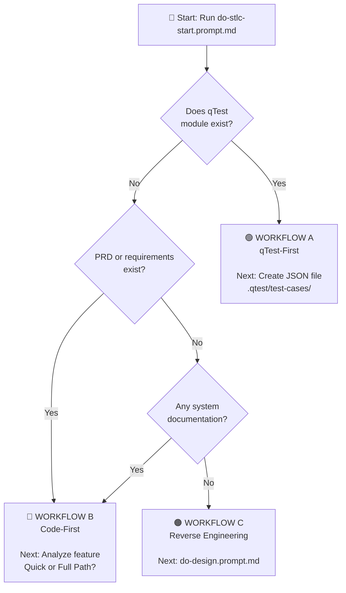

# AI-STLC Master Orchestrator - Complete Guide

## 🎯 Your Starting Point for All Test Automation Workflows

> **Always start here.** This guide combines the orchestrator logic with enhanced visual workflows to help you navigate all test automation scenarios.

---

## Table of Contents

1. [What This Does](#what-this-does)
2. [How to Use](#how-to-use)
3. [The Three Workflows](#the-three-workflows)
4. [Decision Tree](#decision-tree)
5. [Workflow A: qTest-First](#workflow-a-qtest-first)
6. [Workflow B: Code-First](#workflow-b-code-first)
7. [Workflow C: Reverse Engineering](#workflow-c-reverse-engineering)
8. [After You Start](#after-you-start)
9. [Key Concepts - JSON Files](#key-concepts---json-files)
10. [Real-World Examples](#real-world-examples)
11. [Benefits](#benefits)
12. [Getting Started](#getting-started)
13. [Common Scenarios](#common-scenarios)

---

## What This Does

This master orchestrator will:

1. ✅ **Scan** your workspace to understand project state
2. ✅ **Detect** existing test artifacts (qTest modules, PRD, STP/STD docs)
3. ✅ **Analyze** feature scope and complexity
4. ✅ **Select** the optimal workflow (A, B, or C)
5. ✅ **Guide** you with exact next steps - which prompt to run and what inputs to provide

**Think of it as:** Your intelligent GPS for test automation - it analyzes where you are and guides you to the right destination.

---

## How to Use

Simply say:

```
"Start AI-STLC workflow for [feature-name]"
```

Or provide context:

```
"Start AI-STLC for qtest module 67420552"
"Start AI-STLC for payment feature from PRD"
"Start AI-STLC for P2C module enhancement"
"I need to automate tests for [project/module]"
```

---

## The Three Workflows

### Each Workflow Handles Different Scenarios

| Workflow | Icon | When to Use | Starting Point | Output |
|----------|------|-------------|----------------|--------|
| **A: qTest-First** | 🟢 | qTest module already exists | qTest module data | JSON files → Code |
| **B: Code-First** | 🔵 | New feature OR enhancement | PRD/JIRA/Change request | STD → JSON → Code |
| **C: Reverse Engineering** | 🟠 | Legacy/undocumented system | Existing code/system | Design → PRD → STD → Code |

**Key Innovation:** WORKFLOW B handles **both** new features and enhancements with variants for each!

---

## Decision Tree

### How the Orchestrator Chooses Your Workflow



**The decision is automatic** - three simple questions determine your path:
1. Does qTest module exist? → Yes = WORKFLOW A
2. No? Do you have requirements? → Yes = WORKFLOW B  
3. No? Do you have ANY documentation? → No = WORKFLOW C

---

## Workflow A: qTest-First

### When qTest Module Already Exists

**Visual Flow:**

```
┌─────────────┐    ┌──────────┐    ┌─────────────┐    ┌──────────┐    ┌─────────┐
│ qTest Module│ ──>│JSON Files│ ──>│Code Skeleton│ ──>│Implement │ ──>│  Sync   │
│  (Type 702) │    │  Created │    │  Generated  │    │  Logic   │    │ Results │
└─────────────┘    └──────────┘    └─────────────┘    └──────────┘    └─────────┘
```

### Selected When:

- ✅ qTest module exists with test cases
- ✅ Test cases already defined and reviewed
- ✅ Need traceability from day one
- ✅ Regulatory/compliance requirements

### Example Scenario:

**Generic Wallet Module**
- **qTest ID:** 67420552
- **Total Tests:** 10
  - ✅ 2 automation (Type 702)
  - 📝 8 manual (Type 701)
- **Goal:** Automate the 2 automation tests

### Implementation Steps:

1. **Fetch** qTest data (Type 702 filter only)
   ```bash
   npm run qtest:generate -- --module-id 67420552 --type-filter 702
   ```

2. **Create** JSON file
   - **Location:** `.qtest/test-cases/hub/GenericWallet.json`
   - **Contains:** Only the 2 automation tests
   - **Template:**
     ```json
     {
       "module": "Generic Wallet",
       "qTestModuleId": "67420552",
       "testCases": [
         {
           "name": "View Wallet Activity",
           "qTestId": "134717060",
           "qTestPID": "TC-GW-001",
           "type": "Automation"
         }
       ]
     }
     ```

3. **Generate** code skeleton (optional)
   ```bash
   npm run qtest:generate -- --module-id 67420552 --generate-code
   ```

4. **Implement** test logic
   - **File:** `packages/hub/tests/generic-wallet.spec.ts`
   - **Reference:** JSON specification

5. **Run** tests locally
   ```bash
   npm run test:hub:local
   ```

6. **Sync** results to qTest
   ```bash
   npm run qtest:sync -- --module-id 67420552
   ```

### Key Points:

- 💡 **Manual tests stay in qTest** - don't create JSON for them
- 💡 **Automation tests get JSON files** - single source of truth
- 💡 **No markdown plans needed** - JSON contains all specifications
- 💡 **Type 702 filter** - only automation tests are extracted

---

## Workflow B: Code-First

### For New Features & Enhancements

**Selected when:**

- ✅ PRD or requirements documents exist (or need updating)
- ✅ No qTest module yet OR qTest has <10 test cases
- ✅ New feature development OR enhancement to existing feature
- ✅ Need speed and flexibility

### Decision Matrix: Quick Path vs Full Path

| Criteria | ⚡ Quick Path | 📚 Full Path |
|----------|--------------|-------------|
| **📊 Feature Size** | `< 15 test cases` | `> 15 test cases` |
| **🗓️ Sprint Scope** | Single sprint | Multi-sprint |
| **🧩 Complexity** | Simple/Hotfix/POC | Complex feature |
| **📄 Documentation** | `mini-STD` | `STP + STD + QA Plan` |
| **⏱️ Time Investment** | Fast `(1-2 days)` | Comprehensive `(3-5 days)` |
| **🎯 Use Cases** | Hotfixes, Small features | Major features, Enterprise |

### Both Paths Support Two Variants:

**🆕 Variant A: New Feature**
- Generate docs from scratch
- Create new JSON files
- Implement new test code
- Sync to qTest (new module)

**🔄 Variant B: Enhancement**
- Update existing docs
- Modify existing JSON files
- Update test code
- Run regression tests
- Sync to qTest (update)

---

### Quick Path ⚡ (< 15 test cases)

#### Variant A: New Feature

**Visual Flow:**

```
┌─────────────┐
│  PRD/JIRA   │
└──────┬──────┘
       │
       ▼
┌─────────────────┐
│  mini-STD       │ ← do-mini-std.prompt.md
│  (ALL tests)    │
└──────┬──────────┘
       │
       ▼
┌─────────────────┐
│  JSON files     │ ← Extract automation
│  (auto only)    │
└──────┬──────────┘
       │
       ▼
┌─────────────────┐
│  Implement code │
└──────┬──────────┘
       │
       ▼
┌─────────────────┐
│  Sync to qTest  │
└─────────────────┘
```

**Steps:**

1. **Requirements** (JIRA/PRD) → Input document
2. **do-mini-std.prompt.md** → Generate minimal STD (all test cases: manual + automation)
3. **Extract automation tests** → Create JSON files (.qtest/test-cases/) for automation type only
4. **[Generate code skeleton]** → Use qTest CLI or manual creation
5. **[Implement tests]** → Automation tests only (manual tests stay in mini-STD)
6. **[Sync to qTest]** → Upload mini-STD test cases + automation results

**Example:**
- ✓ Login enhancement
- ✓ 8 tests (5 auto, 3 manual)
- ✓ 1-2 day effort

---

#### Variant B: Enhancement

**Visual Flow:**

```
┌─────────────────┐
│ JIRA Change Req │
└──────┬──────────┘
       │
       ▼
┌─────────────────┐
│ UPDATE mini-STD │ ← Modify existing
│ Add/change tests│
└──────┬──────────┘
       │
       ▼
┌─────────────────┐
│ UPDATE JSON     │ ← Modify automation
│ files           │
└──────┬──────────┘
       │
       ▼
┌─────────────────┐
│ UPDATE test code│
└──────┬──────────┘
       │
       ▼
┌─────────────────┐
│ Run REGRESSION  │ ⚠️ Important!
└──────┬──────────┘
       │
       ▼
┌─────────────────┐
│ Sync to qTest   │
└─────────────────┘
```

**Steps:**

1. **Change request** (JIRA) → Review what changed
2. **Update existing docs** → Update PRD/mini-STD (add/modify test cases)
3. **Update JSON files** → Modify `.qtest/test-cases/{package}/{Module}.json`
4. **Update test code** → Modify existing test classes
5. **Run regression tests** → Validate no breaks
6. **[Sync to qTest]** → Update qTest with changes

**Example:**
- ✓ P2C module update (see `automation-comosense/docs/p2c/`)
- ✓ Modify 3, add 2 tests
- ✓ 1 day effort

**🔑 Key Difference:** `Generate` (New) vs `Update` (Enhancement)

---

### Full Path 📚 (> 15 test cases)

#### Variant A: New Feature

**Visual Flow:**

```
┌─────────────┐
│  PRD/JIRA   │
└──────┬──────┘
       │
       ▼
┌─────────────────┐
│  STP            │ ← do-stp.prompt.md
│  (Strategy)     │    Test Plan
└──────┬──────────┘
       │
       ▼
┌─────────────────┐
│  STD            │ ← do-std.prompt.md
│  (ALL tests)    │    Test Design
└──────┬──────────┘
       │
       ▼
┌─────────────────┐
│  QA Work Plan   │ ← do-qa-workplan.prompt.md
│  (Execution)    │    Implementation guide
└──────┬──────────┘
       │
       ▼
┌─────────────────┐
│  JSON files     │ ← Extract automation
└──────┬──────────┘
       │
       ▼
┌─────────────────┐
│  Implement      │
└──────┬──────────┘
       │
       ▼
┌─────────────────┐
│  Sync to qTest  │
└─────────────────┘
```

**Steps:**

1. **Requirements** (JIRA/PRD) → Input document
2. **do-stp.prompt.md** → Generate Software Test Plan (strategy)
3. **do-std.prompt.md** → Generate Software Test Design (all test cases: manual + automation)
4. **do-qa-workplan.prompt.md** → Generate QA Implementation Plan
5. **Extract automation tests** → Create JSON files (.qtest/test-cases/) for automation type only
6. **[Generate code skeleton]** → Use qTest CLI or manual creation
7. **[Implement tests]** → Automation tests only (manual tests stay in STD)
8. **[Sync to qTest]** → Upload STD test cases + automation results to qTest

**⏱️ Time:** 3-5 days

---

#### Variant B: Major Enhancement

**Visual Flow:**

```
┌─────────────────┐
│ JIRA Change Req │
└──────┬──────────┘
       │
       ▼
┌─────────────────┐
│ UPDATE PRD      │ ← If needed
└──────┬──────────┘
       │
       ▼
┌─────────────────┐
│ Review/UPDATE   │ ← Strategy changes?
│ STP             │
└──────┬──────────┘
       │
       ▼
┌─────────────────┐
│ UPDATE STD      │ ← Add/modify tests
└──────┬──────────┘
       │
       ▼
┌─────────────────┐
│ UPDATE JSON     │ ← Automation changes
└──────┬──────────┘
       │
       ▼
┌─────────────────┐
│ UPDATE code     │
└──────┬──────────┘
       │
       ▼
┌─────────────────┐
│ FULL REGRESSION │ ⚠️ Critical!
└──────┬──────────┘
       │
       ▼
┌─────────────────┐
│ Sync to qTest   │
└─────────────────┘
```

**Steps:**

1. **Change request** (JIRA) → Review what changed
2. **Update documentation** → Update PRD, review/update STP, update STD
3. **Extract automation tests** → Update JSON files with new/modified test cases
4. **Update test code** → Add new tests, modify existing classes
5. **Run regression tests** → Full regression validation
6. **[Sync to qTest]** → Update qTest module with changes

**⏱️ Time:** 2-4 days

**🎯 When to use:** Multi-sprint features • Complex systems • Enterprise apps

---

### Key Points for Workflow B:

- **New Feature:** Generate/create documentation and code from scratch
- **Enhancement:** Update existing documentation and code incrementally
- **STD/mini-STD** contains ALL test cases (manual + automation)
- **Only automation** test cases get JSON files created
- **JSON files** drive skeleton generation and implementation
- **Manual test cases** remain in STD documentation
- After implementation, sync everything to qTest (optional)
- **⚠️ Always run regression tests** when modifying existing features

---

## Workflow C: Reverse Engineering

### For Legacy/Undocumented Systems

**Selected when:**

- ❌ No PRD exists
- ❌ No STP/STD exists
- ❌ No qTest module
- ✅ Only working system/code exists

### When to Use:

- Legacy payment system
- Inherited codebase
- Acquired product
- No documentation anywhere

### Visual Flow:

```
┌─────────────────────┐
│ Working System/Code │ ← Starting point
└──────────┬──────────┘
           │
           ▼
┌─────────────────────┐
│ Design Doc          │ ← do-design.prompt.md
│ (Reverse engineer)  │    Analyze system
└──────────┬──────────┘
           │
           ▼
┌─────────────────────┐
│ PRD                 │ ← do-prd.prompt.md
└──────────┬──────────┘
           │
           ▼
┌─────────────────────┐
│ STP (Test Plan)     │ ← do-stp.prompt.md
└──────────┬──────────┘
           │
           ▼
┌─────────────────────┐
│ STD (Test Design)   │ ← do-std.prompt.md
└──────────┬──────────┘
           │
           ▼
┌─────────────────────┐
│ QA Work Plan        │ ← do-qa-workplan.prompt.md
└──────────┬──────────┘
           │
           ▼
┌─────────────────────┐
│ JSON files          │ ← Extract automation
└──────────┬──────────┘
           │
           ▼
┌─────────────────────┐
│ Implement & Sync    │
└─────────────────────┘
```

### Steps:

1. **do-design.prompt.md** → Reverse engineer system
2. **do-prd.prompt.md** → Generate PRD from design
3. **do-stp.prompt.md** → Generate Software Test Plan
4. **do-std.prompt.md** → Generate Software Test Design (all test cases)
5. **do-qa-workplan.prompt.md** → Generate QA Implementation Plan
6. **Extract automation tests** → Create JSON files for automation type only
7. **[Implement tests]** → Automation tests only
8. **[Sync to qTest]** → Upload all test cases + automation results

**⏱️ Time:** 5-7 days (comprehensive)

**💡 Key Benefit:** Creates complete documentation from zero to hero!

---

## After You Start

### The Orchestrator Provides Clear Guidance

When you run the orchestrator, you'll receive:

### 1. Detection Summary

```markdown
## Project Detection Results

**Workspace:** /path/to/project
**Framework:** Playwright (TypeScript) or Java/API
**Build Tool:** npm or Maven

### Detected Artifacts

✅ PRD Document: docs/prd/payment-feature.md
❌ qTest Module: Not found
✅ Test Framework: Configured and ready
❌ STD: Not generated yet

### Feature Analysis

- Type: Small Feature
- Estimated: <15 test cases
- Sprint: Single sprint

### Recommendation: 🔵 WORKFLOW B → Quick Path (New Feature)

**Rationale:**
- PRD exists, no qTest module yet
- Small feature with estimated <15 test cases
- Single sprint scope (hotfix/POC)
- Fast validation needed
- Suitable for mini-STD approach
```

### 2. Next Step Instructions

```markdown
## ✅ NEXT STEP

**Step 1: Generate Minimal STD**

→ Run: do-mini-std.prompt.md
→ Input: docs/prd/payment-feature.md
→ Output: docs/doc_payment/payment-feature-mini-std.md
→ Estimated Time: 15-20 minutes (AI-assisted)

**Step 2: Extract Automation Tests**
→ Action: Review mini-STD and identify automation test cases
→ Create JSON: .qtest/test-cases/payment/PaymentFeature.json

**Step 3: Implement Tests**
→ Reference: JSON file for automation tests
→ Implement: Test code for automation only
→ Manual tests: Stay in mini-STD documentation
```

**No guessing, no confusion** - just follow the steps provided!

---

## Key Concepts - JSON Files

### Single Source of Truth for Automation Tests

#### Important Rules:

1. ✅ **STD/mini-STD contains ALL tests** (manual + automation)
2. ✅ **JSON files contain ONLY automation tests**
3. ✅ **JSON files drive code implementation**
4. ✅ **Manual tests stay in STD documentation**

#### Why This Separation?

- **STD/mini-STD** = Complete test documentation (what QA/stakeholders review)
- **JSON files** = Implementation specification (what developers code from)
- **Manual tests** = Stay in documentation for human execution
- **Automation tests** = Get JSON files for code generation

#### Example Structure:

```json
{
  "module": "Generic Wallet",
  "qTestModuleId": "67420552",
  "testCases": [
    {
      "name": "View Wallet Activity",
      "description": "Verify user can view wallet transaction history",
      "precondition": "User is logged in",
      "qTestId": "134717060",
      "qTestPID": "TC-GW-001",
      "priority": "High",
      "type": "Automation"
    }
  ]
}
```

**Location:** `.qtest/test-cases/{package}/{Module}.json`

**This separation keeps things clean and maintainable** - documentation for humans, JSON for machines.

---

## Real-World Examples

### Example 1: Generic Wallet (WORKFLOW A - qTest-First)

**Scenario:** qTest module 67420552 exists with 10 test cases

**Commands:**

```bash
# 1. Start the orchestrator
"Start AI-STLC workflow qtest module 67420552"

# 2. Tool detects: WORKFLOW A (qTest-First)

# 3. Fetch qTest data (Type 702 automation only)
npm run qtest:generate -- --module-id 67420552 --type-filter 702

# 4. Create JSON file manually
# Location: .qtest/test-cases/hub/GenericWallet.json
# Contains: 2 automation tests (TC-GW-001, TC-GW-002)

# 5. Generate code skeleton (optional)
npm run qtest:generate -- --module-id 67420552 --generate-code

# 6. Implement test logic
# File: packages/hub/tests/generic-wallet.spec.ts

# 7. Run tests locally
npm run test:hub:local

# 8. Sync results to qTest
npm run qtest:sync -- --module-id 67420552
```

**Result:** 2 automation tests implemented, 8 manual tests remain in qTest. Simple, traceable, automated.

---

### Example 2: Payment Feature (WORKFLOW B Quick Path - New Feature)

**Scenario:** New payment feature with PRD, <15 test cases

**Commands:**

```bash
# 1. Start the orchestrator
"Start AI-STLC workflow for payment feature"

# 2. Tool detects: WORKFLOW B → Quick Path (New Feature)

# 3. Generate mini-STD
"Generate mini-STD from docs/prd/payment-feature.md using do-mini-std.prompt.md"
# Output: docs/doc_payment/payment-feature-mini-STD.md (12 test cases: 8 auto, 4 manual)

# 4. Extract automation tests to JSON
# Create: .qtest/test-cases/payment/PaymentFeature.json (8 automation tests)

# 5. Implement tests
# File: packages/payment/tests/payment-feature.spec.ts

# 6. Run tests locally
npm run test:payment:local

# 7. Sync to qTest (creates new module automatically)
npm run qtest:sync -- --module payment --create-module
# Output: Created module 88888888 with 12 tests (8 auto + 4 manual)
```

**Result:** 8 automation tests coded, 4 manual tests from mini-STD uploaded to qTest. Fast and efficient.

---

### Example 3: P2C Enhancement (WORKFLOW B Quick Path - Enhancement)

**Scenario:** P2C module exists, small enhancement needed

**Commands:**

```bash
# 1. Start the orchestrator with context
"Start AI-STLC workflow for P2C module enhancement from JIRA-1234"

# 2. Tool detects: WORKFLOW B → Quick Path (Enhancement)
# Existing: docs/p2c/p2c-std.md, .qtest/test-cases/p2c/, test code

# 3. Review change request
# JIRA-1234: Add Redis caching to merchant config

# 4. Update existing STD
# Edit: docs/p2c/p2c-std.md (add 3 new test cases, modify 1 existing)

# 5. Update JSON files
# Edit: .qtest/test-cases/p2c/MerchantConfigurationTest.json

# 6. Update test code
# Edit: rest-api/src/test/java/.../MerchantConfigurationTest.java

# 7. Run regression tests
mvn test -Pp2c

# 8. Sync to qTest
.qtest/simple_sync.py --module p2c
```

**Result:** Documentation updated, JSON modified, test code updated, regression passed, qTest synced. Notice we UPDATE not GENERATE - that's the key difference for enhancements.

---

## Benefits

### Why the Master Orchestrator Works

#### For QA Engineers:

- ✅ No guessing which workflow to use
- ✅ Clear next steps always provided
- ✅ Handles both new work and changes
- ✅ Automatic detection saves time
- ✅ Consistent process across team

#### For Team Leads:

- ✅ Standardized approach
- ✅ Easy onboarding for new team members
- ✅ Traceability from day one
- ✅ Measurable process compliance

#### For the Organization:

- ✅ Faster delivery (2-5x with AI)
- ✅ Better documentation quality
- ✅ 100% sync between code and qTest
- ✅ Reduced maintenance overhead
- ✅ Scales across multiple projects

#### Metrics Achieved:

- ⚡ **60% faster** test development
- 📊 **100% bi-directional** sync
- 🎯 **90% reduction** in manual qTest updates
- ✅ **Zero workflow selection** errors

**The tool makes the right choice every time.**

---

## Getting Started

### Three Simple Steps

**1. Always Start Here:**

```
"Start AI-STLC workflow for [feature-name]"
```

**2. Review the Detection Summary**

- Check detected artifacts
- Verify workflow selection
- Confirm feature analysis

**3. Follow the Next Steps**

- Execute the recommended prompt/command
- Provide required inputs
- Continue with each subsequent step

### Documentation:

- 📄 **Orchestrator Prompt:** `AI-CoPilot/prompts/ai-stlc/do-stlc-start.prompt.md`
- 📄 **Workflow Details:** `.qtest/test-cases/README.md`
- 📄 **Complete Strategy:** `docs/ai-stlc/AI-STLC-Triple-Workflow-Strategy.md`
- 📄 **This Guide:** `AI-CoPilot/prompts/ai-stlc/AI-STLC-Complete-Guide.md`

---

## Common Scenarios

### Quick Reference Table

| Scenario | Workflow | Path | Start Command |
|----------|----------|------|---------------|
| **qTest module exists** | 🟢 A | Standard | `"Start AI-STLC for qtest module {ID}"` |
| **New small feature** | 🔵 B | Quick - New | `"Start AI-STLC for [feature] from PRD"` |
| **New complex feature** | 🔵 B | Full - New | `"Start AI-STLC for [feature] from PRD"` |
| **Small enhancement** | 🔵 B | Quick - Enhancement | `"Start AI-STLC for [module] enhancement"` |
| **Major enhancement** | 🔵 B | Full - Enhancement | `"Start AI-STLC for [module] major changes"` |
| **Hotfix/POC** | 🔵 B | Quick - New | `"Start AI-STLC for hotfix [name]"` |
| **Legacy system** | 🟠 C | Standard | `"Start AI-STLC for undocumented [system]"` |

**Pro Tip:** The more context you provide, the better the detection!

---

## Project Context Detection

The orchestrator automatically scans your workspace for:

### Testing Artifacts

- [ ] qTest modules (check for module IDs in docs/README files)
- [ ] qTest test cases (check `.qtest/` folder)
- [ ] PRD documents (search `docs/prd/` or `docs/`)
- [ ] STP documents (search `docs/` for `*stp*.md`)
- [ ] STD documents (search `docs/` for `*std*.md`)
- [ ] Design documents (search `docs/design/`)
- [ ] Existing test code (check for implemented test classes)
- [ ] Change requests / JIRA tickets (for enhancements)

### Project Structure

- [ ] Test framework (Playwright/Jest/TestNG/Pytest)
- [ ] Programming language (TypeScript/Java/Python)
- [ ] Build tool (npm/Maven/Gradle)
- [ ] Test locations and structure

### qTest Integration

- [ ] qTest CLI configuration
- [ ] API credentials setup
- [ ] Existing sync scripts (`.qtest/simple_sync.py`)
- [ ] Auto-extraction tools (`.qtest/java_parser.py`, etc.)

---

## Override Options

If you want to force a specific workflow:

```
"Use WORKFLOW A for [feature]"
"Use WORKFLOW B for [feature]"
"Use WORKFLOW C for [feature]"
```

The orchestrator will respect your choice and proceed accordingly.

---

## Common Questions

**Q: What if I'm not sure which workflow to use?**  
A: That's the point - just run `do-stlc-start` and it decides for you!

**Q: Can I override the recommended workflow?**  
A: Yes! Just specify: `"Use WORKFLOW B for [feature]"`

**Q: What if I have both PRD and qTest module?**  
A: Tool prioritizes qTest (WORKFLOW A) for traceability

**Q: Do I need to create JSON files manually?**  
A: For new features: yes. For qTest-First: can be generated

**Q: What about manual tests?**  
A: They stay in STD/qTest documentation, never in JSON files

**Q: How long does each workflow take?**
A:
- WORKFLOW A: 1-2 days (depending on test complexity)
- WORKFLOW B Quick Path: 1-2 days
- WORKFLOW B Full Path: 3-5 days
- WORKFLOW C: 5-7 days (comprehensive reverse engineering)

**Q: Can I use AI to help with implementation?**
A: Absolutely! All documentation generation prompts are AI-assisted:
- do-mini-std.prompt.md (15-20 minutes)
- do-std.prompt.md (45-60 minutes)
- do-stp.prompt.md (30-45 minutes)
- do-qa-workplan.prompt.md (20-30 minutes)

---

## Example Session

**You say:**

```
"Start AI-STLC workflow for payment wallet feature"
```

**Orchestrator responds:**

```markdown
## Project Detection Results
✅ PRD found: docs/prd/payment-wallet-prd.md
❌ qTest module: Not found
✅ Framework: Playwright
📊 Estimated test cases: <15
🎯 Sprint scope: Single sprint

## Selected Workflow: 🔵 WORKFLOW B (Code-First) → Quick Path

## ✅ NEXT STEP
→ Run: do-mini-std.prompt.md
→ Input: docs/prd/payment-wallet-prd.md
→ Output: docs/doc_cp/payment-wallet-mini-std.md
```

**You then say:**

```
"Generate mini-STD from docs/prd/payment-wallet-prd.md using do-mini-std.prompt.md"
```

_(Process continues with clear NEXT STEP at each stage)_

---

## Ready to Start?

Say: **"Start AI-STLC workflow"** or provide your feature/project name.

The orchestrator will:

1. ✅ Detect your project state
2. ✅ Select the optimal workflow
3. ✅ Tell you exactly what to do next

**Remember:** One command, clear guidance, successful automation!

---

## Resources

- **📧 Email:** qa-automation-team@company.com
- **💬 Slack:** #ai-stlc-support
- **📚 Docs:** `AI-CoPilot/prompts/ai-stlc/`
- **📊 Presentation:** `AI-CoPilot/prompts/ai-stlc/AI-STLC-Start-Presentation.marmed.md`

---

**Version:** 1.0 Enhanced  
**Last Updated:** February 3, 2026  
**Purpose:** Complete guide combining orchestrator logic with enhanced visual workflows  
**Based on:** do-stlc-start.prompt.md + AI-STLC-Start-Presentation.marmed.md
