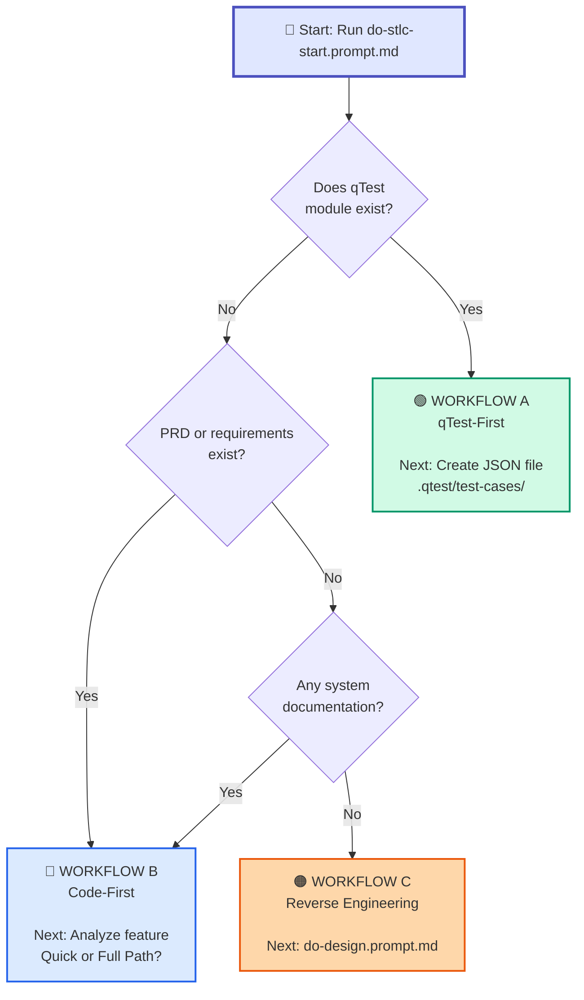

<!-- _class: lead -->

# AI-STLC Master Orchestrator

## Your Starting Point for All Test Automation

**do-stlc-start.prompt.md**

**Presented by:** QA Automation Team  
**Date:** February 2, 2026

<!--
TALKING POINTS:
Welcome! Today I'll show you how to use the AI-STLC Master Orchestrator - your single entry point for all test automation workflows. No matter what testing scenario you face, this tool will guide you to the right workflow and tell you exactly what to do next.
-->

---

# What is do-stlc-start?

### 🎯 The Master Orchestrator for Test Automation

**One simple command:**
```
"Start AI-STLC workflow for [feature-name]"
```

**What it does:**
1. ✅ Scans your workspace to understand project state
2. ✅ Detects existing artifacts (qTest, PRD, STP/STD, test code)
3. ✅ Analyzes feature scope and complexity
4. ✅ Selects the optimal workflow (A, B, or C)
5. ✅ **Tells you exactly which prompt/command to run next**

**Think of it as:** Your intelligent GPS for test automation - it analyzes where you are and guides you to the right destination.

<!--
TALKING POINTS:
Think of do-stlc-start as your GPS for testing. Just like Google Maps analyzes your location and destination to give you the best route, this tool analyzes your project state and tells you exactly which workflow to follow. One command, automatic detection, clear next steps.
-->

---

# The Three Workflows

### Each Workflow Handles Different Scenarios

| Workflow | Icon | When to Use | Starting Point | Output |
|----------|------|-------------|----------------|--------|
| **A: qTest-First** | 🟢 | qTest module already exists | qTest module data | JSON files → Code |
| **B: Code-First** | 🔵 | New feature OR enhancement | PRD/JIRA/Change request | STD → JSON → Code |
| **C: Reverse Engineering** | 🟠 | Legacy/undocumented system | Existing code/system | Design → PRD → STD → Code |

**Key Innovation:** WORKFLOW B handles **both** new features and enhancements!

<!--
TALKING POINTS:
We have three workflows. Workflow A is qTest-First - when you already have test cases in qTest. Workflow B is Code-First - this is our most flexible workflow, handling both brand new features and enhancements to existing features. And Workflow C is for legacy systems with no documentation. The key is WORKFLOW B can handle both new work and changes to existing features.
-->

---

# Decision Tree - How It Chooses



<!--
TALKING POINTS:
The decision is simple - three questions. First, does qTest module exist? Yes means Workflow A. No? Do you have requirements? Yes means Workflow B. No? Do you have ANY documentation? No means Workflow C Reverse Engineering. The tool makes this decision automatically by scanning your workspace.
-->

---

# 🟢 WORKFLOW A: qTest-First

### When qTest Module Already Exists

**Path:**
```
qTest Module → JSON Files → Code Skeleton → Implement → Sync Results
```

**Example Scenario:**
- Generic Wallet module (qTest ID: 67420552) with 10 test cases
- 2 automation tests (Type 702), 8 manual tests
- Need to implement automation for the 2 automation tests

**Steps:**
1. Fetch qTest module data (filter Type 702 automation only)
2. Create JSON file: `.qtest/test-cases/hub/GenericWallet.json`
3. Generate code skeleton (optional)
4. Implement test logic
5. Run tests locally
6. Sync results back to qTest

**Key Point:** Manual tests stay in qTest, only automation tests get JSON files

<!--
TALKING POINTS:
Workflow A is straightforward. You already have test cases in qTest. The tool extracts only the automation tests, creates JSON files as your single source of truth, and you implement from there. Manual tests stay in qTest - we only automate what's marked for automation. This is perfect for mature projects with established test repositories.
-->

---

# 🔵 WORKFLOW B: Code-First (Part 1)

### Quick Path vs Full Path

The orchestrator analyzes your feature and recommends a path:

| Criteria | Quick Path | Full Path |
|----------|------------|-----------|
| **Feature Size** | <15 test cases | >15 test cases |
| **Sprint Scope** | Single sprint | Multi-sprint |
| **Complexity** | Simple/Hotfix/POC | Complex feature |
| **Documentation** | mini-STD | STP + STD |
| **Time** | Fast (1-2 days) | Comprehensive (3-5 days) |

**Both paths support:**
- ✅ **Variant A:** New Feature (generate docs)
- ✅ **Variant B:** Enhancement (update docs)

<!--
TALKING POINTS:
Workflow B adapts to your needs. For small features, hotfixes, or POCs - Quick Path generates a minimal STD and gets you coding fast. For complex features requiring comprehensive planning - Full Path generates STP, STD, and QA Work Plan. Both paths work for new features AND enhancements to existing features.
-->

---

# 🔵 WORKFLOW B: Quick Path

### For Small Features & Hotfixes (<15 test cases)

<div class="columns">

<div>

**Variant A: New Feature**

```
1. PRD/JIRA
2. do-mini-std.prompt.md
   → mini-STD (ALL tests)
3. Extract automation tests
   → JSON files
4. Implement code
5. Sync to qTest
```

**Example:**
- Login enhancement
- 8 test cases total
- 5 automation, 3 manual
- 1-2 day effort

</div>

<div>

**Variant B: Enhancement**

```
1. JIRA Change Request
2. Update existing mini-STD
   → Add/modify test cases
3. Update JSON files
   → Only automation tests
4. Update test code
5. Run regression tests
6. Sync to qTest
```

**Example:**
- P2C module improvement
- Modify 3 existing tests
- Add 2 new tests
- 1 day effort

</div>

</div>

**Key Difference:** New = Generate, Enhancement = Update

<!--
TALKING POINTS:
Quick Path has two variants. For a NEW small feature, you generate a mini-STD from scratch, extract automation tests to JSON, and implement. For an ENHANCEMENT to existing code, you UPDATE the existing mini-STD, UPDATE the JSON files, and modify your test code. The key difference: new features generate, enhancements update. Both require regression testing for enhancements.
-->

---

# 🔵 WORKFLOW B: Full Path

### For Complex Features (>15 test cases)

<div class="columns">

<div>

**Variant A: New Feature**

```
1. PRD/JIRA
2. do-stp.prompt.md
   → Test Plan (strategy)
3. do-std.prompt.md
   → Test Design (ALL tests)
4. do-qa-workplan.prompt.md
   → Implementation plan
5. Extract automation
   → JSON files
6. Implement code
7. Sync to qTest
```

**Time:** 3-5 days

</div>

<div>

**Variant B: Major Enhancement**

```
1. JIRA Change Request
2. Update PRD (if needed)
3. Review/Update STP
4. Update STD
   → Add/modify test cases
5. Update JSON files
6. Update test code
7. Full regression suite
8. Sync to qTest
```

**Time:** 2-4 days

</div>

</div>

**When to use:** Multi-sprint features, complex systems, comprehensive documentation needed

<!--
TALKING POINTS:
Full Path is for complex work. New features get comprehensive documentation - STP for strategy, STD for detailed test cases, and QA workplan for implementation guidance. Major enhancements update all existing docs incrementally and run full regression testing. This is perfect for enterprise features requiring thorough planning and traceability.
-->

---

# 🟠 WORKFLOW C: Reverse Engineering

### For Legacy/Undocumented Systems

**When to use:**
- ❌ No PRD exists
- ❌ No STP/STD exists  
- ❌ No qTest module
- ✅ Only working system/code exists

**Path:**
```
1. do-design.prompt.md      → Reverse engineer system/code
2. do-prd.prompt.md         → Generate PRD from design
3. do-stp.prompt.md         → Generate Test Plan
4. do-std.prompt.md         → Generate Test Design
5. do-qa-workplan.prompt.md → Generate Implementation Plan
6. Extract automation       → Create JSON files
7. Implement tests
8. Sync to qTest
```

**Example:** Legacy payment system with no documentation

<!--
TALKING POINTS:
Workflow C is your lifeline for legacy systems. When you have zero documentation - just working code - this workflow reverse engineers the system, creates design documentation, generates PRD, then follows the full testing workflow. It's longer but gives you complete documentation where none existed before. Essential for legacy modernization projects.
-->

---

# What Happens After You Start?

### The Orchestrator Provides Clear Guidance

**1. Detection Summary**
```markdown
✅ Framework: Playwright (TypeScript)
✅ PRD Document: docs/prd/payment-feature.md
❌ qTest Module: Not found
❌ STD: Not generated yet

Feature Analysis:
- Type: Small Feature
- Estimated: <15 test cases
- Sprint: Single sprint

Recommendation: 🔵 WORKFLOW B → Quick Path (New Feature)
```

**2. Next Step Instructions**
```markdown
Step 1: Generate Minimal STD
→ Run: do-mini-std.prompt.md
→ Input: docs/prd/payment-feature.md
→ Output: docs/doc_payment/payment-feature-mini-std.md
```

<!--
TALKING POINTS:
After you run do-stlc-start, you get two things: a detection summary showing what the tool found in your workspace, and clear next step instructions. No guessing, no confusion - just follow the steps. Each step tells you which prompt to run, what input to provide, and what output to expect.
-->

---

# Key Concepts - JSON Files

### Single Source of Truth for Automation Tests

**Important Rules:**

1. ✅ **STD/mini-STD contains ALL tests** (manual + automation)
2. ✅ **JSON files contain ONLY automation tests**
3. ✅ **JSON files drive code implementation**
4. ✅ **Manual tests stay in STD documentation**

**Example Structure:**
```json
{
  "module": "Generic Wallet",
  "qTestModuleId": "67420552",
  "testCases": [
    {
      "name": "View Wallet Activity",
      "qTestId": "134717060",
      "qTestPID": "TC-GW-001",
      "type": "Automation"
    }
  ]
}
```

**Location:** `.qtest/test-cases/{package}/{Module}.json`

<!--
TALKING POINTS:
Understanding JSON files is crucial. Your STD or mini-STD contains ALL test cases - both manual and automation. But JSON files contain ONLY the automation tests. Why? Because JSON files are what drive your code implementation. Manual tests stay in the documentation for manual execution. This separation keeps things clean and maintainable.
-->

---

# Real-World Example: Generic Wallet

### Step-by-Step WORKFLOW A (qTest-First)

**Scenario:** qTest module 67420552 exists with 10 test cases

**Commands:**
```bash
# 1. Start the orchestrator
"Start AI-STLC workflow qtest module 67420552"

# 2. Tool detects: WORKFLOW A (qTest-First)

# 3. Fetch qTest data (Type 702 automation only)
npm run qtest:generate -- --module-id 67420552 --type-filter 702

# 4. Create JSON file manually
# Location: .qtest/test-cases/hub/GenericWallet.json
# Contains: 2 automation tests (TC-GW-001, TC-GW-002)

# 5. Generate code skeleton (optional)
npm run qtest:generate -- --module-id 67420552 --generate-code

# 6. Implement test logic
# File: packages/hub/tests/generic-wallet.spec.ts

# 7. Run tests locally
npm run test:hub:local

# 8. Sync results to qTest
npm run qtest:sync -- --module-id 67420552
```

<!--
TALKING POINTS:
Let's walk through a real example. We have Generic Wallet module in qTest with 10 test cases. The orchestrator detects this is Workflow A. We fetch the automation tests, create our JSON file with 2 automation tests, generate code skeleton, implement the logic, test locally, and sync results back. The 8 manual tests stay in qTest. Simple, traceable, automated.
-->

---

# Real-World Example: Payment Feature

### Step-by-Step WORKFLOW B Quick Path (New Feature)

**Scenario:** New payment feature with PRD, <15 test cases

**Commands:**
```bash
# 1. Start the orchestrator
"Start AI-STLC workflow for payment feature"

# 2. Tool detects: WORKFLOW B → Quick Path (New Feature)

# 3. Generate mini-STD
"Generate mini-STD from docs/prd/payment-feature.md using do-mini-std.prompt.md"
# Output: docs/doc_payment/payment-feature-mini-STD.md (12 test cases: 8 auto, 4 manual)

# 4. Extract automation tests to JSON
# Create: .qtest/test-cases/payment/PaymentFeature.json (8 automation tests)

# 5. Implement tests
# File: packages/payment/tests/payment-feature.spec.ts

# 6. Run tests locally
npm run test:payment:local

# 7. Sync to qTest (creates new module automatically)
npm run qtest:sync -- --module payment --create-module
# Output: Created module 88888888 with 12 tests (8 auto + 4 manual)
```

<!--
TALKING POINTS:
Here's a new feature example. Payment feature with a PRD. The orchestrator sees no qTest module, finds the PRD, estimates under 15 test cases, and recommends Quick Path. We generate mini-STD which has ALL 12 test cases. We extract the 8 automation tests to JSON, implement code, test locally, and sync to qTest which creates the module automatically. The 4 manual tests from the mini-STD go into qTest for manual execution.
-->

---

# Real-World Example: P2C Enhancement

### Step-by-Step WORKFLOW B Quick Path (Enhancement)

**Scenario:** P2C module exists, small enhancement needed

**Commands:**
```bash
# 1. Start the orchestrator with context
"Start AI-STLC workflow for P2C module enhancement from JIRA-1234"

# 2. Tool detects: WORKFLOW B → Quick Path (Enhancement)
# Existing: docs/p2c/p2c-std.md, .qtest/test-cases/p2c/, test code

# 3. Review change request
# JIRA-1234: Add Redis caching to merchant config

# 4. Update existing STD
# Edit: docs/p2c/p2c-std.md (add 3 new test cases, modify 1 existing)

# 5. Update JSON files
# Edit: .qtest/test-cases/p2c/MerchantConfigurationTest.json

# 6. Update test code
# Edit: rest-api/src/test/java/.../MerchantConfigurationTest.java

# 7. Run regression tests
mvn test -Pp2c

# 8. Sync to qTest
.qtest/simple_sync.py --module p2c
```

<!--
TALKING POINTS:
Enhancement example - P2C module needs Redis caching. The orchestrator detects existing documentation, qTest module, and test code. It recommends Quick Path Enhancement variant. We update the existing STD document, update the JSON file with modified test cases, update our Java test code, run full regression to ensure nothing broke, and sync changes to qTest. Notice we UPDATE not GENERATE - that's the key difference.
-->

---

# Benefits of This Approach

### Why the Master Orchestrator Works

<div class="columns">

<div>

**For QA Engineers:**
- ✅ No guessing which workflow to use
- ✅ Clear next steps always provided
- ✅ Handles both new work and changes
- ✅ Automatic detection saves time
- ✅ Consistent process across team

**For Team Leads:**
- ✅ Standardized approach
- ✅ Easy onboarding for new team members
- ✅ Traceability from day one
- ✅ Measurable process compliance

</div>

<div>

**For the Organization:**
- ✅ Faster delivery (2-5x with AI)
- ✅ Better documentation quality
- ✅ 100% sync between code and qTest
- ✅ Reduced maintenance overhead
- ✅ Scales across multiple projects

**Metrics Achieved:**
- ⚡ 60% faster test development
- 📊 100% bi-directional sync
- 🎯 90% reduction in manual qTest updates
- ✅ Zero workflow selection errors

</div>

</div>

<!--
TALKING POINTS:
The benefits are clear for everyone. QA engineers get clarity - no more guessing which approach to use. Team leads get standardization - everyone follows the same process. The organization gets speed, quality, and cost savings. We've measured 60% faster development, 100% automated sync, and zero workflow selection errors. The tool makes the right choice every time.
-->

---

# How to Get Started

### Three Simple Steps

**1. Always Start Here:**
```
"Start AI-STLC workflow for [feature-name]"
```

**2. Review the Detection Summary**
- Check detected artifacts
- Verify workflow selection
- Confirm feature analysis

**3. Follow the Next Steps**
- Execute the recommended prompt/command
- Provide required inputs
- Continue with each subsequent step

**Documentation:**
- 📄 Full Prompt: `AI-CoPilot/prompts/ai-stlc/do-stlc-start.prompt.md`
- 📄 Workflow Details: `.qtest/test-cases/README.md`
- 📄 Complete Strategy: `docs/ai-stlc/AI-STLC-Triple-Workflow-Strategy.md`

<!--
TALKING POINTS:
Getting started is easy. Three steps: run the start command with your feature name, review what it detected, and follow the next steps it provides. That's it. All documentation is available in your workspace - the full prompt explains everything in detail, workflow-specific README files guide you through each path, and the complete strategy document covers all scenarios.
-->

---

# Common Scenarios Quick Reference

| Scenario | Workflow | Path | Start Command |
|----------|----------|------|---------------|
| qTest module exists | 🟢 A | Standard | `"Start AI-STLC for qtest module {ID}"` |
| New small feature | 🔵 B | Quick - New | `"Start AI-STLC for [feature] from PRD"` |
| New complex feature | 🔵 B | Full - New | `"Start AI-STLC for [feature] from PRD"` |
| Small enhancement | 🔵 B | Quick - Enhancement | `"Start AI-STLC for [module] enhancement"` |
| Major enhancement | 🔵 B | Full - Enhancement | `"Start AI-STLC for [module] major changes"` |
| Hotfix/POC | 🔵 B | Quick - New | `"Start AI-STLC for hotfix [name]"` |
| Legacy system | 🟠 C | Standard | `"Start AI-STLC for undocumented [system]"` |

**Pro Tip:** The more context you provide, the better the detection!

<!--
TALKING POINTS:
Here's your cheat sheet for common scenarios. Notice the pattern - you just describe your situation in plain English and the tool figures out the rest. "qTest module exists" - Workflow A. "New feature from PRD" - Workflow B. "Enhancement" - Workflow B with update variant. "Legacy system" - Workflow C. The more context you give, the smarter the detection becomes.
-->

---

# Questions & Answers

### Let's Discuss Your Use Cases

**Common Questions:**

1. **Q:** What if I'm not sure which workflow to use?  
   **A:** That's the point - just run `do-stlc-start` and it decides for you!

2. **Q:** Can I override the recommended workflow?  
   **A:** Yes! Just specify: `"Use WORKFLOW B for [feature]"`

3. **Q:** What if I have both PRD and qTest module?  
   **A:** Tool prioritizes qTest (WORKFLOW A) for traceability

4. **Q:** Do I need to create JSON files manually?  
   **A:** For new features: yes. For qTest-First: can be generated

5. **Q:** What about manual tests?  
   **A:** They stay in STD/qTest documentation, never in JSON files

<!--
TALKING POINTS:
Let's open the floor for questions. I know you'll have specific scenarios from your projects. Remember, the whole point of this tool is to remove confusion - when in doubt, just run it and let it guide you. And yes, you can always override if you have specific needs, but in practice, the tool's recommendations are almost always correct.
-->

---

<!-- _class: lead -->

# Thank You!

## Ready to Start?

**Next Steps:**
1. Try it with your current project
2. Share feedback with the team
3. Join our AI-STLC working group

**Resources:**
- 📧 Email: qa-automation-team@company.com
- 💬 Slack: #ai-stlc-support
- 📚 Docs: `AI-CoPilot/prompts/ai-stlc/`

**Remember:** One command, clear guidance, successful automation!

```
"Start AI-STLC workflow"
```

<!--
TALKING POINTS:
Thank you all! I encourage you to try this on your current project today. The best way to learn is by doing. Share your experience with the team - what worked, what didn't. And join our working group if you want to contribute to making this even better. Remember the mantra: One command, clear guidance, successful automation. Now let's go automate some tests!
-->
