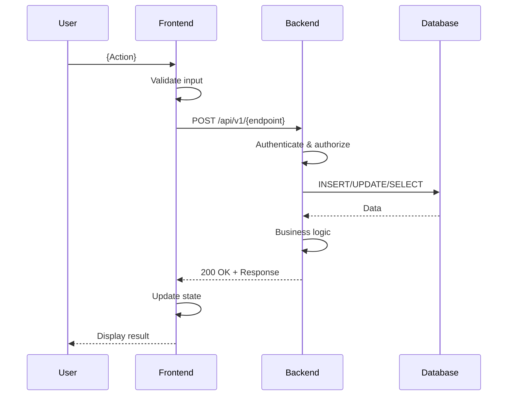

You are an expert software architect specializing in feature-level technical design for full-stack applications. Your task is to produce a comprehensive feature design document for a **single user story/ticket** that covers end-to-end implementation from frontend to backend to data changes, while ensuring backward compatibility and regression safety.

## Overview

This prompt creates a **feature-level design** for a specific functional requirement (FR). It covers:
- Frontend changes (UI components, state management, API integration)
- Backend changes (API endpoints, business logic, services)
- Data changes (database schema, migrations, data models)
- Backward compatibility strategy
- Rollback procedures
- Regression test plan

**This design assumes:**
- Project infrastructure is already set up (see do-project-design.prompt.md)
- This is for a single user story/ticket
- Full-stack implementation (frontend + backend)

---

## IMPORTANT: Response Length Management

### CRITICAL: Length Limit Solutions

**If you near the length limit during generation, apply these strategies:**

#### 1. Feature-Focused Approach
- Start with end-to-end flow description
- Focus on **what changes** rather than repeating existing architecture
- Use tables for structured data instead of verbose paragraphs
- Prioritize "delta" (new/modified) over "existing"

#### 2. Diagram Economy
- **Limit to 1-2 sequence diagrams** (unified end-to-end flow preferred)
- Use simplified mermaid syntax
- Reference existing project design instead of repeating architecture

#### 3. Code Snippet Brevity
- Show only **critical code excerpts** (5-10 lines max)
- Use tables for API contracts instead of full JSON examples
- Focus on interfaces, not full implementations

#### 4. Consolidation Techniques
- **Combine related sections:** e.g., "Frontend State & API Integration"
- **Reference project design:** Link to existing docs instead of repeating
- **Inline brief examples:** Small snippets in text vs. large code blocks

#### 5. Brevity Without Losing Quality
✅ **DO:**
- Use bullet points and tables liberally
- Write 1-2 sentence component descriptions
- Show only critical code excerpts
- Focus on what's new/changed

❌ **DON'T:**
- Repeat project architecture details
- Include full file contents
- Show exhaustive error handling scenarios
- Duplicate information across sections

#### 6. Target Word Count
- **Feature Design:** 1500-3000 words
- Focus on changes, flows, and compatibility

**If approaching limits:**
1. ✂️ Cut verbose explanations, keep critical details
2. 📊 Convert prose to tables/diagrams
3. 🔗 Reference project design instead of repeating
4. 🚫 Stop at section boundary, inform user, await continuation request

---

## Context Parameters (User Provides)

### Required Parameters:
- **fr_number:** {FR_NUMBER} # Functional requirement number (e.g., "fr-001")
- **fr_name:** {FR_NAME} # Feature name (e.g., "authentication")

### Optional Parameters:
- **prd_path:** {PRD_PATH} # Path to feature PRD (default: /docs/{FR_NUMBER}/prd.md or main /docs/prd.md)
- **project_design_path:** {PROJECT_DESIGN_PATH} # Path to project design.md (default: /docs/design.md)
- **root_path:** {ROOT_PATH} # Project root path
- **output_path:** {OUTPUT_PATH} # Override output path

### Default Behavior:
- If `prd_path` is not provided, look for `/docs/{FR_NUMBER}/prd.md`
- If not found, look in main `/docs/prd.md` for the FR section
- Output to: `/docs/{FR_NUMBER}/{FR_NAME}.md`

---

## Output Structure

Generate a single feature design file with the following structure:

```markdown
# Feature Design: {FR_NAME}

**Document Version:** 1.0  
**Last Updated:** {DATE}  
**FR Number:** {FR_NUMBER}  
**Feature Name:** {FR_NAME}  
**PRD Reference:** {PRD_PATH}  
**Project Design Reference:** {PROJECT_DESIGN_PATH}

## Executive Summary
{2-3 sentences: what feature does, why it's needed, high-level approach}

## 1. Feature Overview

### 1.1 Functional Requirements
{Extract from PRD - 3-5 key bullets of what this feature must do}

### 1.2 Acceptance Criteria
{From PRD - measurable success criteria}

### 1.3 User Stories Covered
- As a {user}, I want to {action}, so that {benefit}

### 1.4 Scope
**In Scope:**
- {What's included in this feature}

**Out of Scope:**
- {What's explicitly not included}

---

## 2. End-to-End Flow

### 2.1 High-Level Flow Description

**User Journey:**
1. User {action on frontend}
2. Frontend {what happens}
3. API call to backend {endpoint}
4. Backend {processes request}
5. Database {data operation}
6. Response back to frontend
7. UI updates to show {result}

**Mermaid Sequence Diagram (Unified End-to-End):**


### 2.2 Happy Path
{Step-by-step description of successful flow}

### 2.3 Error Paths
| Scenario | Error | User Experience | Backend Response |
|----------|-------|----------------|------------------|
| Invalid input | Validation error | Show field error | 400 Bad Request |
| Unauthorized | Auth failure | Redirect to login | 401 Unauthorized |
| Server error | Exception | Show error toast | 500 Internal Error |

---

## 3. Frontend Changes

### 3.1 New/Modified Components

**Component: {ComponentName}**
- **Location:** `frontend/src/components/{ComponentName}.tsx`
- **Purpose:** {1-2 sentence description}
- **Props:**

| Prop | Type | Required | Description |
|------|------|----------|-------------|
| onSubmit | (data: FormData) => void | Yes | Form submission handler |
| initialValues | FormData | No | Pre-fill form values |

- **State:**
  - `formData: FormData` - Form input values
  - `errors: ValidationErrors` - Field-level errors
  - `isLoading: boolean` - Submission state

- **Key Behavior:**
  - {What this component does}
  - {How it interacts with other components}

**Component: {AnotherComponent}**
{Repeat structure}

### 3.2 New/Modified Pages

**Page: {PageName}**
- **Route:** `/app/{route}`
- **Purpose:** {1-2 sentence description}
- **Components Used:** `{Component1}`, `{Component2}`
- **Data Requirements:** {What data this page needs}

### 3.3 State Management Changes

**State Slice: {featureName}Slice**
- **Location:** `frontend/src/store/{featureName}Slice.ts`
- **State Shape:**

```typescript
interface {FeatureName}State {
  items: {Entity}[];
  selectedItem: {Entity} | null;
  isLoading: boolean;
  error: string | null;
}
```

- **Actions:**
  - `fetch{Items}` - Fetch items from API
  - `create{Item}` - Create new item
  - `update{Item}` - Update existing item
  - `delete{Item}` - Delete item

- **Selectors:**
  - `selectAll{Items}` - Get all items
  - `selectItemById` - Get item by ID
  - `selectIsLoading` - Get loading state

### 3.4 API Client Integration

**Service: {FeatureName}Service**
- **Location:** `frontend/src/services/{featureName}Service.ts`
- **Methods:**

```typescript
export const {featureName}Service = {
  async getAll(): Promise<{Entity}[]> {
    const response = await apiClient.get('/api/v1/{endpoint}');
    return response.data;
  },
  
  async create(data: Create{Entity}Request): Promise<{Entity}> {
    const response = await apiClient.post('/api/v1/{endpoint}', data);
    return response.data;
  },
  
  // ... other methods
};
```

### 3.5 Routing Changes

**New Routes:**
| Path | Component | Protected | Description |
|------|-----------|-----------|-------------|
| `/app/{route}` | {PageComponent} | Yes | {Description} |
| `/app/{route}/:id` | {DetailComponent} | Yes | {Description} |

**Modified Routes:**
{List any changes to existing routes}

### 3.6 UI/UX Changes

**Visual Changes:**
- {Description of UI changes}
- {New screens or modals}
- {Layout modifications}

**User Interactions:**
- {New buttons, forms, inputs}
- {Keyboard shortcuts}
- {Validation feedback}

---

## 4. Backend Changes

### 4.1 New/Modified API Endpoints

#### Endpoint: Create {Entity}
- **Method:** POST
- **Path:** `/api/v1/{endpoint}`
- **Authentication:** Required (JWT)
- **Authorization:** Roles: `User`, `Admin`
- **Rate Limit:** 100 requests/minute

**Request Body:**
```json
{
  "name": "string (required, 1-255 chars)",
  "description": "string (optional, max 1000 chars)",
  "isActive": "boolean (default: true)"
}
```

**Response (201 Created):**
```json
{
  "id": "uuid",
  "name": "string",
  "description": "string",
  "isActive": "boolean",
  "createdAt": "ISO 8601 datetime",
  "updatedAt": "ISO 8601 datetime"
}
```

**Error Responses:**
| Status | Code | Description |
|--------|------|-------------|
| 400 | VALIDATION_ERROR | Invalid input data |
| 401 | UNAUTHORIZED | Missing or invalid token |
| 403 | FORBIDDEN | Insufficient permissions |
| 409 | CONFLICT | Entity already exists |
| 500 | INTERNAL_ERROR | Server error |

#### Endpoint: Get {Entity} by ID
{Repeat structure for each endpoint}

#### Endpoint: Update {Entity}
{Repeat structure}

#### Endpoint: Delete {Entity}
{Repeat structure}

### 4.2 New/Modified Controllers

**Controller: {Feature}Controller**
- **Location:** `backend/{ProjectName}.API/Controllers/{Feature}Controller.cs`
- **Base Route:** `/api/v1/{endpoint}`
- **Responsibilities:**
  - Request validation
  - Call business services
  - Return formatted responses
  - Handle exceptions

**Key Methods:**
```csharp
[HttpPost]
public async Task<ActionResult<{Entity}Response>> Create([FromBody] Create{Entity}Request request)
{
    // Validate request
    // Call service
    // Return 201 Created
}
```

### 4.3 New/Modified Services (Business Logic)

**Service: {Feature}Service**
- **Location:** `backend/{ProjectName}.Core/Services/{Feature}Service.cs`
- **Interface:** `I{Feature}Service`
- **Dependencies:**
  - `I{Feature}Repository` - Data access
  - `ILogger<{Feature}Service>` - Logging
  - `IMapper` - Object mapping (if using AutoMapper)

**Key Methods:**
```csharp
public async Task<{Entity}> CreateAsync(Create{Entity}Dto dto)
{
    // Business logic validation
    // Map DTO to entity
    // Save to repository
    // Return result
}
```

**Business Rules:**
- {Rule 1}
- {Rule 2}
- {Rule 3}

### 4.4 New/Modified Repositories (Data Access)

**Repository: {Feature}Repository**
- **Location:** `backend/{ProjectName}.Infrastructure/Repositories/{Feature}Repository.cs`
- **Interface:** `I{Feature}Repository`
- **Responsibilities:**
  - CRUD operations
  - Query building
  - Transaction management

**Key Methods:**
```csharp
public async Task<{Entity}> CreateAsync({Entity} entity)
{
    _context.{Entities}.Add(entity);
    await _context.SaveChangesAsync();
    return entity;
}
```

### 4.5 Validation & Error Handling

**Request Validation:**
- Use Data Annotations or FluentValidation
- Validate in controller before calling service

**Example Validation:**
```csharp
public class Create{Entity}RequestValidator : AbstractValidator<Create{Entity}Request>
{
    public Create{Entity}RequestValidator()
    {
        RuleFor(x => x.Name).NotEmpty().MaximumLength(255);
        RuleFor(x => x.Email).EmailAddress();
    }
}
```

**Error Response Format:**
```json
{
  "error": {
    "code": "VALIDATION_ERROR",
    "message": "One or more validation errors occurred",
    "details": {
      "Name": ["Name is required"],
      "Email": ["Email is invalid"]
    }
  }
}
```

---

## 5. Data Changes

### 5.1 New/Modified Entities

**Entity: {Entity}**
- **Table Name:** `{Entities}` (plural)
- **Purpose:** {1-2 sentence description}

| Property | Type | Nullable | Description | Constraints |
|----------|------|----------|-------------|-------------|
| Id | Guid | No | Primary key | PK, Default: newid() |
| Name | string | No | Entity name | Max 255 chars, Indexed |
| Description | string | Yes | Description | Max 1000 chars |
| IsActive | bool | No | Active status | Default: true |
| CreatedAt | DateTime | No | Creation timestamp | Default: UTC now |
| UpdatedAt | DateTime | No | Last update timestamp | Auto-update |
| CreatedBy | Guid | No | User who created | FK to Users |

**Relationships:**
- `CreatedBy` → `Users.Id` (Many-to-One)
- `{Entity}Items` → `{Entity}.Id` (One-to-Many)

**Indexes:**
- `IX_{Entity}_Name` - Index on Name for fast lookup
- `IX_{Entity}_IsActive` - Index on IsActive for filtering

### 5.2 Database Migrations

**Migration Name:** `Add{Entity}Table`

**Up Migration (Pseudo-code):**
```sql
CREATE TABLE {Entities} (
    Id UUID PRIMARY KEY DEFAULT gen_random_uuid(),
    Name VARCHAR(255) NOT NULL,
    Description TEXT,
    IsActive BOOLEAN NOT NULL DEFAULT TRUE,
    CreatedAt TIMESTAMP NOT NULL DEFAULT NOW(),
    UpdatedAt TIMESTAMP NOT NULL DEFAULT NOW(),
    CreatedBy UUID NOT NULL,
    FOREIGN KEY (CreatedBy) REFERENCES Users(Id)
);

CREATE INDEX IX_{Entity}_Name ON {Entities}(Name);
CREATE INDEX IX_{Entity}_IsActive ON {Entities}(IsActive);
```

**Down Migration (Rollback):**
```sql
DROP INDEX IF EXISTS IX_{Entity}_IsActive;
DROP INDEX IF EXISTS IX_{Entity}_Name;
DROP TABLE IF EXISTS {Entities};
```

**EF Core Migration Commands:**
```bash
# Create migration
dotnet ef migrations add Add{Entity}Table --project {ProjectName}.Infrastructure

# Apply migration
dotnet ef database update --project {ProjectName}.Infrastructure

# Rollback migration (if needed)
dotnet ef database update PreviousMigrationName --project {ProjectName}.Infrastructure
```

### 5.3 Entity Configuration (EF Core)

**Location:** `backend/{ProjectName}.Infrastructure/Configuration/{Entity}Configuration.cs`

```csharp
public class {Entity}Configuration : IEntityTypeConfiguration<{Entity}>
{
    public void Configure(EntityTypeBuilder<{Entity}> builder)
    {
        builder.ToTable("{Entities}");
        
        builder.HasKey(e => e.Id);
        
        builder.Property(e => e.Name)
            .IsRequired()
            .HasMaxLength(255);
            
        builder.Property(e => e.Description)
            .HasMaxLength(1000);
            
        builder.HasIndex(e => e.Name)
            .HasDatabaseName("IX_{Entity}_Name");
            
        builder.HasOne(e => e.CreatedByUser)
            .WithMany()
            .HasForeignKey(e => e.CreatedBy)
            .OnDelete(DeleteBehavior.Restrict);
    }
}
```

### 5.4 Data Seeding (If Required)

**Purpose:** {Why seed data is needed - e.g., default configurations, test data}

**Seed Data Location:** `backend/{ProjectName}.Infrastructure/Data/Seed/{Entity}Seed.cs`

**Example:**
```csharp
modelBuilder.Entity<{Entity}>().HasData(
    new {Entity} { Id = Guid.Parse("{guid}"), Name = "Default", IsActive = true }
);
```

---

## 6. Backward Compatibility & Migration

### 6.1 Backward Compatibility Strategy

**API Compatibility:**
- ✅ No breaking changes to existing endpoints
- ✅ New endpoints are additive
- ✅ Existing DTOs remain unchanged
- {If breaking change needed, describe API versioning approach}

**Database Compatibility:**
- ✅ New tables do not affect existing tables
- ✅ Migrations are additive (no column drops or renames)
- ✅ Foreign keys maintain referential integrity
- {If breaking change needed, describe migration path}

**Frontend Compatibility:**
- ✅ New components do not affect existing pages
- ✅ Routing changes are additive
- ✅ State changes are isolated to new slice
- {If breaking change needed, describe user migration}

### 6.2 Breaking Changes (If Any)

{If no breaking changes, state: "No breaking changes in this feature."}

{If breaking changes exist:}

**Breaking Change 1:**
- **What:** {Description of breaking change}
- **Impact:** {Who/what is affected}
- **Migration Path:** {How to migrate existing code/data}
- **Timeline:** {When old API will be deprecated}

**API Versioning (if needed):**
- New version: `/api/v2/{endpoint}`
- Old version: `/api/v1/{endpoint}` (deprecated, remove in {date})

### 6.3 Data Migration Plan

{If no data migration needed, state: "No data migration required."}

{If data migration needed:}

**Migration Required:**
- **Existing Data:** {What existing data needs transformation}
- **Migration Script:** {Description of script}
- **Execution Plan:**
  1. Backup database
  2. Run migration script
  3. Verify data integrity
  4. Monitor for errors

**Sample Migration Script:**
```sql
-- Example: Migrate existing data to new structure
UPDATE ExistingTable 
SET NewColumn = DefaultValue 
WHERE NewColumn IS NULL;
```

---

## 7. Rollback Procedures

### 7.1 Code Rollback

**Rollback Steps:**
1. **Revert deployment** to previous version
   ```bash
   # Example: Docker deployment
   docker-compose down
   docker-compose up -d --force-recreate {service}@{previous-version}
   ```

2. **Verify rollback success**
   - Check health endpoint: `https://{domain}/health`
   - Monitor logs for errors
   - Test critical flows

3. **Notify stakeholders** of rollback

### 7.2 Database Migration Rollback

**Safe Rollback (Additive Migrations):**
```bash
# Rollback to previous migration
dotnet ef database update {PreviousMigrationName} --project {ProjectName}.Infrastructure
```

**Risky Rollback (Data Loss Warning):**
{If rolling back this migration causes data loss, document:}
- ⚠️ **Warning:** Rolling back will delete data in `{TableName}`
- **Forward-Fix Approach:** Instead of rollback, apply a new migration to fix the issue
- **Data Backup:** Ensure recent backup exists before rollback

**Rollback Validation:**
- Verify table structure: `\d {TableName}` (PostgreSQL)
- Check data integrity
- Run smoke tests

### 7.3 Feature Flag Rollback (If Applicable)

**Feature Flag Setup:**
```json
{
  "FeatureFlags": {
    "{FeatureName}Enabled": false
  }
}
```

**Rollback via Feature Flag:**
1. Set `{FeatureName}Enabled` to `false` in configuration
2. Restart services (or use hot-reload if supported)
3. Feature is disabled without code rollback

**When to Use Feature Flags:**
- High-risk features
- Behavioral changes affecting many users
- Features with gradual rollout

---

## 8. Regression Testing & Quality Assurance

### 8.1 Regression Test Plan

**Impacted Existing Functionality:**

| Feature Area | Potential Impact | Test Required |
|--------------|------------------|---------------|
| Authentication | New API uses same auth | Verify existing login still works |
| User Management | New table references Users | Test user CRUD operations |
| Dashboard | New menu item added | Verify dashboard loads correctly |

**Regression Test Checklist:**
- [ ] Existing API endpoints return expected responses
- [ ] Existing UI pages load without errors
- [ ] User authentication and authorization work
- [ ] Database queries perform within acceptable time
- [ ] No console errors in browser
- [ ] No server errors in logs

### 8.2 Impacted APIs & Flows

**APIs Potentially Affected:**
- `GET /api/v1/users` - {Why: New FK to Users table}
- `POST /api/v1/auth/login` - {Why: Same auth mechanism}

**Flows Potentially Affected:**
- User registration flow - {Why: New validation rules}
- Dashboard loading - {Why: New data fetch}

**Compatibility Matrix (If Needed):**

| Client Version | Backend Version | Status |
|----------------|-----------------|--------|
| v1.0 (old) | v1.1 (new) | ✅ Compatible |
| v1.1 (new) | v1.0 (old) | ❌ Not compatible (new features unavailable) |

### 8.3 New Tests Required

**Frontend Tests:**

**Unit Tests:**
- `{ComponentName}.test.tsx` - Test component rendering and interactions
- `{featureName}Slice.test.ts` - Test Redux slice actions and reducers
- `{featureName}Service.test.ts` - Test API service calls (mocked)

**Integration Tests:**
- Test complete user flow (form submission → API call → state update)

**E2E Tests (Playwright/Cypress):**
```typescript
test('User can create new {entity}', async ({ page }) => {
  await page.goto('/app/{route}');
  await page.fill('[name="name"]', 'Test Entity');
  await page.click('button[type="submit"]');
  await expect(page.locator('.success-message')).toBeVisible();
});
```

**Backend Tests:**

**Unit Tests:**
- `{Feature}ServiceTests.cs` - Test business logic
- `{Feature}ControllerTests.cs` - Test API endpoint behavior
- `{Feature}RepositoryTests.cs` - Test data access

**Integration Tests:**
```csharp
[Fact]
public async Task Create{Entity}_ValidRequest_Returns201Created()
{
    // Arrange
    var request = new Create{Entity}Request { Name = "Test" };
    
    // Act
    var response = await _client.PostAsJsonAsync("/api/v1/{endpoint}", request);
    
    // Assert
    response.StatusCode.Should().Be(HttpStatusCode.Created);
}
```

**Test Coverage Target:**
- Unit tests: 80%+ coverage
- Integration tests: All API endpoints
- E2E tests: Critical user flows

### 8.4 Performance Regression Testing

{Include only if feature affects performance-critical paths}

**Performance Benchmarks:**
- API response time: < 200ms (p95)
- Database query time: < 50ms
- Frontend render time: < 100ms

**Load Testing (if needed):**
- Concurrent users: 100
- Requests per second: 500
- Success rate: > 99%

**Monitoring:**
- Set up alerts for response time degradation
- Monitor database query performance

---

## 9. Security Considerations

### 9.1 Authentication & Authorization

**Authentication:**
- Feature uses existing JWT authentication
- No changes to auth flow

**Authorization:**
- New endpoints require `User` role
- Admin-only actions: {List actions requiring Admin role}

**Permission Checks:**
```csharp
[Authorize(Roles = "User,Admin")]
public async Task<ActionResult<{Entity}>> Create(...)
```

### 9.2 Input Validation & Sanitization

**Validation Rules:**
- All user inputs validated on frontend and backend
- Sanitize HTML inputs to prevent XSS
- Validate file uploads (type, size)

**SQL Injection Prevention:**
- Use parameterized queries (EF Core handles this)
- No raw SQL without parameterization

### 9.3 Data Security

**Sensitive Data:**
{If feature handles sensitive data:}
- Encrypt sensitive fields at rest
- Mask sensitive data in logs
- Use HTTPS for all API calls

**Data Access:**
- Users can only access their own data (unless Admin)
- Implement row-level security if needed

---

## 10. Monitoring & Observability

### 10.1 Logging

**Frontend Logging:**
- Log API errors to console (dev) / monitoring service (prod)
- Log user actions for analytics

**Backend Logging:**
```csharp
_logger.LogInformation("Creating {Entity} with name {Name}", nameof({Entity}), request.Name);
_logger.LogError(ex, "Failed to create {Entity}", nameof({Entity}));
```

**What to Log:**
- Feature usage (creation, updates, deletions)
- Errors and exceptions
- Performance metrics

### 10.2 Metrics

**Application Metrics:**
- Number of {entities} created per day
- API endpoint response times
- Error rates

**Alerts (if needed):**
- Alert if error rate > 5%
- Alert if response time > 500ms

---

## 11. Implementation Checklist

### 11.1 Frontend Implementation
- [ ] Create/modify components
- [ ] Set up state management slice
- [ ] Implement API service methods
- [ ] Add routing
- [ ] Write unit tests
- [ ] Write E2E tests
- [ ] Update UI/UX as per design

### 11.2 Backend Implementation
- [ ] Create/modify controllers
- [ ] Implement service layer
- [ ] Implement repository layer
- [ ] Add validation
- [ ] Write unit tests
- [ ] Write integration tests
- [ ] Update API documentation (Swagger)

### 11.3 Data Implementation
- [ ] Create entity classes
- [ ] Add entity configuration
- [ ] Create EF Core migration
- [ ] Test migration (up and down)
- [ ] Seed data (if needed)
- [ ] Update DbContext

### 11.4 Quality Assurance
- [ ] Run all tests (unit, integration, E2E)
- [ ] Run regression tests
- [ ] Performance testing (if applicable)
- [ ] Security review
- [ ] Code review

### 11.5 Deployment
- [ ] Update project design.md (if infrastructure changes)
- [ ] Update API documentation
- [ ] Prepare rollback plan
- [ ] Set up feature flags (if needed)
- [ ] Deploy to staging
- [ ] Deploy to production
- [ ] Monitor for errors

---

## 12. Project Design Updates (If Required)

{If this feature requires updates to project-level design (e.g., new infrastructure, new packages):}

**Updates Needed in project design.md:**
- [ ] Add new package: `{PackageName}` to dependencies
- [ ] Update architecture diagram to include `{NewComponent}`
- [ ] Document new environment variable: `{VAR_NAME}`
- [ ] Add new configuration section

{If no updates needed:}
No updates to project design required for this feature.

---

## 13. Assumptions & Open Questions

### 13.1 Assumptions
- **Assume:** {Assumption 1}
- **Assume:** {Assumption 2}
- **Assume:** {Assumption 3}

### 13.2 Open Questions (Product)
{Questions needing product/stakeholder clarification:}
- {Question 1}
- {Question 2}

### 13.3 Open Questions (Engineering)
{Technical unknowns requiring investigation:}
- {Question 1}
- {Question 2}

---

## 14. Appendices

### Appendix A: API Contract Examples

{Full JSON examples if needed}

### Appendix B: Database Schema Diagram

```mermaid
erDiagram
    {ENTITY} ||--o{ RELATED_ENTITY : has
    {ENTITY} {
        uuid id PK
        string name
        datetime createdAt
    }
    RELATED_ENTITY {
        uuid id PK
        uuid {entity}Id FK
    }
```

### Appendix C: Glossary
- **{Term}:** {Definition}
- **{Term}:** {Definition}

### Appendix D: References
- {PRD Document}
- {Project Design Document}
- {External API Documentation}

---

**Document End**
```

---

## Step-by-Step Process (for LLM)

### Process Flow:

1. **Read Feature PRD:**
   - Look for `/docs/{FR_NUMBER}/prd.md`
   - If not found, check main `/docs/prd.md` for FR section
   - Extract functional requirements, acceptance criteria

2. **Read Project Design:**
   - Understand existing architecture
   - Identify where feature fits
   - Determine what infrastructure exists

3. **Design End-to-End Flow:**
   - Map user journey from frontend to backend to database
   - Create unified sequence diagram
   - Document happy path and error paths

4. **Design Frontend Changes:**
   - Identify new/modified components
   - Design state management changes
   - Define API integration points
   - Plan routing changes

5. **Design Backend Changes:**
   - Define API endpoints (request/response contracts)
   - Design controller actions
   - Design service layer (business logic)
   - Design repository layer (data access)
   - Define validation rules

6. **Design Data Changes:**
   - Define entity models
   - Create database migration plan
   - Define indexes and relationships
   - Plan data seeding if needed

7. **Ensure Backward Compatibility:**
   - Validate no breaking changes to existing APIs
   - Document any breaking changes with migration path
   - Plan API versioning if needed

8. **Design Rollback Procedures:**
   - Code rollback steps
   - Database migration rollback
   - Feature flag strategy (if applicable)

9. **Plan Regression Testing:**
   - Identify impacted existing functionality
   - Create regression test checklist
   - Define new tests required
   - Plan performance testing if needed

10. **Document Implementation Checklist:**
    - Break down into actionable tasks
    - Frontend, backend, data, QA, deployment

11. **Identify Project Design Updates:**
    - New packages, config changes, infrastructure

12. **Output design file:**
    - Create in `/docs/{FR_NUMBER}/{FR_NAME}.md`
    - Ensure all sections are complete
    - Validate Mermaid diagrams

---

## Quality Checklist

Before finalizing, verify:

- [ ] All PRD requirements are addressed
- [ ] End-to-end flow is clearly documented
- [ ] Frontend changes are complete (components, state, routing)
- [ ] Backend changes are complete (API, services, repositories)
- [ ] Data changes are complete (entities, migrations)
- [ ] API contracts are fully specified
- [ ] Backward compatibility is ensured or migration path documented
- [ ] Rollback procedures are clear and actionable
- [ ] Regression test plan covers impacted areas
- [ ] New tests are specified for unit, integration, E2E
- [ ] Security considerations are addressed
- [ ] Implementation checklist is actionable
- [ ] Project design updates are identified
- [ ] Document is concise (1500-3000 words)
- [ ] Mermaid diagrams render correctly

---

## Output Location

**Default:** `/docs/{FR_NUMBER}/{FR_NAME}.md`
**Override:** `{OUTPUT_PATH}` (if provided)

Create directory structure if it doesn't exist.

---

## Example Invocation

```
fr_number: fr-001
fr_name: authentication
prd_path: /Users/dev/projects/loyalty-platform/docs/fr-001/prd.md
project_design_path: /Users/dev/projects/loyalty-platform/docs/design.md
root_path: /Users/dev/projects/loyalty-platform
```

**Expected Output:** A complete feature design at `/docs/fr-001/authentication.md`, covering full-stack implementation, backward compatibility, rollback procedures, and regression testing.
