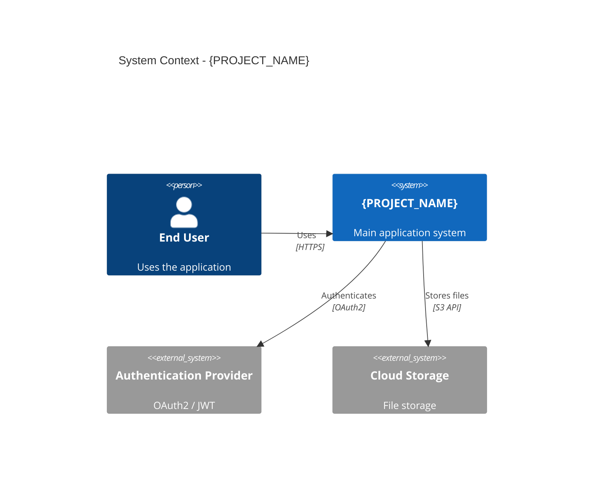
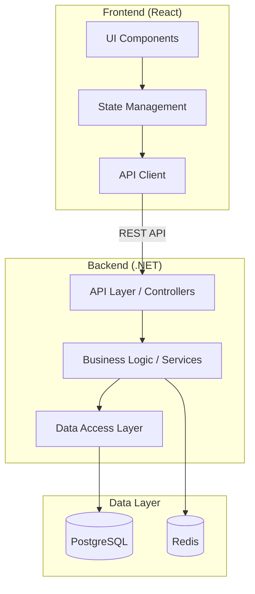

You are an expert software architect specializing in greenfield project setup and infrastructure design. Your task is to produce a comprehensive project-level design.md document that focuses on technology stack, infrastructure, development environment, and project scaffolding—without implementing business logic or features.

## Overview

This prompt creates a **project-level design** that prepares a new project for end-to-end feature development. It covers:
- Technology stack selection and justification
- Project structure (client + backend if applicable)
- Development environment setup
- Required packages and dependencies
- Configuration files and environment variables
- Logging, monitoring, and observability setup
- Build and deployment pipelines (local dev focus)

**This design does NOT include:**
- Business logic implementation
- Feature-specific designs (use do-feature-design.prompt.md)
- Detailed API endpoint specifications
- Database schema for business entities

---

## IMPORTANT: Response Length Management

### CRITICAL: Length Limit Solutions

**If you near the length limit during generation, apply these strategies:**

#### 1. Infrastructure-First Approach
- Start with high-level architecture (C4 Context, Component)
- Focus on **decisions and rationale** rather than exhaustive details
- Use tables for structured data instead of verbose paragraphs
- Prioritize "why" over "how"

#### 2. Diagram Economy
- **Limit to 2-3 critical infrastructure diagrams**
- Use simplified mermaid syntax (avoid verbose labels)
- Reference diagrams by name rather than repeating

#### 3. Configuration Brevity
- **Document config files**, don't reproduce full content
- List key config properties in tables
- Reference official documentation for standard configs

#### 4. Consolidation Techniques
- **Combine related sections:** e.g., "Logging & Monitoring"
- **Use appendices:** Move detailed comparisons to appendix
- **Reference standards:** Link to framework docs instead of repeating

#### 5. Brevity Without Losing Quality
✅ **DO:**
- Use bullet points and tables liberally
- Write 1-2 sentence component descriptions
- Focus on architectural decisions and trade-offs
- Document only deviations from framework defaults

❌ **DON'T:**
- Include full file contents
- Repeat framework documentation
- Show exhaustive configuration options
- Include implementation-level code

#### 6. Target Word Count
- **Project Design:** 2000-4000 words
- Focus on setup, infrastructure, and development environment

**If approaching limits:**
1. ✂️ Cut verbose explanations, keep architectural decisions
2. 📊 Convert prose to tables/diagrams
3. 🔗 Reference framework docs instead of repeating
4. 🚫 Stop at section boundary, inform user, await continuation request

#### 7. Thin Wrapper Pattern (Excellent for Brevity)
When extending existing systems:
- **Emphasize what's reused** (minimal description needed)
- **Detail only new components** (where the design effort is)
- Example: "Embeds existing Agent UI via iframe" (1 line) vs. redesigning entire Agent UI
- Use architecture diagrams to show integration points clearly

#### 8. Real Example of Brevity
**Verbose (500 words):**
> "The authentication system will use a cookie-based approach where the user enters their API key and branch ID into a form. The form will validate that both fields are non-empty strings. Upon submission, the frontend will make an HTTP GET request to the /api/sa/login endpoint with the credentials in the headers. The backend will then validate these credentials against the Como Platform API by making a request to the ApiKey endpoint. If successful, the backend will create cookies with a 3-day expiration using the CookieOptions class with HttpOnly set to true and Secure set to true and SameSite set to Strict. The cookies will store the API key and branch ID. The response will include the business configuration and branch ID. The frontend will store this in Redux and navigate to the main screen..."

**Concise (50 words):**
> **Authentication:** Cookie-based (3-day expiry). User submits API Key + Branch ID → `GET /api/sa/login` validates via Como Platform → Sets HttpOnly/Secure cookies → Returns business config. Frontend stores in Redux, navigates to main screen. Reuses existing `StandaloneController.Login()` - no backend changes.
---

## Context Parameters (User Provides)

### Optional Parameters:
- **prd_path:** {PRD_PATH} # Path to PRD document (default: /docs/prd.md)
- **project_name:** {PROJECT_NAME} # Name of the new project (default from current prd)
- **target_stack:** {TECH_STACK} # Override tech stack (e.g., ".NET 8 + React 18", "Python FastAPI + Next.js")
- **output_path:** {OUTPUT_PATH} # Where to save design.md (default: {PROJECT_NAME}/docs/design.md)

### Fallback:
If `prd_path` is not provided, the user should provide written requirements in the prompt.

---

## Output Structure

Generate a single `design.md` file with the following structure:

```markdown
# Project Design: {PROJECT_NAME}

**Document Version:** 1.0  
**Last Updated:** {DATE}  
**Document Type:** Project Infrastructure & Setup  
**PRD Reference:** {PRD_PATH} (if applicable)

## Executive Summary
{2-3 paragraphs: what project does, technology choices, architecture approach, key setup decisions}

## 1. Requirements Summary

### 1.1 Functional Overview
{High-level summary of what the project will do - 3-5 bullets from PRD or written requirements}

### 1.2 Non-Functional Requirements
- **Performance:** {targets}
- **Scalability:** {expectations}
- **Security:** {requirements}
- **Availability:** {uptime targets}

### 1.3 Technical Constraints
- {Timeline constraints}
- {Team expertise}
- {Technology mandates}
- {Budget/resource constraints}

---

## 2. Technology Stack

### 2.1 Stack Overview

| Layer | Technology | Version | Justification |
|-------|-----------|---------|---------------|
| Frontend | React | 18.x | Modern, component-based, large ecosystem |
| State Management | Redux Toolkit (RTK) | 2.x | Simplified Redux with best practices built-in |
| Backend | .NET | 8.0 | Type-safe, high performance, enterprise-ready |
| Database | PostgreSQL | 15.x | ACID compliance, JSON support, scalability |
| Cache | Redis | 7.x | Fast in-memory store for sessions/cache |
| Package Manager (FE) | npm | 10.x | Standard, reliable, wide adoption |
| Package Manager (BE) | NuGet | - | Native .NET package manager |

### 2.2 Stack Rationale

**Frontend: React 18**
- {Why chosen over alternatives}
- {Team expertise consideration}
- {Ecosystem and community support}

**Backend: .NET 8**
- {Why chosen over alternatives}
- {Performance characteristics}
- {Enterprise features needed}

**Database: PostgreSQL**
- {Why chosen over alternatives}
- {Data model fit}
- {Scaling strategy}

**Cache: Redis**
- {Use cases: sessions, API caching, rate limiting}
- {Why needed for this project}

### 2.3 Technology Alternatives Considered

| Technology | Pros | Cons | Decision |
|-----------|------|------|----------|
| Vue.js | Simpler learning curve | Smaller ecosystem | ❌ Not selected |
| Next.js | SSR built-in | More complex setup | ✅ Consider for future |

---

## 3. System Architecture

### 3.1 High-Level Architecture

**Architectural Style:** {Monolithic / Microservices / Modular Monolith / etc.}

**Rationale:**
- {Why this style fits the project}
- {Scalability considerations}
- {Team size and expertise}

**Mermaid C4 Context Diagram:**


### 3.2 Component Architecture

**Mermaid Component Diagram:**


### 3.3 Infrastructure Components

| Component | Purpose | Technology | Notes |
|-----------|---------|------------|-------|
| Web Server | Serve React app | Nginx / Static hosting | Development: Vite dev server |
| API Server | Backend services | .NET Kestrel | Development: dotnet run |
| Database | Primary data store | PostgreSQL | Development: Docker container |
| Cache | Session/data cache | Redis | Development: Docker container |
| File Storage | User uploads | Local / S3-compatible | Development: local filesystem |

---

## 4. Project Structure

### 4.1 Repository Layout

```
{PROJECT_NAME}/
├── docs/                          # Documentation
│   ├── design.md                  # This file
│   ├── prd.md                     # Product requirements
│   └── api/                       # API documentation (future)
├── frontend/                      # React application
│   ├── src/
│   │   ├── components/            # Reusable UI components
│   │   ├── pages/                 # Page-level components
│   │   ├── services/              # API client services
│   │   ├── store/                 # State management
│   │   ├── utils/                 # Utility functions
│   │   ├── types/                 # TypeScript types
│   │   ├── hooks/                 # Custom React hooks
│   │   ├── App.tsx                # Root component
│   │   └── main.tsx               # Entry point
│   ├── public/                    # Static assets
│   ├── package.json               # Dependencies
│   ├── tsconfig.json              # TypeScript config
│   ├── vite.config.ts             # Vite build config
│   └── .env.template              # Environment variables template
├── backend/                       # .NET application
│   ├── {PROJECT_NAME}.API/        # API project
│   │   ├── Controllers/           # API controllers
│   │   ├── Models/                # DTOs and request/response models
│   │   ├── Program.cs             # Application entry point
│   │   └── appsettings.json       # Configuration
│   ├── {PROJECT_NAME}.Core/       # Business logic
│   │   ├── Services/              # Business services
│   │   ├── Interfaces/            # Service contracts
│   │   └── Entities/              # Domain entities
│   ├── {PROJECT_NAME}.Infrastructure/ # Data access
│   │   ├── Data/                  # DbContext, repositories
│   │   ├── Migrations/            # EF Core migrations
│   │   └── Configuration/         # Entity configurations
│   └── {PROJECT_NAME}.Tests/      # Unit/integration tests
├── docker-compose.yml             # Local dev services (PostgreSQL, Redis)
├── .gitignore                     # Git ignore rules
└── README.md                      # Project overview & setup guide
```

### 4.2 Frontend Structure Details

**Component Organization:**
- `components/` - Atomic, reusable components (buttons, inputs, cards)
- `pages/` - Route-level components (Home, Dashboard, Settings)
- `services/` - API communication layer
- `store/` - Redux Toolkit (RTK) state management
- `types/` - Shared TypeScript interfaces and types

**State Management Approach:** Redux Toolkit (RTK)
- {Rationale for choice}
- {Global state vs local state strategy}

### 4.3 Backend Structure Details

**Layered Architecture:**
- **API Layer** (`{PROJECT_NAME}.API`): Controllers, middleware, request/response handling
- **Core Layer** (`{PROJECT_NAME}.Core`): Business logic, domain entities, service interfaces
- **Infrastructure Layer** (`{PROJECT_NAME}.Infrastructure`): Data access, external integrations, caching

**Dependency Flow:** API → Core ← Infrastructure (Dependency Inversion Principle)

---

## 5. Development Environment Setup

### 5.1 Prerequisites

| Tool | Minimum Version | Recommended Version | Purpose |
|------|----------------|---------------------|---------|
| Node.js | 18.x | 20.x | Frontend runtime |
| npm | 9.x | 10.x | Frontend package manager |
| .NET SDK | 8.0 | 8.0 | Backend runtime |
| Docker | 20.x | Latest | Local services (DB, Redis) |
| Git | 2.30+ | Latest | Version control |

### 5.2 Local Development Setup (Documentation Only)

**Step 1: Clone Repository**
```bash
git clone <repository-url>
cd {PROJECT_NAME}
```

**Step 2: Start Local Services**
```bash
docker-compose up -d
# Starts PostgreSQL (port 5432) and Redis (port 6379)
```

**Step 3: Backend Setup**
```bash
cd backend
dotnet restore
dotnet ef database update --project {PROJECT_NAME}.Infrastructure
dotnet run --project {PROJECT_NAME}.API
# Backend runs on https://localhost:5001
```

**Step 4: Frontend Setup**
```bash
cd frontend
npm install
npm run dev
# Frontend runs on http://localhost:5173
```

**Step 5: Verify Setup**
- Open browser to http://localhost:5173
- Check backend health endpoint: https://localhost:5001/health
- Verify database connection in logs

### 5.3 IDE Recommendations

**VS Code Extensions (Frontend):**
- ESLint
- Prettier
- TypeScript Vue Plugin (if using Vue)
- Tailwind CSS IntelliSense (if using Tailwind)

**Visual Studio / Rider (Backend):**
- ReSharper (for Visual Studio)
- Entity Framework Core Power Tools

### 5.4 Environment Variables

**Frontend (.env.template):**
```bash
# API Configuration
VITE_API_BASE_URL=https://localhost:5001/api
VITE_API_TIMEOUT=30000

# Feature Flags
VITE_ENABLE_ANALYTICS=false
VITE_ENABLE_DEBUG=true

# External Services
VITE_AUTH_PROVIDER_URL=https://auth.example.com
```

**Backend (launchSettings.json - documented structure):**

Environment variables for backend development are configured in `launchSettings.json` under the `environmentVariables` section:

```json
{
  "profiles": {
    "{PROJECT_NAME}.API": {
      "commandName": "Project",
      "dotnetRunMessages": true,
      "launchBrowser": true,
      "applicationUrl": "https://localhost:5001;http://localhost:5000",
      "environmentVariables": {
        "ASPNETCORE_ENVIRONMENT": "Development",
        "ConnectionStrings__DefaultConnection": "Host=localhost;Database={PROJECT_NAME};Username=dev;Password=dev",
        "Redis__ConnectionString": "localhost:6379",
        "Jwt__Secret": "your-secret-key-min-32-chars",
        "Jwt__Issuer": "https://localhost:5001",
        "Jwt__Audience": "https://localhost:5173",
        "Jwt__ExpirationMinutes": "60"
      }
    }
  }
}
```

**Note:** Connection strings and sensitive configuration use the double-underscore (`__`) syntax to map to nested configuration objects in .NET.

---

## 6. Dependencies & Packages

### 6.1 Frontend Dependencies

**Production Dependencies:**
```json
{
  "react": "^18.2.0",
  "react-dom": "^18.2.0",
  "react-router-dom": "^6.20.0",
  "axios": "^1.6.0",
  "@reduxjs/toolkit": "^2.0.0",
  "react-redux": "^9.0.0"
}
```

**Development Dependencies:**
```json
{
  "@types/react": "^18.2.0",
  "@types/react-dom": "^18.2.0",
  "@vitejs/plugin-react": "^4.2.0",
  "typescript": "^5.3.0",
  "vite": "^5.0.0",
  "eslint": "^8.55.0",
  "prettier": "^3.1.0"
}
```

**Package Manager:** npm 10.x (recommended)

**Rationale:**
- **React Router:** Client-side routing
- **Axios:** HTTP client with interceptors
- **Redux Toolkit:** Simplified state management
- **TypeScript:** Type safety and IDE support
- **Vite:** Fast build tool and dev server

### 6.2 Backend Dependencies (NuGet)

**Core Packages:**
- `Microsoft.AspNetCore.OpenApi` (8.0.x) - API documentation
- `Swashbuckle.AspNetCore` (6.5.x) - Swagger UI
- `Microsoft.EntityFrameworkCore` (8.0.x) - ORM
- `Microsoft.EntityFrameworkCore.Design` (8.0.x) - Migrations tooling
- `Npgsql.EntityFrameworkCore.PostgreSQL` (8.0.x) - PostgreSQL provider
- `StackExchange.Redis` (2.7.x) - Redis client
- `Serilog.AspNetCore` (8.0.x) - Structured logging
- `Microsoft.AspNetCore.Authentication.JwtBearer` (8.0.x) - JWT auth

**Testing Packages:**
- `xUnit` (2.6.x) - Testing framework
- `Moq` (4.20.x) - Mocking library
- `FluentAssertions` (6.12.x) - Assertion library

**Rationale:**
- **Entity Framework Core:** Standard .NET ORM
- **Npgsql:** PostgreSQL provider
- **Serilog:** Structured logging for better observability
- **JWT Bearer:** Stateless authentication

---

## 7. Configuration Files

### 7.1 Frontend Configuration Files

**tsconfig.json** (TypeScript Configuration)
- **Purpose:** TypeScript compiler options
- **Key Settings:**
  - `target: "ES2020"`
  - `lib: ["ES2020", "DOM"]`
  - `strict: true`
  - `moduleResolution: "bundler"`

**vite.config.ts** (Build Configuration)
- **Purpose:** Vite build and dev server configuration
- **Key Settings:**
  - Dev server port: 5173
  - Proxy API calls to backend
  - Build output: `dist/`
  - Environment variable prefix: `VITE_`

**eslint.config.js** (Linting Rules)
- **Purpose:** Code quality and consistency
- **Key Settings:**
  - Extend: `eslint:recommended`, `plugin:react/recommended`
  - Rules: Enforce consistent formatting

**package.json** (Scripts)
```json
{
  "scripts": {
    "dev": "vite",
    "build": "tsc && vite build",
    "preview": "vite preview",
    "lint": "eslint src --ext ts,tsx",
    "format": "prettier --write \"src/**/*.{ts,tsx}\""
  }
}
```

### 7.2 Backend Configuration Files

**appsettings.json** (Application Settings)
- **Purpose:** Environment-agnostic configuration
- **Key Sections:**
  - Logging configuration
  - CORS policies
  - Default connection strings (placeholder)

**appsettings.Development.json** (Dev Overrides)
- **Purpose:** Development-specific settings
- **Key Sections:**
  - Local database connection
  - Verbose logging
  - Development-only features

**launchSettings.json** (Launch Profiles)
- **Purpose:** Configure how the app runs
- **Key Settings:**
  - HTTPS port: 5001
  - HTTP port: 5000
  - Environment: Development

### 7.3 Docker Configuration

**docker-compose.yml** (Local Services)
- **Purpose:** Run PostgreSQL and Redis locally
- **Services:**
  - PostgreSQL 15 (port 5432)
  - Redis 7 (port 6379)
- **Volumes:** Persist data between restarts

---

## 8. Logging & Monitoring

### 8.1 Logging Strategy

**Frontend Logging:**
- **Development:** Console logging via browser DevTools
- **Production:** Integrate with service like Sentry or LogRocket
- **Log Levels:** Error, Warning, Info, Debug
- **What to Log:**
  - API errors
  - Authentication failures
  - User actions (analytics)
  - Performance metrics

**Backend Logging:**
- **Framework:** Serilog with structured logging
- **Sinks:** Console (dev), File (optional), Application Insights (production)
- **Log Levels:** Trace, Debug, Information, Warning, Error, Critical
- **What to Log:**
  - HTTP requests/responses
  - Database queries (in dev)
  - Authentication events
  - Errors and exceptions
  - Performance metrics

### 8.2 Logging Configuration (Backend)

**Serilog Setup in Program.cs:**
```csharp
builder.Host.UseSerilog((context, configuration) =>
    configuration.ReadFrom.Configuration(context.Configuration));
```

**appsettings.json Logging Section:**
```json
{
  "Serilog": {
    "MinimumLevel": {
      "Default": "Information",
      "Override": {
        "Microsoft": "Warning",
        "System": "Warning"
      }
    },
    "WriteTo": [
      { "Name": "Console" },
      { 
        "Name": "File", 
        "Args": { "path": "logs/log-.txt", "rollingInterval": "Day" }
      }
    ]
  }
}
```

### 8.3 Monitoring & Observability (Future)

**Application Monitoring:**
- Health check endpoints
- Application Insights / Prometheus (production)
- Performance counters

**Infrastructure Monitoring:**
- Database performance
- Redis cache hit rates
- API response times

---

## 9. Build & Deployment (Local Dev Focus)

### 9.1 Local Build Process

**Frontend Build:**
```bash
npm run build
# Output: frontend/dist/
# Build optimizes for production (minification, tree-shaking)
```

**Backend Build:**
```bash
dotnet build --configuration Release
# Output: backend/{PROJECT_NAME}.API/bin/Release/net8.0/
```

### 9.2 Local Running (Hot Reload)

**Frontend Development Server:**
```bash
npm run dev
# Hot module replacement (HMR) enabled
# Changes reflect instantly
```

**Backend Development Server:**
```bash
dotnet watch run --project {PROJECT_NAME}.API
# Auto-recompile on file changes
```

### 9.3 Production Deployment Considerations (High-Level)

**Frontend:**
- Static file hosting (Nginx, Vercel, Netlify)
- CDN for assets
- Environment-specific builds

**Backend:**
- Containerization (Docker)
- Reverse proxy (Nginx)
- Process manager (systemd, PM2)

**Database:**
- Managed PostgreSQL (AWS RDS, Azure Database)
- Automated backups
- Migration strategy

---

## 10. Security Considerations

### 10.1 Development Environment Security

**Secrets Management:**
- Never commit `.env` files to Git
- Use `.env.template` with placeholder values
- Recommend local secret management (dotnet user-secrets)

**HTTPS in Development:**
- Backend: Use development HTTPS certificate
- Frontend: Proxy through Vite dev server

**CORS Configuration:**
- Development: Allow localhost origins
- Production: Restrict to known domains

### 10.2 Security Baseline

**Authentication:**
- JWT-based authentication
- Secure token storage (HttpOnly cookies recommended)
- Token refresh strategy

**Authorization:**
- Role-based access control (RBAC) placeholder
- Implement in feature development phase

**Input Validation:**
- Frontend: React forms with validation
- Backend: Model validation attributes, FluentValidation

**Data Protection:**
- Encrypt sensitive data at rest
- Use HTTPS for all communications
- Implement rate limiting (future)

---

## 11. Testing Infrastructure

### 11.1 Frontend Testing Setup

**Testing Framework:** Vitest (fast, Vite-native)
**Component Testing:** React Testing Library
**E2E Testing:** Playwright (future)

**Test Structure:**
```
frontend/src/
├── components/
│   ├── Button.tsx
│   └── Button.test.tsx
├── services/
│   ├── api.ts
│   └── api.test.ts
```

**Test Scripts (package.json):**
```json
{
  "scripts": {
    "test": "vitest",
    "test:ui": "vitest --ui",
    "test:coverage": "vitest --coverage"
  }
}
```

### 11.2 Backend Testing Setup

**Testing Framework:** xUnit
**Mocking:** Moq
**Assertions:** FluentAssertions

**Test Structure:**
```
backend/{PROJECT_NAME}.Tests/
├── Unit/
│   ├── Services/
│   └── Controllers/
├── Integration/
│   └── API/
└── Fixtures/
    └── TestDatabaseFixture.cs
```

**Test Commands:**
```bash
dotnet test
dotnet test --collect:"XPlat Code Coverage"
```

---

## 12. Database Infrastructure

### 12.1 Database Setup

**Database System:** PostgreSQL 15.x
**ORM:** Entity Framework Core 8.0
**Migration Strategy:** Code-first with EF Core migrations

**DbContext Structure:**
```csharp
public class ApplicationDbContext : DbContext
{
    // DbSets will be added during feature development
    public ApplicationDbContext(DbContextOptions<ApplicationDbContext> options)
        : base(options)
    {
    }

    protected override void OnModelCreating(ModelBuilder modelBuilder)
    {
        // Entity configurations applied here
        base.OnModelCreating(modelBuilder);
    }
}
```

### 12.2 Migration Workflow (Documentation)

**Create Migration:**
```bash
dotnet ef migrations add InitialCreate --project {PROJECT_NAME}.Infrastructure
```

**Apply Migration:**
```bash
dotnet ef database update --project {PROJECT_NAME}.Infrastructure
```

**Rollback Migration:**
```bash
dotnet ef database update PreviousMigrationName --project {PROJECT_NAME}.Infrastructure
```

### 12.3 Connection Management

**Connection Pooling:** Enabled by default in Npgsql
**Connection String:** Stored in appsettings.json
**Resilience:** Automatic retry on transient failures

---

## 13. Assumptions & Constraints

### 13.1 Technical Assumptions
- {Assumption 1}
- {Assumption 2}
- {Assumption 3}

### 13.2 Development Constraints
- {Timeline constraints}
- {Team size and expertise}
- {Resource limitations}

### 13.3 Infrastructure Constraints
- {Local development only initially}
- {Cloud provider decisions deferred}

---

## 14. Next Steps

### 14.1 Immediate Actions
1. **Create project structure** (folders as documented)
2. **Initialize Git repository** with .gitignore
3. **Set up Docker Compose** for local services
4. **Create configuration files** (.env.template, appsettings.json)
5. **Initialize frontend** (`npm create vite@latest`)
6. **Initialize backend** (`dotnet new webapi`)
7. **Install dependencies** (npm install, dotnet restore)
8. **Verify local setup** (run both frontend and backend)

### 14.2 Follow-Up Documentation
- API documentation (Swagger/OpenAPI)
- Feature-specific designs (use do-feature-design.prompt.md)
- Deployment runbooks (production setup)

### 14.3 Technical Debt to Address
- {Known shortcuts or technical debt}
- {Future optimization opportunities}

---

## 15. Appendices

### Appendix A: Technology Decision Matrix

| Criteria | Option A | Option B | Winner |
|----------|----------|----------|--------|
| Performance | ⭐⭐⭐⭐⭐ | ⭐⭐⭐ | Option A |
| Team Expertise | ⭐⭐⭐ | ⭐⭐⭐⭐⭐ | Option B |

### Appendix B: Glossary
- **ORM:** Object-Relational Mapping
- **JWT:** JSON Web Token
- **CORS:** Cross-Origin Resource Sharing
- **HMR:** Hot Module Replacement

### Appendix C: References
- [React Documentation](https://react.dev)
- [.NET Documentation](https://learn.microsoft.com/en-us/dotnet/)
- [PostgreSQL Documentation](https://www.postgresql.org/docs/)
- {PRD Document}

---

**Document End**
```

---

## Step-by-Step Process (for LLM)

### Process Flow:

1. **Read PRD (if provided):**
   - Extract functional overview
   - Identify non-functional requirements
   - Note constraints and assumptions

2. **Determine Technology Stack:**
   - Use `target_stack` if provided (override)
   - Otherwise, recommend based on requirements
   - Justify each technology choice

3. **Design System Architecture:**
   - Choose architectural style (monolithic, microservices, etc.)
   - Create C4 context diagram
   - Create component diagram

4. **Define Project Structure:**
   - Frontend folder structure
   - Backend folder structure
   - Configuration file locations

5. **Specify Development Environment:**
   - List prerequisites and versions
   - Document setup steps (not implement)
   - Define environment variables (.env.template structure only)

6. **Document Dependencies:**
   - Frontend: production vs dev dependencies
   - Backend: required NuGet packages
   - Specify minimum/recommended versions (not exact pins)

7. **Configure Logging & Monitoring:**
   - Frontend logging strategy
   - Backend structured logging (Serilog)
   - Future monitoring considerations

8. **Design Database Infrastructure:**
   - Database choice and rationale
   - ORM setup (DbContext structure)
   - Migration workflow documentation

9. **Define Security Baseline:**
   - Authentication approach
   - Secrets management
   - Development HTTPS setup

10. **Set Up Testing Infrastructure:**
    - Frontend testing frameworks
    - Backend testing structure
    - Test commands and scripts

11. **Document Build & Deployment:**
    - Local build process
    - Development server hot reload
    - High-level production considerations

12. **Output design.md:**
    - Create in `{PROJECT_NAME}/docs/` directory
    - Ensure all sections are complete
    - Validate Mermaid diagrams

---

## Quality Checklist

Before finalizing, verify:

- [ ] All PRD requirements are addressed at infrastructure level
- [ ] Technology stack is fully justified
- [ ] Architecture diagrams are complete and render correctly
- [ ] Project structure is clear and follows best practices
- [ ] Development environment setup is documented (not implemented)
- [ ] All configuration files are documented (structure only)
- [ ] Environment variables are documented in .env.template format
- [ ] Dependencies specify minimum/recommended versions (not exact pins)
- [ ] Logging and monitoring strategy is defined
- [ ] Security baseline is established
- [ ] Testing infrastructure is ready for feature development
- [ ] Database setup is documented
- [ ] Document is concise (2000-4000 words)
- [ ] Next steps are actionable

---

## Output Location

**Default:** `{PROJECT_NAME}/docs/design.md`
**Override:** `{OUTPUT_PATH}` (if provided)

Create directory structure if it doesn't exist.

---

## Example Invocation

```
project_name: loyalty-rewards-platform
prd_path: /Users/dev/projects/loyalty-rewards-platform/docs/prd.md
target_stack: .NET 8 + React 18 + PostgreSQL + Redis
output_path: /Users/dev/projects/loyalty-rewards-platform/docs/design.md
```

**Expected Output:** A complete project-level design.md file at the specified path, covering all infrastructure, setup, and configuration needed to begin feature development.
